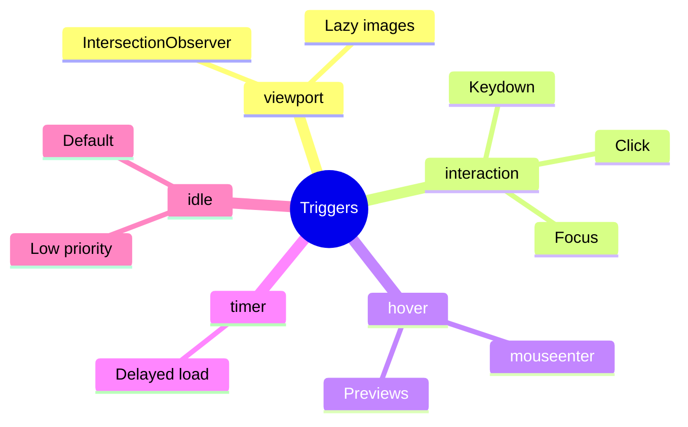

# 🎯 Use Case 3: Trigger Conditions

> **💡 Lightbulb Moment**: Different triggers for different needs - `on viewport` for lazy images, `on hover` for previews!

---

## Trigger Types

| Trigger | API | Best For |
|---------|-----|----------|
| `on viewport` | IntersectionObserver | Below-fold content |
| `on interaction` | click/focus/keydown | Expandable panels |
| `on hover` | mouseenter | Tooltips, previews |
| `on idle` | requestIdleCallback | Default (low priority) |
| `on timer(Xms)` | setTimeout | Delayed loading |
| `on immediate` | None | Code split only |

---

## Syntax Examples

```typescript
// Viewport
@defer (on viewport) { ... }

// Interaction with reference
@defer (on interaction(myButton)) { ... }

// Timer
@defer (on timer(2s)) { ... }

// Multiple triggers
@defer (on hover; on timer(5s)) { ... }
```

---

## 🚪 Smart Doorbell Analogy (Easy to Remember!)

Think of defer triggers like **different types of doorbells**:

| Trigger | Doorbell Analogy | Memory Trick |
|---------|------------------|--------------| 
| **on viewport** | 👁️ **Motion sensor**: Bell rings when you approach | **"When visible"** |
| **on interaction** | 🔔 **Press bell**: Only ring when specifically pushed | **"When clicked"** |
| **on hover** | 📡 **Proximity sensor**: Just wave hand near it | **"When hovered"** |
| **on idle** | ⏰ **Delayed bell**: Rings after house settles | **"When browser idle"** |
| **on timer** | ⏱️ **Scheduled bell**: Automatic bell at 5 PM | **"After X time"** |

### 📖 Story to Remember:

> 🚪 **The Smart Home Doorbells**
>
> Your app has different doorbells (triggers) for different rooms:
>
> **Types of Bells:**
> ```typescript
> // 👁️ Motion sensor at entrance - loads when you see it
> @defer (on viewport) { <footer /> }
> 
> // 🔔 Traditional doorbell - loads when clicked
> @defer (on interaction) { <modal /> }
> 
> // 📡 Wave sensor - loads on hover
> @defer (on hover) { <tooltip /> }
> 
> // ⏰ Delayed bell - loads when house is quiet
> @defer (on idle) { <analytics /> }
> 
> // ⏱️ Scheduled - loads after 5 seconds
> @defer (on timer(5s)) { <suggestions /> }
> ```
>
> **Each doorbell triggers content at the RIGHT moment!**

### 🎯 Quick Reference:
```
👁️ on viewport     = Motion sensor (when you see it)
🔔 on interaction  = Press bell (on click)
📡 on hover        = Wave hand (hover)
⏰ on idle         = When house settles (browser idle)
⏱️ on timer(Xs)    = Scheduled (after X time)
```

---

## 🧠 Mind Map


