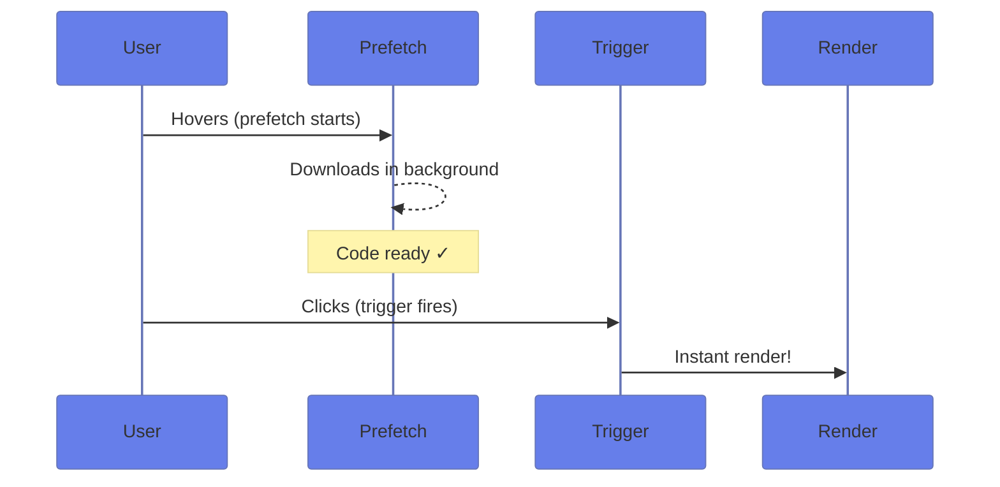
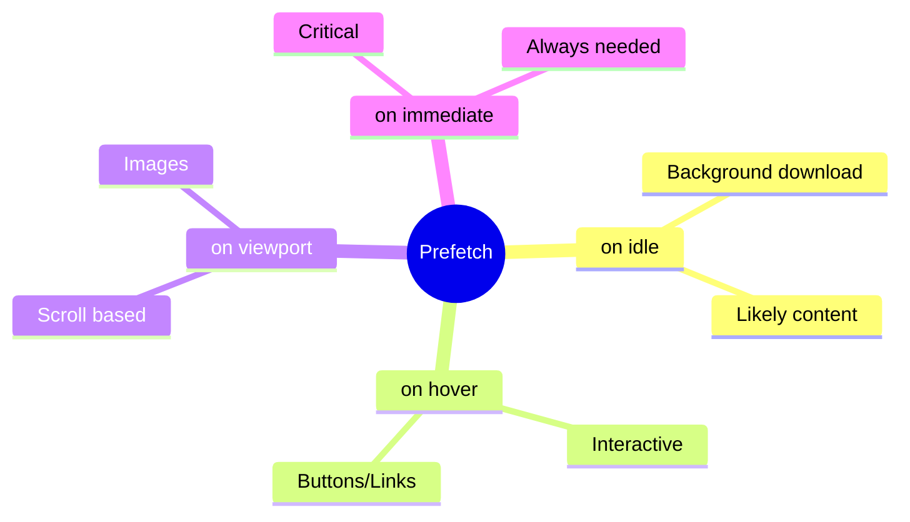

# 🚀 Use Case 4: Prefetching

> **💡 Lightbulb Moment**: Prefetch = download early, show later. Instant perceived performance!

---

## How Prefetching Works



---

## Prefetch Options

| Prefetch | Use When |
|----------|----------|
| `prefetch on idle` | Likely to be needed |
| `prefetch on hover` | Interactive elements |
| `prefetch on viewport` | Scrollable content |
| `prefetch on immediate` | Critical path code |

---

## 🍿 Popcorn Prep Analogy (Easy to Remember!)

Think of prefetching like **making popcorn before the movie**:

| Prefetch | Movie Analogy | Memory Trick |
|----------|---------------|--------------| 
| **prefetch on idle** | 🍿 **Make popcorn during trailers**: Nobody needs it yet | **"Prepare early"** |
| **prefetch on hover** | 👆 **Hand near play button**: About to start! | **"Almost active"** |
| **prefetch on viewport** | 👀 **Movie poster in view**: Coming attraction! | **"In sight"** |
| **prefetch on immediate** | ⏱️ **Pre-made batch**: Always ready | **"Critical content"** |

### 📖 Story to Remember:

> 🍿 **Movie Night Prep**
>
> You're hosting movie night:
>
> **Preparation Strategy:**
> ```typescript
> // 🍿 Make popcorn during trailers (browser idle)
> @defer (prefetch on idle) { <comments /> }
> 
> // 👆 Start heating when someone hovers over play
> @defer (prefetch on hover) { <video-player /> }
> 
> // 👀 See the "Coming Soon" poster? Start prepping
> @defer (prefetch on viewport) { <next-episode /> }
> 
> // ⏱️ Always have snacks ready!
> @defer (prefetch on immediate) { <essential-ui /> }
> ```
>
> **Popcorn is ready BEFORE the movie starts! 🎬**

### 🎯 Quick Reference:
```
🍿 prefetch on idle      = During trailers (background)
👆 prefetch on hover     = Hand near button
👀 prefetch on viewport  = Poster in view
⏱️ prefetch on immediate = Always ready
```

---

## 🧠 Mind Map


