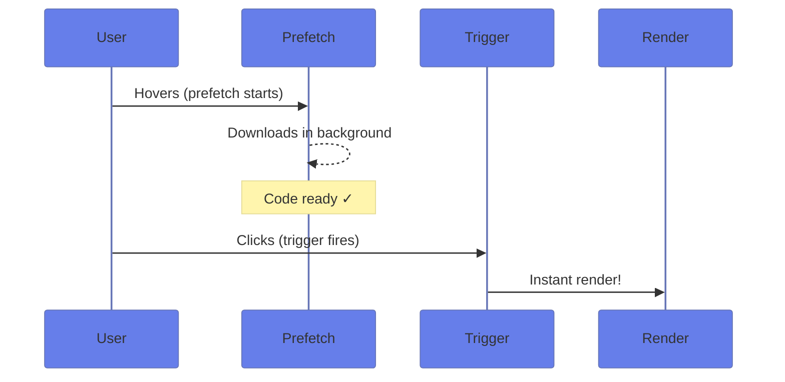
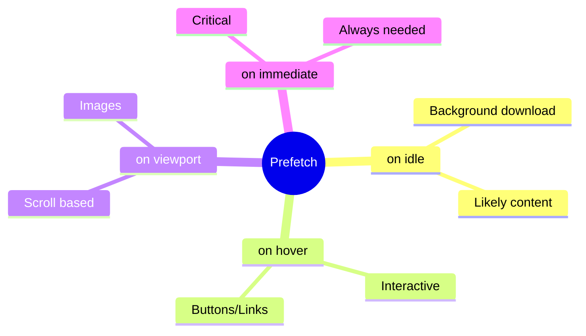

# 🚀 Use Case 4: Prefetching

> **💡 Lightbulb Moment**: Prefetch = download early, show later. Instant perceived performance!

---

## How Prefetching Works

---

## Prefetch Options

| Prefetch | Use When |
|----------|----------|
| `prefetch on idle` | Likely to be needed |
| `prefetch on hover` | Interactive elements |
| `prefetch on viewport` | Scrollable content |
| `prefetch on immediate` | Critical path code |

---

## 🧠 Mind Map

