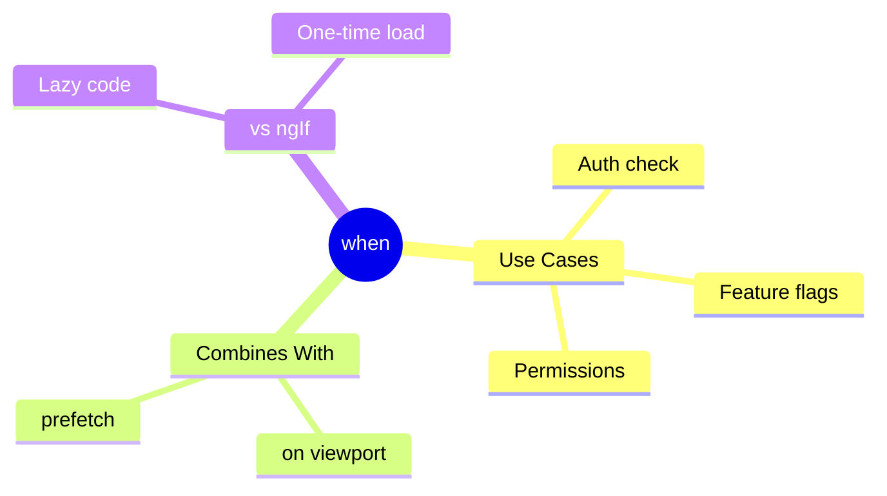

# 🔀 Use Case 5: When Condition

> **💡 Lightbulb Moment**: `when` = lazy ngIf. Load code only when condition is true!

---

## Syntax

```typescript
// Basic
@defer (when isVisible) { ... }

// With signal
@defer (when mySignal()) { ... }

// Combined with trigger
@defer (on viewport; when hasPermission) { ... }
```

---

## when vs *ngIf

| Aspect | @defer when | *ngIf |
|--------|-------------|-------|
| Code loading | Lazy (separate chunk) | Always in bundle |
| On false→true | Loads from server | Already loaded |
| Best for | Heavy, rare content | Light, frequent toggle |

---

## 🧠 Mind Map


