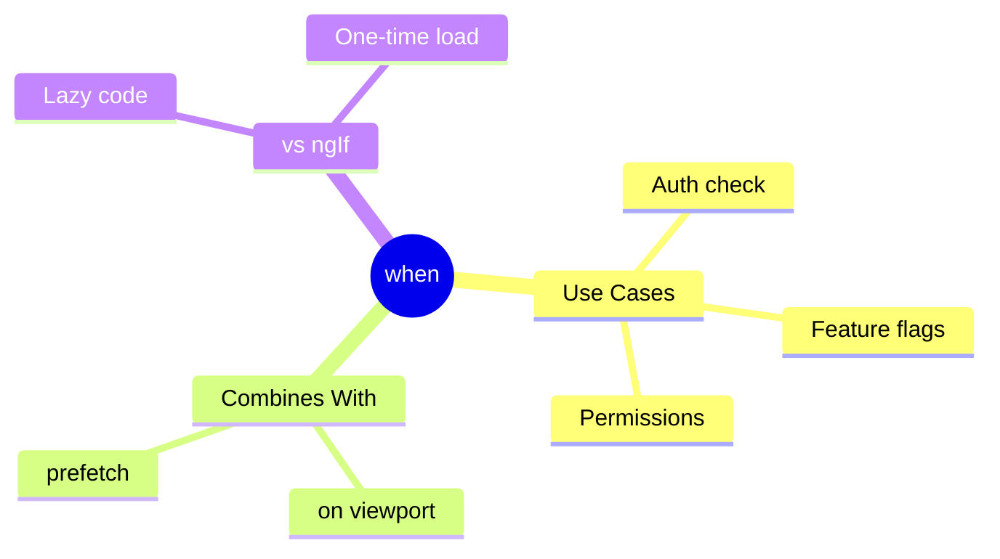

# 🔀 Use Case 5: When Condition

> **💡 Lightbulb Moment**: `when` = lazy ngIf. Load code only when condition is true!

---

## Syntax

```typescript
// Basic
@defer (when isVisible) { ... }

// With signal
@defer (when mySignal()) { ... }

// Combined with trigger
@defer (on viewport; when hasPermission) { ... }
```

---

## when vs *ngIf

| Aspect | @defer when | *ngIf |
|--------|-------------|-------|
| Code loading | Lazy (separate chunk) | Always in bundle |
| On false→true | Loads from server | Already loaded |
| Best for | Heavy, rare content | Light, frequent toggle |

---

### 📦 Data Flow Summary (Visual Box Diagram)

```
┌─────────────────────────────────────────────────────────────┐
│  @defer (when condition): CONDITIONAL LAZY LOADING          │
│                                                             │
│   *ngIf (Always in bundle):                                 │
│   ┌───────────────────────────────────────────────────────┐ │
│   │ condition = false → Component exists, just hidden     │ │
│   │ condition = true  → Show (already loaded)             │ │
│   │ ⚠️ Code always in main bundle!                        │ │
│   └───────────────────────────────────────────────────────┘ │
│                                                             │
│   @defer (when condition):                                  │
│   ┌───────────────────────────────────────────────────────┐ │
│   │ condition = false → Code NOT downloaded at all        │ │
│   │ condition = true  → Download chunk → Render           │ │
│   │ ✅ Code only loaded when actually needed!              │ │
│   └───────────────────────────────────────────────────────┘ │
│                                                             │
│   COMBINING:                                                │
│   ┌───────────────────────────────────────────────────────┐ │
│   │ @defer (on viewport; when hasPermission)              │ │
│   │                                                       │ │
│   │ BOTH conditions must be true:                         │ │
│   │   • Element in viewport AND                           │ │
│   │   • hasPermission = true                              │ │
│   └───────────────────────────────────────────────────────┘ │
└─────────────────────────────────────────────────────────────┘
```

> **Key Takeaway**: Use `when` for heavy, rare content. Use `*ngIf` for light, frequently toggled content!

---

## 🧠 Mind Map


