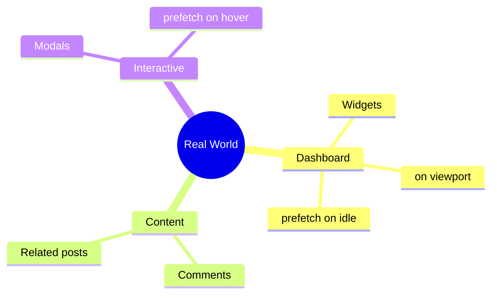

# 🌍 Use Case 6: Real-world Patterns

> **💡 Lightbulb Moment**: Combine @defer patterns for production-ready lazy loading!

---

## Common Patterns

### Dashboard Widgets
```typescript
@defer (on viewport; prefetch on idle) {
    <analytics-widget />
} @placeholder {
    <skeleton-loader />
}
```

### Comments Section
```typescript
@defer (on viewport) {
    <comments [(data)]="comments" />
}
```

### Heavy Modal
```typescript
@defer (on interaction; prefetch on hover) {
    <heavy-modal />
}
```

---

## Best Practices Checklist

- ✅ Use `on viewport` for below-fold
- ✅ Add `prefetch on idle` for likely content  
- ✅ Use `minimum` on @loading (prevent flicker)
- ✅ Provide skeleton @placeholder
- ✅ Handle @error states

---

## 🧠 Mind Map


