# 🎯 Angular Directives
## A Complete Guide to Building Powerful, Reusable Behaviors

---

# 📋 Agenda

1. **What Are Directives?**
2. **Three Types of Directives**
3. **Attribute Directives** - Changing Appearance & Behavior
4. **Structural Directives** - Manipulating the DOM
5. **Key APIs: ElementRef, Renderer2, TemplateRef, ViewContainerRef**
6. **@HostListener & @HostBinding**
7. **Real-World Production Patterns**
8. **Best Practices & Performance Tips**

---

# 🤔 What Are Directives?

> **Directives are classes that add behavior to elements in Angular applications.**

Think of them as **"HTML attribute superpowers"** - they extend what HTML elements can do!

```html
<!-- Built-in Directive Examples -->
<div *ngIf="isVisible">Conditional Content</div>
<li *ngFor="let item of items">{{ item }}</li>
<div [ngClass]="{'active': isActive}">Styled Content</div>
```

---

# 🏗️ Three Types of Directives

```mermaid
graph TD
    A[📦 Directives] --> B[🎨 Components]
    A --> C[✨ Attribute Directives]
    A --> D[🔧 Structural Directives]
    
    B --> B1["Directives with a template<br/>@Component decorator"]
    C --> C1["Change appearance/behavior<br/>ngClass, ngStyle"]
    D --> D1["Change DOM structure<br/>*ngIf, *ngFor, *ngSwitch"]
```



| Type | Description | Example |
|------|-------------|---------|
| **Components** | Directives with a template | `@Component` |
| **Attribute** | Modify appearance/behavior | `[ngClass]`, `[ngStyle]` |
| **Structural** | Add/remove DOM elements | `*ngIf`, `*ngFor` |

---

# ✨ Attribute Directives
## Changing Element Appearance & Behavior

### Simple Highlight Directive

```typescript
@Directive({
    selector: '[appHighlight]',
    standalone: true
})
export class HighlightDirective implements OnInit {
    private el = inject(ElementRef);
    private renderer = inject(Renderer2);

    ngOnInit(): void {
        this.renderer.setStyle(
            this.el.nativeElement, 
            'backgroundColor', 
            '#ffeb3b'
        );
        this.renderer.setStyle(
            this.el.nativeElement, 
            'padding', 
            '4px 8px'
        );
    }
}
```

### Usage
```html
<span appHighlight>This text is highlighted! ✨</span>
```

---

# 🎨 Attribute Directives with @Input

### Configurable Highlight

```typescript
@Directive({
    selector: '[appHighlight]',
    standalone: true
})
export class HighlightDirective {
    private el = inject(ElementRef);
    private renderer = inject(Renderer2);

    @Input() set appHighlight(color: string) {
        this.renderer.setStyle(
            this.el.nativeElement,
            'backgroundColor',
            color || '#ffeb3b'
        );
    }
}
```

### Usage
```html
<p [appHighlight]="'yellow'">Yellow highlight</p>
<p [appHighlight]="'lightblue'">Blue highlight</p>
<p appHighlight>Default highlight</p>
```

---

# 🔧 Key APIs: ElementRef & Renderer2

## ElementRef - Direct DOM Access

```typescript
// ⚠️ Provides direct access to host element
private el = inject(ElementRef);

// Access the native DOM element
const nativeEl = this.el.nativeElement;
```

## Renderer2 - Safe DOM Manipulation

```typescript
// ✅ Platform-agnostic DOM operations
private renderer = inject(Renderer2);

// Methods available:
renderer.setStyle(el, 'color', 'red');      // Set CSS
renderer.addClass(el, 'active');             // Add class
renderer.removeClass(el, 'active');          // Remove class
renderer.setAttribute(el, 'data-id', '1');   // Set attribute
renderer.listen(el, 'click', callback);      // Add listener
```

> **💡 Always prefer Renderer2 over direct nativeElement access for SSR compatibility!**

---

# 🎧 @HostListener
## Responding to Host Element Events

```typescript
@Directive({
    selector: '[appHoverEffect]',
    standalone: true
})
export class HoverEffectDirective {
    private el = inject(ElementRef);
    private renderer = inject(Renderer2);
    
    @Input() hoverBg = '#667eea';
    @Input() hoverColor = 'white';

    @HostListener('mouseenter')
    onMouseEnter(): void {
        this.renderer.setStyle(this.el.nativeElement, 'backgroundColor', this.hoverBg);
        this.renderer.setStyle(this.el.nativeElement, 'color', this.hoverColor);
        this.renderer.setStyle(this.el.nativeElement, 'transform', 'scale(1.05)');
    }

    @HostListener('mouseleave')
    onMouseLeave(): void {
        this.renderer.removeStyle(this.el.nativeElement, 'backgroundColor');
        this.renderer.removeStyle(this.el.nativeElement, 'color');
        this.renderer.setStyle(this.el.nativeElement, 'transform', 'scale(1)');
    }
}
```

### Common Events
- `click`, `dblclick`
- `mouseenter`, `mouseleave`
- `focus`, `blur`
- `keydown`, `keyup`
- `scroll`, `resize`

---

# 🔗 @HostBinding
## Binding Host Element Properties

```typescript
@Directive({
    selector: '[appActiveToggle]',
    standalone: true
})
export class ActiveToggleDirective {
    private isActive = false;

    // Bind to CSS classes
    @HostBinding('class.active')
    get active(): boolean { return this.isActive; }

    @HostBinding('class.inactive')
    get inactive(): boolean { return !this.isActive; }

    // Bind to inline styles
    @HostBinding('style.backgroundColor')
    get bgColor(): string { 
        return this.isActive ? '#4ade80' : '#f87171'; 
    }

    @HostListener('click')
    toggle(): void {
        this.isActive = !this.isActive;
    }
}
```

### Binding Types
| Syntax | Description |
|--------|-------------|
| `@HostBinding('class.name')` | Toggle CSS class |
| `@HostBinding('style.prop')` | Set inline style |
| `@HostBinding('attr.name')` | Set HTML attribute |
| `@HostBinding('disabled')` | Set DOM property |

---

# 🏗️ Structural Directives
## Manipulating the DOM Structure

### The `*` Syntax Explained

```html
<!-- Shorthand syntax -->
<div *ngIf="condition">Content</div>

<!-- Expands to -->
<ng-template [ngIf]="condition">
    <div>Content</div>
</ng-template>
```

> The asterisk `*` is syntactic sugar that wraps the element in an `<ng-template>`

---

# 🔧 Key APIs: TemplateRef & ViewContainerRef

```mermaid
graph LR
    A["🏷️ TemplateRef<br/><em>The Rubber Stamp</em>"] --> B["📄 ViewContainerRef<br/><em>The Slot on Page</em>"]
    B --> C["🖼️ Rendered View<br/><em>Stamped Content</em>"]
    
    style A fill:#e0f2fe
    style B fill:#fef3c7
    style C fill:#dcfce7
```



| API | Analogy | Purpose |
|-----|---------|---------|
| **TemplateRef** | 🏷️ Rubber Stamp | Holds the blueprint (HTML) but doesn't render |
| **ViewContainerRef** | 📄 Slot on Page | Location to "stamp" (render) the template |

---

# ✏️ Custom Structural Directive: *appIf

```typescript
@Directive({
    selector: '[appIf]',
    standalone: true
})
export class AppIfDirective implements OnChanges {
    // 🏷️ The "Rubber Stamp" - holds the template blueprint
    private templateRef = inject(TemplateRef<any>);
    
    // 📄 The "Slot" - where we render the template
    private viewContainer = inject(ViewContainerRef);
    
    private hasView = false;

    @Input() appIf = false;

    ngOnChanges(changes: SimpleChanges): void {
        if (changes['appIf']) {
            this.updateView();
        }
    }

    private updateView(): void {
        if (this.appIf && !this.hasView) {
            // ✅ Press the stamp! Render the template
            this.viewContainer.createEmbeddedView(this.templateRef);
            this.hasView = true;
        } else if (!this.appIf && this.hasView) {
            // ❌ Clear the slot! Remove the view
            this.viewContainer.clear();
            this.hasView = false;
        }
    }
}
```

---

# 🔄 Custom Structural Directive: *appFor

```typescript
@Directive({
    selector: '[appFor][appForOf]',
    standalone: true
})
export class AppForDirective implements OnChanges {
    private templateRef = inject(TemplateRef<any>);
    private viewContainer = inject(ViewContainerRef);

    @Input() appForOf: any[] = [];

    ngOnChanges(changes: SimpleChanges): void {
        if (changes['appForOf']) {
            // Clear existing views
            this.viewContainer.clear();

            // Create a view for each item
            this.appForOf.forEach((item, index) => {
                this.viewContainer.createEmbeddedView(this.templateRef, {
                    $implicit: item,              // Default variable
                    index: index,                 // Index variable
                    first: index === 0,
                    last: index === this.appForOf.length - 1,
                    odd: index % 2 === 1,
                    even: index % 2 === 0
                });
            });
        }
    }
}
```

### Usage
```html
<li *appFor="let item of items; let i = index">
    {{ i + 1 }}. {{ item }}
</li>
```

---

# 🌍 Real-World Directive: Permission-Based Visibility

```typescript
@Directive({
    selector: '[appPermission]',
    standalone: true
})
export class PermissionDirective implements OnInit {
    private templateRef = inject(TemplateRef<any>);
    private viewContainer = inject(ViewContainerRef);
    private hasView = false;

    @Input() appPermission: string[] = [];

    // In real app: inject UserService
    private currentUserRoles = ['user', 'editor'];

    ngOnInit(): void {
        this.checkPermission();
    }

    private checkPermission(): void {
        const hasPermission = this.appPermission.some(role =>
            this.currentUserRoles.includes(role)
        );

        if (hasPermission && !this.hasView) {
            this.viewContainer.createEmbeddedView(this.templateRef);
            this.hasView = true;
        } else if (!hasPermission && this.hasView) {
            this.viewContainer.clear();
            this.hasView = false;
        }
    }
}
```

### Usage
```html
<button *appPermission="['admin']">Delete User</button>
<button *appPermission="['editor', 'admin']">Edit</button>
<button *appPermission="['user']">View</button>
```

---

# 🖼️ Real-World Directive: Lazy Load Images

```typescript
@Directive({
    selector: '[appLazyLoad]',
    standalone: true
})
export class LazyLoadDirective implements AfterViewInit, OnDestroy {
    private el = inject(ElementRef);
    private renderer = inject(Renderer2);
    private observer: IntersectionObserver | null = null;

    @Input() appLazyLoad = '';
    @Input() placeholder = 'https://via.placeholder.com/300x200?text=Loading...';
    @Output() loaded = new EventEmitter<void>();

    ngAfterViewInit(): void {
        // Set placeholder initially
        this.renderer.setAttribute(this.el.nativeElement, 'src', this.placeholder);

        // 🕵️ IntersectionObserver - Modern Browser API
        // Efficiently notifies when element enters viewport
        this.observer = new IntersectionObserver(entries => {
            entries.forEach(entry => {
                if (entry.isIntersecting) {
                    this.loadImage();
                }
            });
        }, { threshold: 0.1 });

        this.observer.observe(this.el.nativeElement);
    }

    private loadImage(): void {
        this.renderer.setAttribute(this.el.nativeElement, 'src', this.appLazyLoad);
        this.renderer.setStyle(this.el.nativeElement, 'opacity', '0');
        this.renderer.setStyle(this.el.nativeElement, 'transition', 'opacity 0.5s');

        this.el.nativeElement.onload = () => {
            this.renderer.setStyle(this.el.nativeElement, 'opacity', '1');
            this.loaded.emit();
        };

        this.observer?.disconnect();
    }

    ngOnDestroy(): void {
        this.observer?.disconnect();
    }
}
```

---

# 📋 Real-World Directive: Copy to Clipboard

```typescript
@Directive({
    selector: '[appCopyToClipboard]',
    standalone: true
})
export class CopyToClipboardDirective {
    private el = inject(ElementRef);
    private renderer = inject(Renderer2);

    @Input() appCopyToClipboard = '';
    @Output() copied = new EventEmitter<string>();

    constructor() {
        this.renderer.setStyle(this.el.nativeElement, 'cursor', 'pointer');
        this.renderer.listen(this.el.nativeElement, 'click', () => this.copy());
    }

    private copy(): void {
        const text = this.appCopyToClipboard || this.el.nativeElement.textContent;

        // 📋 Modern Async Clipboard API
        navigator.clipboard.writeText(text).then(() => {
            this.copied.emit(text);

            // Visual feedback
            const original = this.el.nativeElement.style.backgroundColor;
            this.renderer.setStyle(this.el.nativeElement, 'backgroundColor', '#dcfce7');
            setTimeout(() => {
                this.renderer.setStyle(this.el.nativeElement, 'backgroundColor', original);
            }, 500);
        });
    }
}
```

### Usage
```html
<code [appCopyToClipboard]="'npm install angular'" (copied)="onCopied($event)">
    npm install angular
</code>
```

---

# ⏱️ Real-World Directive: Debounce Click

```typescript
@Directive({
    selector: '[appDebounceClick]',
    standalone: true
})
export class DebounceClickDirective implements OnInit {
    private el = inject(ElementRef);

    @Input() debounceTime = 500;
    @Output() debounceClick = new EventEmitter<MouseEvent>();

    private lastClickTime = 0;

    ngOnInit(): void {
        this.el.nativeElement.addEventListener('click', (e: MouseEvent) => {
            const now = Date.now();
            if (now - this.lastClickTime > this.debounceTime) {
                this.lastClickTime = now;
                this.debounceClick.emit(e);
            }
        });
    }
}
```

### Usage
```html
<button appDebounceClick 
        [debounceTime]="1000" 
        (debounceClick)="submitForm()">
    Submit (Protected from double-click)
</button>
```

---

# 📚 Directive Catalog Summary

| Directive | Type | Use Case |
|-----------|------|----------|
| `[appHighlight]` | Attribute | Apply background color |
| `[appTooltip]` | Attribute | Show tooltip on hover |
| `[appHoverEffect]` | Attribute | Mouse enter/leave effects |
| `[appCopyToClipboard]` | Attribute | Copy text on click |
| `[appDebounceClick]` | Attribute | Prevent double clicks |
| `[appAutoFocus]` | Attribute | Auto-focus input |
| `[appLazyLoad]` | Attribute | Lazy load images |
| `*appIf` | Structural | Conditional rendering |
| `*appFor` | Structural | Iterate over collection |
| `*appPermission` | Structural | Role-based visibility |

---

# ✅ Best Practices

## ✔️ DO

- ✅ Use **Renderer2** for DOM manipulation (SSR-safe)
- ✅ Use **inject()** function for dependency injection
- ✅ Clean up in **ngOnDestroy** (observers, listeners)
- ✅ Use **@Input** setters for reactive changes
- ✅ Keep directives **focused** and single-purpose
- ✅ Use **standalone: true** for modern Angular

## ❌ DON'T

- ❌ Directly access `nativeElement` for styling
- ❌ Forget to unsubscribe/disconnect observers
- ❌ Create directives that do too many things
- ❌ Use directives when a component is more appropriate

---

# 📊 Lifecycle Hook Selection Guide

```mermaid
graph TD
    A["🎯 What do you need?"] --> B{"Need @Input values?"}
    B -->|No| C["constructor()"]
    B -->|Yes| D{"Need DOM element ready?"}
    D -->|No| E["ngOnInit()"]
    D -->|Yes| F{"Setting up listeners<br/>or styles?"}
    F -->|Listeners/Styles| G["ngOnInit()"]
    F -->|Focus/Scroll/Measure| H["ngAfterViewInit()"]
    
    style C fill:#dcfce7
    style E fill:#dbeafe
    style G fill:#dbeafe
    style H fill:#fef3c7
```



| Hook | Use When |
|------|----------|
| `constructor()` | Dependencies ready, no inputs needed |
| `ngOnInit()` | Inputs ready, set up logic/listeners |
| `ngAfterViewInit()` | DOM fully rendered, focus/scroll/measure |
| `ngOnChanges()` | React to input changes |
| `ngOnDestroy()` | Cleanup observers/listeners |

---

# 🎓 Key Takeaways

1. **Directives extend HTML** with custom behaviors
2. **Attribute directives** modify appearance/behavior
3. **Structural directives** change DOM structure
4. **Use Renderer2** for safe DOM manipulation
5. **TemplateRef + ViewContainerRef** = Structural directive magic
6. **@HostListener** for events, **@HostBinding** for properties
7. **Real-world patterns**: Permission, Lazy Load, Clipboard, Debounce
8. **Always clean up** in ngOnDestroy

---

# 🚀 Next Steps

1. **Practice**: Create a custom `[appTooltip]` directive
2. **Explore**: Directive Composition API (`hostDirectives`)
3. **Build**: Permission-based visibility system
4. **Optimize**: Lazy loading for images/components

---

# ❓ Questions?

## Resources

- 📖 [Angular Directives Guide](https://angular.dev/guide/directives)
- 🔗 [Directive Composition API](https://angular.dev/guide/directives/directive-composition-api)
- 📺 [Angular University](https://angular-university.io)

---

# 🙏 Thank You!

> **"Directives are the secret sauce that makes Angular templates truly powerful."**

