# 🎛️ Directive with @Input

> **💡 Lightbulb Moment**: @Input transforms directives from static tools to dynamic, configurable powerhouses!


## 📋 Table of Contents
- [1. 🔍 How It Works (The Concept)](#1--how-it-works-the-concept)
  - [Core Mechanism](#core-mechanism)
  - [Default vs. Configurable Behavior](#default-vs-configurable-behavior)
  - [📊 Data Flow with @Input & ngOnChanges](#data-flow-with-input--ngonchanges)
- [❓ What Problem Does It Solve?](#what-problem-does-it-solve)
- [🌍 Real-World .  **Role-Based Access Control (RBAC)**:](#real-world---role-based-access-control-rbac)
- [2. 🚀 Step-by-Step Implementation Guide](#2--step-by-step-implementation-guide)
  - [Step 1: Basic @Input (Same Name as Selector)](#step-1-basic-input-same-name-as-selector)
  - [Step 2: Consumer Template](#step-2-consumer-template)
  - [📊 Input Binding Patterns](#input-binding-patterns)
  - [Step 3: Multiple Inputs](#step-3-multiple-inputs)
  - [Step 4: Object Configuration Pattern](#step-4-object-configuration-pattern)
- [3. 🐛 Common Pitfalls & Debugging](#3--common-pitfalls--debugging)
  - [❌ Bad Example: Using ngOnInit Instead of ngOnChanges](#bad-example-using-ngoninit-instead-of-ngonchanges)
  - [✅ Good Example: Using ngOnChanges](#good-example-using-ngonchanges)
  - [❌ Bad: String vs. Property Binding Confusion](#bad-string-vs-property-binding-confusion)
  - [Debugging Checklist](#debugging-checklist)
- [4. ⚡ Performance & Architecture](#4--performance--architecture)
  - [Performance Characteristics](#performance-characteristics)
  - [Input Change Detection Optimization](#input-change-detection-optimization)
  - [Architecture: Reusable Configuration](#architecture-reusable-configuration)
- [5. 🌍 Real World Use Cases](#5--real-world-use-cases)
  - [1. 🎨 Theme-Aware Styling](#1--theme-aware-styling)
  - [2. 📐 Responsive Spacing](#2--responsive-spacing)
  - [3. 🔄 Loading State Indicator](#3--loading-state-indicator)
- [6. 📝 The Analogy](#6--the-analogy)
- [🚦 When to Use vs. Not Use](#when-to-use-vs-not-use)
- [🏗️ Architecture & Performance](#architecture--performance)
  - [Architecture](#architecture)
  - [Performance](#performance)
- [7. ❓ Interview & Concept Questions](#7--interview--concept-questions)
  - [Core Concepts](#core-concepts)
  - [Debugging](#debugging)
  - [Implementation](#implementation)
  - [Performance](#performance)
  - [Architecture](#architecture)
  - [Scenario Based](#scenario-based)
- [🧠 Mind Map](#mind-map)
- [❓ Additional Interview Questions (15+)](#additional-interview-questions-15)
  - [Type Safety Questions](#type-safety-questions)
  - [Lifecycle Questions](#lifecycle-questions)
  - [Pattern Questions](#pattern-questions)
  - [Scenario Questions](#scenario-questions)
  - [Advanced Questions](#advanced-questions)

---
---


## 1. 🔍 How It Works (The Concept)

### Core Mechanism

`@Input()` allows you to pass data from the template into your directive, making it **configurable** and **reusable** with different settings.

| Pattern | Syntax | Use Case |
|---------|--------|----------|
| Same name as selector | `[appBgColor]="'red'"` | Single primary input |
| Separate input name | `appDir [color]="'red'"` | Multiple inputs |
| Object configuration | `[appStyle]="{color: 'red', size: 'lg'}"` | Complex config |

### Default vs. Configurable Behavior

```
STATIC DIRECTIVE (No @Input):
<span appHighlight>Always yellow</span>
→ Same highlight color everywhere 😴

CONFIGURABLE DIRECTIVE (With @Input):
<span [appHighlight]="'red'">Red highlight</span>
<span [appHighlight]="'green'">Green highlight</span>
<span [appHighlight]="userColor">Dynamic!</span>
→ Different colors, one directive! 🎉
```

### 📊 Data Flow with @Input & ngOnChanges

```mermaid
sequenceDiagram
    participant P as 📦 Parent Component
    participant T as 📄 Template (HTML)
    participant D as 🎯 BgColorDirective

    Note over P: selectedColor = 'red'
    P->>T: Data Binding [appBgColor]='selectedColor'
    T->>D: 1. Set @Input() appBgColor = 'red'
    
    rect rgb(240, 240, 240)
        Note right of D: ⚡ LIFECYCLE HOOK TRIGGERED
        D->>D: 2. ngOnChanges(changes)
        Note right of D: if (changes['appBgColor']) { ... }
    end

    D->>D: 3. this.renderer.setStyle(...)
    Note over D: background-color: red applied!
```



> [!TIP]
> **Important Code Flow**:
> 1.  **Parent** updates the property bound to the directive.
> 2.  **Angular** detects the change and updates the `@Input()` property on the Directive instance.
> 3.  **`ngOnChanges`** is automatically called. This is the **most important** place to react to data changes.
> 4.  **Renderer2** is used inside `ngOnChanges` to safely update the DOM.

---

## ❓ What Problem Does It Solve?

In Angular, directives often need to be configurable. Without `@Input()`, a directive is static and rigid—it always does the exact same thing.

*   **The Problem**: Code duplication. If you want a "Red Background" directive and a "Blue Background" directive, you'd have to write two separate classes. 🚫
*   **The Solution**: Use `@Input()` to pass the color as a parameter. Now one single directive can handle ANY color. ✅

## 🌍 Real-World .  **Role-Based Access Control (RBAC)**:
    *   *Scenario*: A directive `*appHasRole` that shows/hides elements based on user permissions.
    *   *Usage*: `<div *appHasRole="['ADMIN', 'EDITOR']">Edit Button</div>`.
    *   *Benefit*: One directive handles logic for all roles throughout the app.

2.  **Analytics Tracking**:
    *   *Scenario*: A directive `appTrackClick` that sends data to Google Analytics when an element is clicked.
    *   *Usage*: `<button appTrackClick="signup_button">Sign Up</button>`.
    *   *Benefit*: Configuring the event name directly in the HTML keeps tracking logic decoupled from component logic.

3.  **Dynamic Theming**:
    *   *Scenario*: Applying complex style config objects based on user preferences.
    *   *Usage*: `<div [appTheme]="userThemeConfig">...</div>`.

---

## 2. 🚀 Step-by-Step Implementation Guide

### Step 1: Basic @Input (Same Name as Selector)

```typescript
import { Directive, ElementRef, Renderer2, Input, OnChanges, SimpleChanges, inject } from '@angular/core';

@Directive({
    selector: '[appBgColor]',
    standalone: true
})
export class BgColorDirective implements OnChanges {
    private el = inject(ElementRef);
    private renderer = inject(Renderer2);

    // 🛡️ CRITICAL: Input name matches selector = shorthand syntax
    @Input() appBgColor = '#667eea';  // Default value

    // 🛡️ CRITICAL: Use ngOnChanges to react to input changes
    ngOnChanges(changes: SimpleChanges): void {
        if (changes['appBgColor']) {
            this.renderer.setStyle(this.el.nativeElement, 'backgroundColor', this.appBgColor);
            this.renderer.setStyle(this.el.nativeElement, 'color', 'white');
            this.renderer.setStyle(this.el.nativeElement, 'padding', '0.5rem 1rem');
            this.renderer.setStyle(this.el.nativeElement, 'borderRadius', '6px');
            this.renderer.setStyle(this.el.nativeElement, 'display', 'inline-block');
        }
    }
}
```

### Step 2: Consumer Template

```html
<!-- Shorthand: Input name matches selector -->
<span [appBgColor]="'#4ade80'">Green Background</span>

<!-- Dynamic binding -->
<span [appBgColor]="selectedColor">{{ selectedColor }}</span>

<!-- Default value used -->
<span appBgColor>Uses default purple</span>
```

### 📊 Input Binding Patterns


### Step 3: Multiple Inputs

```typescript
@Directive({
    selector: '[appConfigHighlight]',
    standalone: true
})
export class ConfigHighlightDirective implements OnChanges {
    private el = inject(ElementRef);
    private renderer = inject(Renderer2);

    // 🛡️ CRITICAL: Multiple inputs for complex configuration
    @Input() highlightColor = '#fef3c7';
    @Input() highlightPadding = '0.25rem 0.5rem';
    @Input() highlightRadius = '4px';
    @Input() highlightBorder = 'none';

    ngOnChanges(): void {
        this.renderer.setStyle(this.el.nativeElement, 'backgroundColor', this.highlightColor);
        this.renderer.setStyle(this.el.nativeElement, 'padding', this.highlightPadding);
        this.renderer.setStyle(this.el.nativeElement, 'borderRadius', this.highlightRadius);
        this.renderer.setStyle(this.el.nativeElement, 'border', this.highlightBorder);
    }
}
```

```html
<!-- Usage with multiple inputs -->
<span appConfigHighlight 
      [highlightColor]="'#dcfce7'" 
      [highlightPadding]="'1rem'"
      [highlightRadius]="'12px'">
    Fully Customized!
</span>
```

### Step 4: Object Configuration Pattern

```typescript
interface StyleConfig {
    color: string;
    background: string;
    padding: string;
    borderRadius: string;
}

@Directive({
    selector: '[appDynamicStyle]',
    standalone: true
})
export class DynamicStyleDirective implements OnChanges {
    private el = inject(ElementRef);
    private renderer = inject(Renderer2);

    // 🛡️ CRITICAL: Single object for complex config
    @Input() appDynamicStyle: Partial<StyleConfig> = {};

    ngOnChanges(): void {
        // Apply each property from the config object
        Object.entries(this.appDynamicStyle).forEach(([property, value]) => {
            if (value) {
                this.renderer.setStyle(this.el.nativeElement, property, value);
            }
        });
    }
}
```

```typescript
// In component
styleConfig = {
    backgroundColor: '#667eea',
    color: 'white',
    padding: '1rem 2rem',
    borderRadius: '8px',
    boxShadow: '0 4px 6px rgba(0,0,0,0.1)'
};

// In template
<div [appDynamicStyle]="styleConfig">Styled by config object!</div>
```

---

## 3. 🐛 Common Pitfalls & Debugging

### ❌ Bad Example: Using ngOnInit Instead of ngOnChanges

```typescript
@Directive({ selector: '[appBadColor]' })
export class BadColorDirective implements OnInit {
    @Input() appBadColor = 'red';

    ngOnInit(): void {
        // ❌ BAD: Only runs once, ignores future changes
        this.renderer.setStyle(this.el.nativeElement, 'backgroundColor', this.appBadColor);
    }
}
```

**Why This Fails:**
- `ngOnInit` runs only **once** after directive initialization
- If `appBadColor` changes later, the style **won't update**!
- User sees stale styling even after input value changes

### ✅ Good Example: Using ngOnChanges

```typescript
@Directive({ selector: '[appGoodColor]' })
export class GoodColorDirective implements OnChanges {
    @Input() appGoodColor = 'red';

    // ✅ GOOD: Runs whenever input changes
    ngOnChanges(changes: SimpleChanges): void {
        if (changes['appGoodColor']) {
            this.renderer.setStyle(this.el.nativeElement, 'backgroundColor', this.appGoodColor);
        }
    }
}
```

### ❌ Bad: String vs. Property Binding Confusion

```html
<!-- ❌ BAD: Passing literal string "color" not variable value -->
<span [appBgColor]="color">Wrong!</span>  <!-- color might be undefined! -->

<!-- ✅ GOOD: Passing string literal -->
<span [appBgColor]="'#ff0000'">Red</span>

<!-- ✅ GOOD: Passing variable (no extra quotes) -->
<span [appBgColor]="userSelectedColor">Dynamic</span>
```

### Debugging Checklist

| Issue | Check | Fix |
|-------|-------|-----|
| Input never received | `console.log` in ngOnChanges | Verify binding syntax |
| Changes not reflected | Using ngOnInit? | Switch to ngOnChanges |
| Type error | Input type mismatch | Add type annotation |
| Undefined input | Missing default value | `@Input() color = 'default'` |

---

## 4. ⚡ Performance & Architecture

### Performance Characteristics

```
INPUT CHANGE DETECTION:

OnChanges lifecycle:
→ Angular detects input change: O(1)
→ ngOnChanges callback: O(n) where n = number of changes
→ Renderer2 style update: O(1)

TOTAL: O(n) - linear with number of changed inputs
```

### Input Change Detection Optimization

```typescript
// 🚀 OPTIMIZATION: Only process when specific input changes
ngOnChanges(changes: SimpleChanges): void {
    // Check if our specific input changed
    if (changes['appBgColor'] && !changes['appBgColor'].firstChange) {
        // Only update if not first change (initial set)
        const prev = changes['appBgColor'].previousValue;
        const curr = changes['appBgColor'].currentValue;
        
        if (prev !== curr) {
            this.updateStyle(curr);
        }
    }
}
```

### Architecture: Reusable Configuration

```
┌────────────────────────────────────────────────────────────┐
│                    DESIGN SYSTEM                            │
│                                                            │
│   ┌──────────────────────────────────────────────────┐    │
│   │              CONFIGURABLE DIRECTIVES              │    │
│   │                                                   │    │
│   │  appBgColor     appTextSize     appSpacing        │    │
│   │  @Input color   @Input size    @Input padding    │    │
│   │                                                   │    │
│   │  Used with tokens from design system:            │    │
│   │  [appBgColor]="theme.primary"                    │    │
│   │  [appTextSize]="typography.heading"              │    │
│   │                                                   │    │
│   └──────────────────────────────────────────────────┘    │
│                                                            │
└────────────────────────────────────────────────────────────┘
```

---

## 5. 🌍 Real World Use Cases

### 1. 🎨 Theme-Aware Styling

```typescript
<button [appThemeColor]="currentTheme === 'dark' ? 'light' : 'dark'">
    Adapts to theme!
</button>
```

### 2. 📐 Responsive Spacing

```typescript
<div [appSpacing]="isMobile ? 'compact' : 'comfortable'">
    Content adapts to screen size
</div>
```

### 3. 🔄 Loading State Indicator

```typescript
<div [appLoadingOverlay]="isLoading" loadingText="Please wait...">
    Content shows loading overlay when isLoading = true
</div>
```

---

## 6. 📝 The Analogy

> **🎚️ The "Volume Knob" Analogy**
>
> Think of `@Input` like a **volume knob** on a speaker:
>
> - The **speaker** (directive) always works the same way
> - The **knob** (@Input) lets you adjust the output
> - Turn it up = louder (e.g., bigger padding)
> - Turn it down = quieter (e.g., smaller padding)
> - Different settings, same speaker!
>
> `[appPadding]="'small'"` → quiet background music
> `[appPadding]="'large'"` → party mode! 🎉

---

## 🚦 When to Use vs. Not Use

| Feature | Use When... | Avoid When... |
| :--- | :--- | :--- |
| **Directive @Input** | You need to configure the *behavior* or *appearance* of the host element. | You are passing data down a deep hierarchy (use Services/Signals instead). |
| **ngOnChanges** | Logic depends on multiple inputs or you need to compare previous vs. current values. | You have a single, independent input (use a **Setter** for cleaner code). |
| **Object Input** | You have 3+ related configuration properties (e.g., a style config). | You only have 1 or 2 simple inputs (use separate `@Input`s for better type checking). |

## 🏗️ Architecture & Performance

### Architecture
*   **Composition**: Directives with Inputs favor "Composition over Inheritance". You can attach multiple small, configurable directives to a single element (`<div appTooltip appHighlight appDraggable>`) to confuse complex behaviors.
*   **Smart vs Dumb**: These are typically "Dumb" (Pure) directives. They receive input, perform a DOM manipulation, and exit. They shouldn't usually call API services directly.

### Performance
*   **Change Detection**: `ngOnChanges` runs on *every* change detection cycle if the parent binding updates.
    *   *Optimization*: Use `if (changes['propName'])` to limit logic execution.
    *   *Optimization*: Check if `currentValue !== previousValue` before doing expensive DOM work.
*   **Setter Pattern**: Using a setter `@Input() set config(v)` can be slightly more performant for simple inputs as it avoids the overhead of generating the `SimpleChanges` object.

## 7. ❓ Interview & Concept Questions

### Core Concepts

**Q1: Why use @Input instead of hardcoding values?**
> A: @Input makes directives **reusable** and **configurable**. One directive can behave differently based on passed values, reducing code duplication.

**Q2: What's the difference between `@Input() appColor` and `@Input('appColor') color`?**
> A: First binds to property name `appColor`. Second aliases it - internal property name is `color` but template uses `appColor`. Aliasing is useful for cleaner internal names.

### Debugging

**Q3: Your input changes but the directive doesn't update. Why?**
> A: You're likely using `ngOnInit` instead of `ngOnChanges`. ngOnInit only runs once, while ngOnChanges runs on every input change.

**Q4: How do you trace input values for debugging?**
> A: Add `console.log` in ngOnChanges: `console.log('appColor changed:', changes['appColor']?.currentValue)`.

### Implementation

**Q5: How do you provide a default value for @Input?**
> A: Initialize the property: `@Input() color = 'blue'`. If no value is passed, 'blue' is used.

**Q6: Can you transform input values before using them?**
> A: Yes! Use a setter: `@Input() set color(value: string) { this._color = value.toUpperCase(); }`

### Performance

**Q7: Does every @Input change trigger change detection?**
> A: Yes, input changes trigger `ngOnChanges`. Use `changes['inputName']` to check which specific input changed.

### Architecture

**Q8: When should you use multiple @Inputs vs. a config object?**
> A: Use multiple inputs for 2-4 independent settings. Use a config object for complex configurations with many related properties.

### Scenario Based

**Q9: Design a directive that applies theme colors from a service.**
> A: Inject the theme service, use @Input for the color type (primary, secondary), and look up the actual color from the service based on current theme.

**Q10: How would you make a tooltip directive configurable for position and text?**
> A: `@Input() appTooltip: string` for text, `@Input() tooltipPosition: 'top' | 'bottom' = 'top'` for position. Use ngOnChanges to update when either changes.

---

## 🧠 Mind Map


---

## ❓ Additional Interview Questions (15+)

### Type Safety Questions

**Q11: How do you make an @Input required in Angular 16+?**
> A: Use the required option:
> ```typescript
> @Input({ required: true }) config!: ConfigType;
> ```

**Q12: How do you type an @Input that accepts multiple types?**
> A: Use union types:
> ```typescript
> @Input() size: 'sm' | 'md' | 'lg' = 'md';
> @Input() value: string | number = '';
> ```

**Q13: What is @Input transform and when would you use it?**
> A: Transform allows automatic value conversion (Angular 16+):
> ```typescript
> @Input({ transform: booleanAttribute }) disabled = false;
> // <div disabled> → disabled becomes true
> ```

---

### Lifecycle Questions

**Q14: What is the order of lifecycle hooks when inputs change?**
> A: ngOnChanges → ngDoCheck → ngAfterContentChecked → ngAfterViewChecked

**Q15: How do you access both previous and current values in ngOnChanges?**
> A:
> ```typescript
> ngOnChanges(changes: SimpleChanges) {
>     const prev = changes['color'].previousValue;
>     const curr = changes['color'].currentValue;
>     const isFirst = changes['color'].firstChange;
> }
> ```

**Q16: When does ngOnChanges NOT fire?**
> A: When the bound object reference doesn't change (e.g., mutating array/object). Use immutable updates.

---

### Pattern Questions

**Q17: How do you use the setter pattern instead of ngOnChanges?**
> A:
> ```typescript
> private _color = 'blue';
> 
> @Input()
> set color(value: string) {
>     this._color = value;
>     this.applyStyle();  // React immediately
> }
> get color(): string { return this._color; }
> ```

**Q18: When is the setter pattern preferred over ngOnChanges?**
> A: When you only have one input to react to. Setters are cleaner for single-input directives.

**Q19: How do you handle null/undefined inputs?**
> A:
> ```typescript
> @Input() color: string | null = null;
> 
> ngOnChanges() {
>     if (this.color != null) {
>         this.applyStyle(this.color);
>     }
> }
> ```

---

### Scenario Questions

**Q20: Create a directive that accepts a permission string and shows/hides element.**
> A:
> ```typescript
> @Directive({ selector: '[appRequireRole]' })
> export class RequireRoleDirective implements OnChanges {
>     @Input() appRequireRole: string = '';
>     private authService = inject(AuthService);
>     
>     ngOnChanges() {
>         const hasRole = this.authService.hasRole(this.appRequireRole);
>         this.renderer.setStyle(this.el.nativeElement, 'display', 
>             hasRole ? '' : 'none');
>     }
> }
> ```

**Q21: How would you create a directive that adds a badge with text?**
> A:
> ```typescript
> @Directive({ selector: '[appBadge]' })
> export class BadgeDirective implements OnChanges {
>     @Input() appBadge: string = '';
>     @Input() badgeColor: string = 'red';
>     
>     ngOnChanges() {
>         // Create/update badge element with text and color
>     }
> }
> ```

**Q22: Build a directive that tracks clicks and sends to analytics.**
> A:
> ```typescript
> @Directive({ selector: '[appTrackClick]' })
> export class TrackClickDirective {
>     @Input() appTrackClick: string = '';
>     
>     @HostListener('click')
>     onClick() {
>         analytics.track('click', { element: this.appTrackClick });
>     }
> }
> ```

---

### Advanced Questions

**Q23: How do you pass dynamic properties computed at runtime?**
> A: Use getters in the parent component:
> ```typescript
> // Parent
> get dynamicConfig() {
>     return { color: this.isDark ? 'white' : 'black' };
> }
> // Template
> <div [appConfig]="dynamicConfig">
> ```

**Q24: Can you use signals with directive inputs?**
> A: Yes! Use input() function (Angular 17+):
> ```typescript
> color = input('blue');  // InputSignal<string>
> // Access with: this.color()
> ```

**Q25: How do you combine @Input with service data?**
> A:
> ```typescript
> @Input() colorKey: string = 'primary';
> private themeService = inject(ThemeService);
> 
> ngOnChanges() {
>     const actualColor = this.themeService.getColor(this.colorKey);
>     this.applyStyle(actualColor);
> }
> ```

