# 🎯 @HostBinding in Directives

> **💡 Lightbulb Moment**: @HostBinding is the reverse of @HostListener - instead of listening to the host, you're commanding it by binding directive properties to host properties!


## 📋 Table of Contents
- [1. 🔍 How It Works (The Concept)](#1--how-it-works-the-concept)
  - [Core Mechanism](#core-mechanism)
  - [Data Flow Direction](#data-flow-direction)
  - [📊 @HostBinding Data Flow](#hostbinding-data-flow)
  - [Binding Types](#binding-types)
- [2. 🚀 Step-by-Step Implementation Guide](#2--step-by-step-implementation-guide)
  - [Step 1: Class Binding](#step-1-class-binding)
  - [Step 2: Style Binding](#step-2-style-binding)
  - [📊 Binding Types Overview](#binding-types-overview)
  - [Step 3: Attribute Binding (Disabled State)](#step-3-attribute-binding-disabled-state)
  - [Step 4: Size Variant Pattern](#step-4-size-variant-pattern)
  - [Step 5: Combining with @HostListener](#step-5-combining-with-hostlistener)
- [3. 🐛 Common Pitfalls & Debugging](#3--common-pitfalls--debugging)
  - [❌ Bad Example: Not Returning null for Attribute Removal](#bad-example-not-returning-null-for-attribute-removal)
  - [✅ Good Example: Proper Attribute Removal](#good-example-proper-attribute-removal)
  - [❌ Bad: Class Binding Returns String](#bad-class-binding-returns-string)
  - [✅ Good: Class Binding Returns Boolean](#good-class-binding-returns-boolean)
- [4. ⚡ Performance & Architecture](#4--performance--architecture)
  - [Performance](#performance)
  - [Optimizing Getter Performance](#optimizing-getter-performance)
- [5. 🌍 Real World Use Cases](#5--real-world-use-cases)
  - [1. 🔘 Button Variants](#1--button-variants)
  - [2. 📝 Form Field States](#2--form-field-states)
  - [3. 📊 Table Cell Highlighting](#3--table-cell-highlighting)
- [🎨 Painter's Brush Analogy (Easy to Remember!)](#painters-brush-analogy-easy-to-remember)
  - [📖 Story to Remember:](#story-to-remember)
  - [🎯 Quick Reference:](#quick-reference)
- [7. ❓ Interview & Concept Questions](#7--interview--concept-questions)
  - [Core Concepts](#core-concepts)
  - [Debugging](#debugging)
  - [Implementation](#implementation)
  - [Performance](#performance)
  - [Scenario Based](#scenario-based)
- [❓ Additional Interview Questions (12+)](#additional-interview-questions-12)
  - [Return Type Questions](#return-type-questions)
  - [Timing Questions](#timing-questions)
  - [Comparison Questions](#comparison-questions)
  - [Multi-Binding Questions](#multi-binding-questions)
  - [Scenario Questions](#scenario-questions)

---
---


## 1. 🔍 How It Works (The Concept)

### Core Mechanism

`@HostBinding` **binds a directive class property to a host element property**. When the directive property changes, the host element automatically updates.

| @HostListener | @HostBinding |
|--------------|--------------|
| Host → Directive | Directive → Host |
| Reads events FROM host | Writes properties TO host |
| `@HostListener('click')` | `@HostBinding('class.active')` |
| Reactive to user actions | Sets element state |

### Data Flow Direction

```
@HostListener: HOST ───────────► DIRECTIVE (Events flow IN)
                     click, keydown

@HostBinding:  DIRECTIVE ────────► HOST (Properties flow OUT)
               class, style, attr
```

### 📊 @HostBinding Data Flow

```mermaid
%%{init: {'theme': 'base', 'themeVariables': { 'primaryColor': '#667eea', 'primaryTextColor': '#fff', 'lineColor': '#4ade80'}}}%%
flowchart LR
    subgraph Directive["🎯 Directive"]
        A["isActive = true"]
        B["@HostBinding('class.active')"]
    end
    
    subgraph Host["📦 Host Element"]
        C["class='active'"]
        D["style.opacity = 0.5"]
        E["disabled attribute"]
    end
    
    A -->|"Property binding"| B
    B -->|"class.active"| C
    
    style Directive fill:#e0e7ff,stroke:#667eea
    style Host fill:#f0fdf4,stroke:#4ade80
```



### Binding Types

| Binding Type | Syntax | Result |
|-------------|--------|--------|
| **Class** | `@HostBinding('class.active')` | Adds/removes 'active' class |
| **Style** | `@HostBinding('style.color')` | Sets inline style |
| **Attribute** | `@HostBinding('attr.disabled')` | Sets HTML attribute |
| **Property** | `@HostBinding('hidden')` | Sets DOM property |

---

## 2. 🚀 Step-by-Step Implementation Guide

### Step 1: Class Binding

```typescript
import { Directive, HostBinding, HostListener, Input } from '@angular/core';

@Directive({
    selector: '[appActiveToggle]',
    standalone: true
})
export class ActiveToggleDirective {
    private isActive = false;

    // 🛡️ CRITICAL: Boolean property controls class presence
    @HostBinding('class.active')
    get active(): boolean {
        return this.isActive;
    }

    @HostBinding('class.inactive')
    get inactive(): boolean {
        return !this.isActive;
    }

    // Toggle on click
    @HostListener('click')
    toggle(): void {
        this.isActive = !this.isActive;
    }
}
```

### Step 2: Style Binding

```typescript
@Directive({
    selector: '[appDynamicStyle]',
    standalone: true
})
export class DynamicStyleDirective {
    @Input() borderColor = '#667eea';
    @Input() bgColor = 'white';

    // 🛡️ CRITICAL: Returns the CSS value as a string
    @HostBinding('style.border')
    get border(): string {
        return `2px solid ${this.borderColor}`;
    }

    @HostBinding('style.backgroundColor')
    get background(): string {
        return this.bgColor;
    }

    @HostBinding('style.padding')
    get padding(): string {
        return '1rem';
    }

    @HostBinding('style.borderRadius')
    get radius(): string {
        return '8px';
    }

    @HostBinding('style.transition')
    get transition(): string {
        return 'all 0.3s ease';
    }
}
```

### 📊 Binding Types Overview


### Step 3: Attribute Binding (Disabled State)

```typescript
@Directive({
    selector: '[appDisabledState]',
    standalone: true
})
export class DisabledStateDirective {
    @Input() appDisabledState = false;

    // 🛡️ CRITICAL: Return null to REMOVE the attribute
    @HostBinding('attr.disabled')
    get disabled(): string | null {
        return this.appDisabledState ? 'disabled' : null;
    }

    // Visual feedback for disabled state
    @HostBinding('style.opacity')
    get opacity(): string {
        return this.appDisabledState ? '0.5' : '1';
    }

    @HostBinding('style.pointerEvents')
    get pointerEvents(): string {
        return this.appDisabledState ? 'none' : 'auto';
    }

    @HostBinding('style.cursor')
    get cursor(): string {
        return this.appDisabledState ? 'not-allowed' : 'pointer';
    }
}
```

### Step 4: Size Variant Pattern

```typescript
@Directive({
    selector: '[appSize]',
    standalone: true
})
export class SizeDirective {
    @Input() appSize: 'sm' | 'md' | 'lg' = 'md';

    // 🛡️ CRITICAL: Only one will be true at a time
    @HostBinding('class.size-sm')
    get small(): boolean {
        return this.appSize === 'sm';
    }

    @HostBinding('class.size-md')
    get medium(): boolean {
        return this.appSize === 'md';
    }

    @HostBinding('class.size-lg')
    get large(): boolean {
        return this.appSize === 'lg';
    }
}
```

### Step 5: Combining with @HostListener

```typescript
@Directive({
    selector: '[appInteractiveBox]',
    standalone: true
})
export class InteractiveBoxDirective {
    private _isHovered = false;
    private _isFocused = false;

    @HostBinding('class.hovered')
    get hovered(): boolean {
        return this._isHovered;
    }

    @HostBinding('class.focused')
    get focused(): boolean {
        return this._isFocused;
    }

    @HostBinding('style.transform')
    get transform(): string {
        return this._isHovered ? 'scale(1.02)' : 'scale(1)';
    }

    @HostBinding('style.boxShadow')
    get shadow(): string {
        if (this._isFocused) return '0 0 0 3px rgba(102, 126, 234, 0.5)';
        if (this._isHovered) return '0 4px 12px rgba(0, 0, 0, 0.15)';
        return 'none';
    }

    @HostListener('mouseenter') onEnter(): void { this._isHovered = true; }
    @HostListener('mouseleave') onLeave(): void { this._isHovered = false; }
    @HostListener('focus') onFocus(): void { this._isFocused = true; }
    @HostListener('blur') onBlur(): void { this._isFocused = false; }
}
```

---

## 3. 🐛 Common Pitfalls & Debugging

### ❌ Bad Example: Not Returning null for Attribute Removal

```typescript
@Directive({ selector: '[appBadDisabled]' })
export class BadDisabledDirective {
    @Input() isDisabled = false;

    // ❌ BAD: Returns 'false' as string, attribute still exists!
    @HostBinding('attr.disabled')
    get disabled(): string {
        return this.isDisabled ? 'disabled' : 'false';
    }
    // Result: <button disabled="false"> - STILL DISABLED!
}
```

**Why This Fails:**
- HTML disabled attribute is **presence-based**, not value-based
- `disabled="false"` still disables the element!
- Must return `null` to actually remove the attribute

### ✅ Good Example: Proper Attribute Removal

```typescript
@Directive({ selector: '[appGoodDisabled]' })
export class GoodDisabledDirective {
    @Input() isDisabled = false;

    // ✅ GOOD: Return null to remove attribute
    @HostBinding('attr.disabled')
    get disabled(): string | null {
        return this.isDisabled ? 'disabled' : null;
    }
    // Result when false: <button> - NO disabled attribute!
}
```

### ❌ Bad: Class Binding Returns String

```typescript
// ❌ BAD: Returns string instead of boolean
@HostBinding('class.active')
get active(): string {
    return this.isActive ? 'active' : '';
}
// Error: expects boolean!
```

### ✅ Good: Class Binding Returns Boolean

```typescript
// ✅ GOOD: Returns boolean
@HostBinding('class.active')
get active(): boolean {
    return this.isActive;
}
```

---

## 4. ⚡ Performance & Architecture

### Performance

```
@HostBinding vs Renderer2:

@HostBinding:
→ Declarative, checked each change detection cycle
→ Getter called frequently
→ Best for: Simple bindings

Renderer2:
→ Imperative, called only when needed
→ More control over timing
→ Best for: Complex, conditional styling

TIP: Keep getters simple, avoid expensive calculations
```

### Optimizing Getter Performance

```typescript
// ❌ BAD: Expensive calculation in getter
@HostBinding('style.background')
get background(): string {
    return this.calculateComplexGradient(); // Called every cycle!
}

// ✅ GOOD: Cache the result
private _cachedBackground = '';

@HostBinding('style.background')
get background(): string {
    return this._cachedBackground;
}

updateBackground(): void {
    this._cachedBackground = this.calculateComplexGradient();
}
```

---

## 5. 🌍 Real World Use Cases

### 1. 🔘 Button Variants

```typescript
<button appButton variant="primary" [disabled]="loading">
    {{ loading ? 'Loading...' : 'Submit' }}
</button>
```

### 2. 📝 Form Field States

```typescript
<input appFormField [error]="hasError" [touched]="isTouched">
```

### 3. 📊 Table Cell Highlighting

```typescript
<td appCellHighlight [value]="cell.amount" [threshold]="1000">
    // Automatically styled based on value
</td>
```

---

## 🎨 Painter's Brush Analogy (Easy to Remember!)

Think of @HostBinding like a **painter's brush**:

| Concept | Painting Analogy | Memory Trick |
|---------|-----------------|--------------|
| **@HostBinding** | 🎨 **Brush**: Applies paint to canvas | **"Write to host"** |
| **Host element** | 🖼️ **Canvas**: The thing being painted | **"Target element"** |
| **Property** | 🎹 **Paint color**: What to apply | **"Class/style/attr"** |
| **Boolean return** | ✅ **Paint or erase**: Add or remove | **"Toggle classes"** |
| **null return** | 🧹 **Wipe clean**: Remove attribute entirely | **"Delete attr"** |

### 📖 Story to Remember:

> 🎨 **The Magic Painting Studio**
>
> Your directive is a painter:
>
> **Painting Classes:**
> ```typescript
> @HostBinding('class.active')  // 🎨 Brush ready
> get active() { return this.isActive; }  // ✅ Paint? Or ❌ erase?
> 
> // isActive = true  → Canvas gets "active" class
> // isActive = false → Canvas loses "active" class
> ```
>
> **Painting Styles:**
> ```typescript
> @HostBinding('style.color')  // 🎹 Color brush
> get textColor() { return 'red'; }  // Canvas text = red
> ```
>
> **⚠️ Removing Attributes:**
> ```typescript
> @HostBinding('attr.disabled')  // 🧹 Special brush
> get disabled() { 
>   return this.isDisabled ? 'disabled' : null; 
>   // null = wipe canvas clean (remove attr)
> }
> ```
>
> **You paint properties onto the element canvas!**

### 🎯 Quick Reference:
```
🎨 @HostBinding      = Painter's brush (write to host)
🖼️ Host element      = Canvas (target)
✅ true/false       = Paint or erase class
🔤 string           = Apply style/attr value
🧹 null             = Wipe clean (remove attr)
```

---

## 7. ❓ Interview & Concept Questions

### Core Concepts

**Q1: What is the difference between @HostListener and @HostBinding?**
> A: @HostListener listens to events FROM the host (input). @HostBinding binds properties TO the host (output). They're directional opposites.

**Q2: How do you add multiple classes with @HostBinding?**
> A: Create multiple @HostBinding('class.xxx') getters, each returning a boolean. Or use @HostBinding('class') with a space-separated string.

### Debugging

**Q3: Your disabled attribute shows "false" but element is still disabled. Why?**
> A: You're returning the string 'false' instead of `null`. HTML disabled is presence-based. Return `null` to remove the attribute.

### Implementation

**Q4: How do you bind to multiple style properties at once?**
> A: Create multiple @HostBinding('style.xxx') getters, or use @HostBinding('style') with a style object (Angular 9+).

**Q5: Can @HostBinding work with ngOnChanges?**
> A: Yes, but implicitly. When @Input changes affect the getter's return value, @HostBinding automatically reflects the new value.

### Performance

**Q6: How often are @HostBinding getters called?**
> A: Every change detection cycle. Keep them simple and avoid expensive calculations.

### Scenario Based

**Q7: Design a directive that applies variant styles (primary, secondary, danger) to buttons.**
> A: Use @Input for variant, then @HostBinding('class.btn-primary'), etc., with getters checking variant === 'primary'.

**Q8: How would you implement a "loading" state directive that disables and shows spinner?**
> A: @Input() loading, @HostBinding('attr.disabled') + @HostBinding('class.loading') + @HostBinding('style.opacity') all based on loading state.

---

## ❓ Additional Interview Questions (12+)

### Return Type Questions

**Q9: What should class bindings return?**
> A: Boolean - true adds class, false removes it.

**Q10: What should style bindings return?**
> A: String with CSS value: `'10px'`, `'red'`, `'1rem'`, etc.

**Q11: What should attribute bindings return to remove the attribute?**
> A: `null` - any string value (even 'false') keeps the attribute.

---

### Timing Questions

**Q12: When are @HostBinding getters called?**
> A: Every change detection cycle - keep them lightweight.

**Q13: Do @HostBinding getters run before or after ngOnInit?**
> A: Before - bindings evaluated early in component lifecycle.

---

### Comparison Questions

**Q14: @HostBinding vs Renderer2 setStyle - when to use which?**
> A: @HostBinding for declarative bindings; Renderer2 for imperative, conditional styling.

**Q15: @HostBinding vs @Input @Output?**
> A: @HostBinding affects the host element's DOM; @Input/@Output are for component API.

---

### Multi-Binding Questions

**Q16: Can you have multiple @HostBinding on the same property?**
> A: No - last one wins. Use computed getter or combine logic.

**Q17: How do you bind multiple classes at once?**
> A: Use `@HostBinding('class')` returning space-separated string, or multiple `class.X` bindings.

---

### Scenario Questions

**Q18: Create theme directive that adds dark-mode or light-mode class.**
> A: `@Input() theme; @HostBinding('class.dark-mode') get dark() { return theme === 'dark'; }`

**Q19: Directive that adds data-testid attribute.**
> A: `@HostBinding('attr.data-testid') testId = 'component-id';`

**Q20: How to disable button and show loading spinner concurrently?**
> A: Multiple bindings - `attr.disabled`, `class.loading`, `style.cursor` all based on same state.


