# 👂 @HostListener in Directives

> **💡 Lightbulb Moment**: @HostListener is like giving your directive super hearing - it can react to any event on its host element without writing a single event listener!


## 📋 Table of Contents
- [1. 🔍 How It Works (The Concept)](#1--how-it-works-the-concept)
  - [Core Mechanism](#core-mechanism)
  - [Event Flow](#event-flow)
  - [📊 @HostListener Data Flow](#hostlistener-data-flow)
- [2. 🚀 Step-by-Step Implementation Guide](#2--step-by-step-implementation-guide)
  - [Step 1: Basic Click Handler](#step-1-basic-click-handler)
  - [Step 2: Access Event Object](#step-2-access-event-object)
  - [📊 Event Parameters](#event-parameters)
  - [Step 3: Mouse Enter/Leave (Hover Effect)](#step-3-mouse-enterleave-hover-effect)
  - [Step 4: Keyboard Events](#step-4-keyboard-events)
  - [Step 5: Document/Window Events](#step-5-documentwindow-events)
  - [📊 Event Scope Diagram](#event-scope-diagram)
- [3. 🐛 Common Pitfalls & Debugging](#3--common-pitfalls--debugging)
  - [❌ Bad Example: Manual Event Listeners](#bad-example-manual-event-listeners)
  - [✅ Good Example: @HostListener](#good-example-hostlistener)
  - [❌ Bad: Not Preventing Default Behavior](#bad-not-preventing-default-behavior)
  - [✅ Good: Preventing Default When Needed](#good-preventing-default-when-needed)
- [4. ⚡ Performance & Architecture](#4--performance--architecture)
  - [Performance Considerations](#performance-considerations)
  - [Event Delegation Pattern](#event-delegation-pattern)
  - [Architecture: Separation of Concerns](#architecture-separation-of-concerns)
- [5. 🌍 Real World Use Cases](#5--real-world-use-cases)
  - [1. 🔽 Dropdown Close on Outside Click](#1--dropdown-close-on-outside-click)
  - [2. ⌨️ Keyboard Shortcuts](#2--keyboard-shortcuts)
  - [3. 📜 Infinite Scroll Trigger](#3--infinite-scroll-trigger)
- [🎤 Microphone Analogy (Easy to Remember!)](#microphone-analogy-easy-to-remember)
  - [📖 Story to Remember:](#story-to-remember)
  - [🎯 Quick Reference:](#quick-reference)
- [7. ❓ Interview & Concept Questions](#7--interview--concept-questions)
  - [Core Concepts](#core-concepts)
  - [Debugging](#debugging)
  - [Implementation](#implementation)
  - [Performance](#performance)
  - [Scenario Based](#scenario-based)
- [🧠 Mind Map](#mind-map)

---
---


## 1. 🔍 How It Works (The Concept)

### Core Mechanism

`@HostListener` is a decorator that **binds a class method to a DOM event** on the directive's host element. When the event fires, the method is automatically called.

| Traditional Approach | @HostListener Approach |
|---------------------|------------------------|
| `addEventListener` manually | Decorator on method |
| Must call `removeEventListener` | Automatic cleanup |
| Imperative code | Declarative annotation |
| Error-prone | Clean and safe |

### Event Flow

```
USER ACTION                    DIRECTIVE                    RESPONSE
    │                              │                            │
    │  Click on Element            │                            │
    │ ──────────────────────────►  │ @HostListener('click')     │
    │                              │ onClick() called           │
    │                              │ ──────────────────────────►│
    │                              │                            │ Update UI
    │                              │                            │ Emit event
    │                              │                            │ Log action
```

### 📊 @HostListener Data Flow

```mermaid
%%{init: {'theme': 'base', 'themeVariables': { 'primaryColor': '#667eea', 'primaryTextColor': '#fff', 'primaryBorderColor': '#764ba2', 'lineColor': '#4ade80'}}}%%
flowchart TB
    subgraph Browser["🌐 Browser"]
        A["User clicks element"]
    end
    
    subgraph Angular["🅰️ Angular Runtime"]
        B["Event captured"]
        C["@HostListener matched"]
        D["Method invoked"]
    end
    
    subgraph Directive["🎯 Directive"]
        E["onClick(event)"]
        F["Execute logic"]
        G["Update state/UI"]
    end
    
    A -->|"DOM Event"| B
    B -->|"Selector match"| C
    C -->|"Decorator bind"| D
    D -->|"Call"| E
    E --> F
    F --> G
    
    style Browser fill:#fee2e2,stroke:#ef4444
    style Angular fill:#e0e7ff,stroke:#667eea
    style Directive fill:#f0fdf4,stroke:#4ade80
```



---

## 2. 🚀 Step-by-Step Implementation Guide

### Step 1: Basic Click Handler

```typescript
import { Directive, HostListener, ElementRef, Renderer2, inject } from '@angular/core';

@Directive({
    selector: '[appClickTracker]',
    standalone: true
})
export class ClickTrackerDirective {
    private el = inject(ElementRef);
    private renderer = inject(Renderer2);
    private clickCount = 0;

    // 🛡️ CRITICAL: Method is called automatically when element is clicked
    @HostListener('click')
    onClick(): void {
        this.clickCount++;
        console.log(`Element clicked ${this.clickCount} times`);
        
        // Update visual feedback
        this.renderer.setAttribute(
            this.el.nativeElement, 
            'data-clicks', 
            String(this.clickCount)
        );
    }
}
```

### Step 2: Access Event Object

```typescript
@Directive({
    selector: '[appClickPosition]',
    standalone: true
})
export class ClickPositionDirective {
    // 🛡️ CRITICAL: ['$event'] passes the event object to the method
    @HostListener('click', ['$event'])
    onClick(event: MouseEvent): void {
        console.log('Clicked at:', event.clientX, event.clientY);
        
        // Prevent default behavior if needed
        event.preventDefault();
        event.stopPropagation();
    }
}
```

### 📊 Event Parameters


### Step 3: Mouse Enter/Leave (Hover Effect)

```typescript
@Directive({
    selector: '[appHoverEffect]',
    standalone: true
})
export class HoverEffectDirective {
    private el = inject(ElementRef);
    private renderer = inject(Renderer2);
    private originalBg = '';

    @Input() hoverColor = '#667eea';
    @Input() hoverScale = '1.05';

    // 🛡️ CRITICAL: Pair mouseenter with mouseleave for hover effects
    @HostListener('mouseenter')
    onMouseEnter(): void {
        // Store original values for restoration
        this.originalBg = this.el.nativeElement.style.backgroundColor || '';
        
        // Apply hover styles
        this.renderer.setStyle(this.el.nativeElement, 'backgroundColor', this.hoverColor);
        this.renderer.setStyle(this.el.nativeElement, 'transform', `scale(${this.hoverScale})`);
        this.renderer.setStyle(this.el.nativeElement, 'transition', 'all 0.2s ease');
        this.renderer.setStyle(this.el.nativeElement, 'color', 'white');
    }

    @HostListener('mouseleave')
    onMouseLeave(): void {
        // Restore original styles
        this.renderer.setStyle(this.el.nativeElement, 'backgroundColor', this.originalBg);
        this.renderer.setStyle(this.el.nativeElement, 'transform', 'scale(1)');
        this.renderer.removeStyle(this.el.nativeElement, 'color');
    }
}
```

### Step 4: Keyboard Events

```typescript
@Directive({
    selector: '[appKeyHandler]',
    standalone: true
})
export class KeyHandlerDirective {
    @Output() keyPressed = new EventEmitter<string>();

    // 🛡️ CRITICAL: Generic keydown handler
    @HostListener('keydown', ['$event'])
    onKeyDown(event: KeyboardEvent): void {
        this.keyPressed.emit(event.key);
        console.log('Key pressed:', event.key, 'Code:', event.code);
    }

    // 🛡️ CRITICAL: Specific key handlers use keydown.KEY syntax
    @HostListener('keydown.enter')
    onEnter(): void {
        console.log('Enter pressed! Submit form...');
    }

    @HostListener('keydown.escape')
    onEscape(): void {
        console.log('Escape pressed! Cancel action...');
    }

    // Combo keys
    @HostListener('keydown.control.s', ['$event'])
    onSave(event: KeyboardEvent): void {
        event.preventDefault(); // Prevent browser save dialog
        console.log('Ctrl+S pressed! Saving...');
    }
}
```

### Step 5: Document/Window Events

```typescript
@Directive({
    selector: '[appClickOutside]',
    standalone: true
})
export class ClickOutsideDirective {
    private el = inject(ElementRef);
    
    @Output() clickOutside = new EventEmitter<void>();

    // 🛡️ CRITICAL: 'document:click' listens to clicks anywhere in document
    @HostListener('document:click', ['$event.target'])
    onDocumentClick(target: HTMLElement): void {
        const clickedInside = this.el.nativeElement.contains(target);
        
        if (!clickedInside) {
            this.clickOutside.emit();
        }
    }
}

@Directive({
    selector: '[appScrollTracker]',
    standalone: true
})
export class ScrollTrackerDirective {
    @Output() scrollPosition = new EventEmitter<{ x: number; y: number }>();

    // 🛡️ CRITICAL: 'window:scroll' tracks page scrolling
    @HostListener('window:scroll')
    onScroll(): void {
        this.scrollPosition.emit({
            x: window.scrollX,
            y: window.scrollY
        });
    }

    // Window resize
    @HostListener('window:resize', ['$event'])
    onResize(event: Event): void {
        const width = (event.target as Window).innerWidth;
        console.log('Window resized to:', width);
    }
}
```

### 📊 Event Scope Diagram


---

## 3. 🐛 Common Pitfalls & Debugging

### ❌ Bad Example: Manual Event Listeners

```typescript
@Directive({ selector: '[appBadClick]' })
export class BadClickDirective implements OnInit, OnDestroy {
    // ❌ BAD: Manual event listener management
    private clickHandler = () => this.handleClick();

    ngOnInit(): void {
        this.el.nativeElement.addEventListener('click', this.clickHandler);
    }

    ngOnDestroy(): void {
        // Easy to forget this!
        this.el.nativeElement.removeEventListener('click', this.clickHandler);
    }

    private handleClick(): void {
        console.log('clicked');
    }
}
```

**Why This Fails:**
- **Memory Leaks**: Forgetting `removeEventListener` causes memory leaks
- **Boilerplate**: Must manage listener lifecycle manually
- **Error-Prone**: Easy to mess up the function reference
- **Not SSR-Safe**: Direct DOM access breaks server-side rendering

### ✅ Good Example: @HostListener

```typescript
@Directive({ selector: '[appGoodClick]' })
export class GoodClickDirective {
    // ✅ GOOD: @HostListener handles everything
    @HostListener('click')
    handleClick(): void {
        console.log('clicked');
    }
    // No cleanup needed! Angular handles it.
}
```

### ❌ Bad: Not Preventing Default Behavior

```typescript
@HostListener('keydown.control.s')
onSave(): void {
    // ❌ BAD: Browser will still show save dialog!
    this.saveDocument();
}
```

### ✅ Good: Preventing Default When Needed

```typescript
@HostListener('keydown.control.s', ['$event'])
onSave(event: KeyboardEvent): void {
    // ✅ GOOD: Prevent browser default
    event.preventDefault();
    this.saveDocument();
}
```

---

## 4. ⚡ Performance & Architecture

### Performance Considerations

```
EVENT LISTENER COMPARISON:

@HostListener:
→ Single listener per event type per directive instance
→ Automatic cleanup on directive destroy
→ Optimized by Angular's event manager

Manual addEventListener:
→ Risk of duplicate listeners
→ Manual cleanup required
→ Direct DOM access (not optimized)

RECOMMENDATION: Always prefer @HostListener
```

### Event Delegation Pattern

```typescript
// 🚀 OPTIMIZATION: Single document listener for multiple dropdowns
@Directive({ selector: '[appDropdownClose]' })
export class DropdownCloseDirective {
    private isOpen = false;
    
    // One document listener handles all dropdown closing
    @HostListener('document:click', ['$event.target'])
    onDocumentClick(target: HTMLElement): void {
        if (this.isOpen && !this.el.nativeElement.contains(target)) {
            this.close();
        }
    }
}
```

### Architecture: Separation of Concerns

```
┌─────────────────────────────────────────────────────────┐
│                    SMART COMPONENT                       │
│              (Business logic, state)                    │
│                                                         │
│    ┌───────────────────────────────────────────────┐   │
│    │         EVENT-HANDLING DIRECTIVES              │   │
│    │                                                │   │
│    │  appClickOutside  → Close popups on outside   │   │
│    │  appKeyHandler    → Keyboard shortcuts        │   │
│    │  appScrollTracker → Infinite scroll trigger   │   │
│    │  appHoverEffect   → Visual feedback           │   │
│    │                                                │   │
│    │  Benefits:                                     │   │
│    │  • Reusable across components                 │   │
│    │  • Single responsibility                      │   │
│    │  • Easy to test                               │   │
│    │                                                │   │
│    └───────────────────────────────────────────────┘   │
└─────────────────────────────────────────────────────────┘
```

---

## 5. 🌍 Real World Use Cases

### 1. 🔽 Dropdown Close on Outside Click

```typescript
<div appClickOutside (clickOutside)="closeDropdown()">
    <button (click)="toggleDropdown()">Menu</button>
    <ul *ngIf="isOpen">...</ul>
</div>
```

### 2. ⌨️ Keyboard Shortcuts

```typescript
<div appKeyHandler (keyPressed)="handleShortcut($event)">
    // Ctrl+S to save, Escape to cancel
</div>
```

### 3. 📜 Infinite Scroll Trigger

```typescript
<div appScrollTracker (scrollPosition)="checkLoadMore($event)">
    // Load more items when scrolled near bottom
</div>
```

---

## 🎤 Microphone Analogy (Easy to Remember!)

Think of @HostListener like a **microphone on stage**:

| Concept | Microphone Analogy | Memory Trick |
|---------|--------------------|-------------|
| **@HostListener** | 🎤 **Microphone**: Picks up sounds (events) | **"Event listener"** |
| **Element** | 🎭 **Stage**: Where events happen | **"Host element"** |
| **Event** | 📢 **Sound**: Click, hover, key press | **"What triggers"** |
| **Method** | 🔊 **Speaker**: Responds to what mic hears | **"Handler"** |
| **'document:click'** | 🏪 **Building-wide mic**: Hears entire venue | **"Global listener"** |

### 📖 Story to Remember:

> 🎤 **The Concert Venue**
>
> Your directive is setting up microphones:
>
> **Stage Mic (Element Event):**
> ```typescript
> @HostListener('click')  // 🎤 Mic ON STAGE
> onClick() {
>   console.log('Stage was clicked!');
> }
> ```
>
> **Building Mic (Document Event):**
> ```typescript
> @HostListener('document:click')  // 🏪 Mic across BUILDING
> onAnyClick() {
>   console.log('Heard click anywhere!');
> }
> ```
>
> **Best part:** Angular sets up AND tears down mics automatically! 🎶

### 🎯 Quick Reference:
```
🎤 @HostListener    = Microphone (auto event listener)
🎭 Element event   = Stage mic (host only)
🏪 document:event  = Building mic (global)
🌍 window:event    = Citywide mic (window events)
🛠️ Cleanup         = Automatic (Angular handles)
```

---

## 7. ❓ Interview & Concept Questions

### Core Concepts

**Q1: What is @HostListener and why use it?**
> A: @HostListener is a decorator that binds a method to a DOM event on the host element. Use it for clean, declarative event handling with automatic cleanup.

**Q2: How do you pass the event object to the handler?**
> A: Use `['$event']` as second argument: `@HostListener('click', ['$event'])`. You can also pass specific properties: `['$event.target']`.

### Debugging

**Q3: Your @HostListener isn't firing. What do you check?**
> A: 1) Directive is imported, 2) Directive selector matches, 3) Element exists in DOM, 4) Event name is correct, 5) Element can receive the event (focusable for keyboard events).

**Q4: Keyboard events aren't captured on a div. Why?**
> A: Divs aren't focusable by default. Add `tabindex="0"` to make them focusable and able to receive keyboard events.

### Implementation

**Q5: How do you listen to document or window events?**
> A: Prefix with target: `@HostListener('document:click')` or `@HostListener('window:scroll')`.

**Q6: How do you handle keyboard shortcuts like Ctrl+S?**
> A: Use the combined syntax: `@HostListener('keydown.control.s', ['$event'])` and call `event.preventDefault()` to stop browser default.

### Performance

**Q7: Are @HostListener handlers cleaned up automatically?**
> A: Yes! Angular removes event listeners when the directive is destroyed. No manual cleanup needed.

**Q8: Is it better to use @HostListener or Renderer2.listen()?**
> A: @HostListener for simple cases (cleaner syntax). Renderer2.listen() when you need to dynamically add/remove listeners or need the cleanup function.

### Scenario Based

**Q9: Design a directive that prevents double-clicking a button.**
> A: Use @HostListener('click'), track time since last click, and only emit if debounce period passed. Disable the button temporarily.

**Q10: How would you track which key shortcuts users use most?**
> A: Create an analytics directive with @HostListener for keydown, log to analytics service, and apply to the document body.

---

## 🧠 Mind Map


