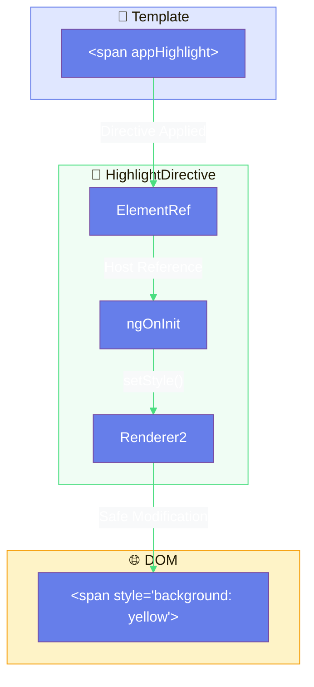
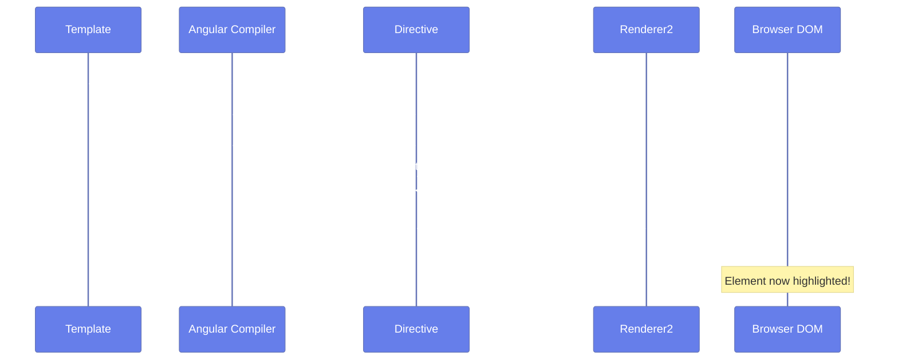
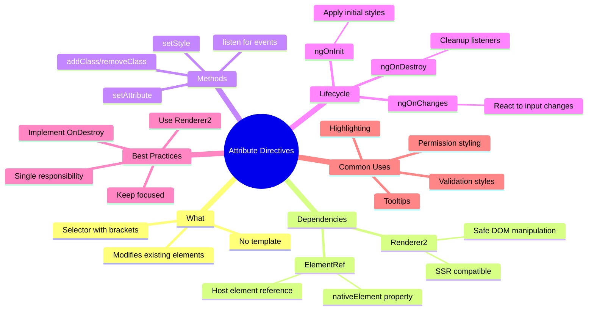

# 🎨 Use Case 1: Basic Attribute Directives

> **💡 Lightbulb Moment**: Attribute directives are like CSS classes with superpowers - they can add behavior, not just style!

---

## 📚 Overview: What is a Directive?

A **Directive** is a class that adds behavior to elements in your Angular applications. Think of them as instructions for the DOM.

### 🏛️ The Three Types of Directives

1.  **Components** (`@Component`)
    *   Directives *with a template*.
    *   The building blocks of your UI.
    *   Example: `<app-header>`, `<user-profile>`

2.  **Attribute Directives** (`@Directive`)
    *   Change the **appearance** or **behavior** of an element, component, or another directive.
    *   They look like HTML attributes.
    *   Example: `[ngClass]`, `[appHighlight]`

3.  **Structural Directives** (`@Directive`)
    *   Change the **DOM layout** by adding and removing DOM elements.
    *   They usually start with a `*` (asterisk).
    *   Example: `*ngIf`, `*ngFor`

### 🛠️ Built-in Directives (The Toolkit)

Angular comes with powerful built-in directives that you use every day:

| Directive | Type | Purpose | Syntax |
|-----------|------|---------|--------|
| **NgIf** | Structural | Conditionally add/remove elements | `*ngIf="condition"` |
| **NgFor** | Structural | Loop through a list | `*ngFor="let item of list"` |
| **NgSwitch** | Structural | Switch between multiple views | `[ngSwitch]="value"` |
| **NgClass** | Attribute | Add/remove CSS classes dynamically | `[ngClass]="{'active': isActive}"` |
| **NgStyle** | Attribute | Set inline styles dynamically | `[ngStyle]="{'color': color}"` |
| **NgModel** | Attribute | Two-way data binding (Forms) | `[(ngModel)]="name"` |

---

## 1. 🔍 How It Works (The Concept)

### Core Mechanism

An **Attribute Directive** is a class that modifies the appearance or behavior of a DOM element. Unlike components, directives don't have templates - they work on existing elements.

| Aspect | Component | Directive |
|--------|-----------|-----------|
| Has Template | ✅ Yes | ❌ No |
| Selector | `<app-name>` | `[appName]` |
| Purpose | Create UI | Modify existing UI |
| Example | `<app-button>` | `<button appHighlight>` |

### Default Behavior vs. Directive-Enhanced Behavior

```
DEFAULT BEHAVIOR:
<span>Hello World</span>
→ Plain text, no special styling

DIRECTIVE-ENHANCED:
<span appHighlight>Hello World</span>
→ Yellow background, rounded corners, padding added automatically!
```

### 📊 Directive Data Flow



### Key Dependencies

| Service | Purpose | Why It's Needed |
|---------|---------|-----------------|
| **ElementRef** | Reference to host element | Access the DOM element the directive is on |
| **Renderer2** | Safe DOM manipulation | Platform-agnostic (works with SSR, Web Workers) |

---

## 2. 🚀 Step-by-Step Implementation Guide

### Step 1: Create the Directive Class

```typescript
import { Directive, ElementRef, Renderer2, OnInit, inject } from '@angular/core';

// 🛡️ CRITICAL: The selector MUST be in brackets for attribute directives
@Directive({
    selector: '[appHighlight]',  // ✅ Attribute selector with brackets
    standalone: true              // ✅ Modern Angular 14+ pattern
})
export class HighlightDirective implements OnInit {
    // 🛡️ CRITICAL: Use inject() for dependency injection (modern pattern)
    private el = inject(ElementRef);
    private renderer = inject(Renderer2);

    ngOnInit(): void {
        // 🛡️ CRITICAL: Use Renderer2, NOT direct DOM access
        this.renderer.setStyle(this.el.nativeElement, 'backgroundColor', '#fef3c7');
        this.renderer.setStyle(this.el.nativeElement, 'padding', '0.25rem 0.5rem');
        this.renderer.setStyle(this.el.nativeElement, 'borderRadius', '4px');
    }
}
```

### Step 2: Use in Template (Consumer)

```typescript
// parent.component.ts
@Component({
    selector: 'app-parent',
    standalone: true,
    imports: [HighlightDirective],  // 🛡️ CRITICAL: Import the directive!
    template: `
        <!-- ✅ Apply directive as an attribute -->
        <p>This is <span appHighlight>highlighted text</span> in a paragraph.</p>
        
        <!-- ✅ Works on any element -->
        <div appHighlight>Entire div is highlighted!</div>
        <button appHighlight>Highlighted button</button>
    `
})
export class ParentComponent {}
```

### 📊 Implementation Flow



### Step 3: Adding Multiple Effects (Tooltip Example)

```typescript
@Directive({
    selector: '[appTooltip]',
    standalone: true
})
export class TooltipDirective implements OnInit {
    private el = inject(ElementRef);
    private renderer = inject(Renderer2);
    private tooltipEl: HTMLElement | null = null;

    ngOnInit(): void {
        // Set up the host element
        this.renderer.setStyle(this.el.nativeElement, 'position', 'relative');
        this.renderer.setStyle(this.el.nativeElement, 'cursor', 'help');

        // 🛡️ CRITICAL: Use Renderer2.listen() for event handling
        this.renderer.listen(this.el.nativeElement, 'mouseenter', () => this.show());
        this.renderer.listen(this.el.nativeElement, 'mouseleave', () => this.hide());
    }

    private show(): void {
        // Create tooltip element dynamically
        this.tooltipEl = this.renderer.createElement('span');
        const text = this.renderer.createText('Tooltip!');
        this.renderer.appendChild(this.tooltipEl, text);
        
        // Style the tooltip
        this.renderer.setStyle(this.tooltipEl, 'position', 'absolute');
        this.renderer.setStyle(this.tooltipEl, 'top', '-30px');
        this.renderer.setStyle(this.tooltipEl, 'backgroundColor', '#1a1a2e');
        this.renderer.setStyle(this.tooltipEl, 'color', 'white');
        this.renderer.setStyle(this.tooltipEl, 'padding', '4px 8px');
        this.renderer.setStyle(this.tooltipEl, 'borderRadius', '4px');
        
        this.renderer.appendChild(this.el.nativeElement, this.tooltipEl);
    }

    private hide(): void {
        if (this.tooltipEl) {
            this.renderer.removeChild(this.el.nativeElement, this.tooltipEl);
            this.tooltipEl = null;
        }
    }
}
```

---

## 3. 🐛 Common Pitfalls & Debugging

### ❌ Bad Example: Direct DOM Manipulation

```typescript
@Directive({ selector: '[appBadHighlight]' })
export class BadHighlightDirective implements OnInit {
    constructor(private el: ElementRef) {}

    ngOnInit(): void {
        // ❌ BAD: Direct DOM access
        this.el.nativeElement.style.backgroundColor = 'yellow';
        this.el.nativeElement.style.padding = '4px';
        
        // ❌ BAD: Direct event listener
        this.el.nativeElement.addEventListener('click', () => {
            console.log('clicked');
        });
    }
}
```

**Why This Fails:**
1. **SSR Incompatible**: `nativeElement` doesn't exist on the server
2. **Web Worker Breaking**: No DOM in web workers
3. **XSS Vulnerability**: Direct DOM access can introduce security risks
4. **Memory Leaks**: Event listeners not cleaned up properly

### ✅ Good Example: Using Renderer2

```typescript
@Directive({ selector: '[appGoodHighlight]' })
export class GoodHighlightDirective implements OnInit, OnDestroy {
    private el = inject(ElementRef);
    private renderer = inject(Renderer2);
    private unlistenClick: (() => void) | null = null;

    ngOnInit(): void {
        // ✅ GOOD: Platform-agnostic styling
        this.renderer.setStyle(this.el.nativeElement, 'backgroundColor', 'yellow');
        this.renderer.setStyle(this.el.nativeElement, 'padding', '4px');
        
        // ✅ GOOD: Renderer2 for events (returns cleanup function)
        this.unlistenClick = this.renderer.listen(
            this.el.nativeElement, 
            'click', 
            () => console.log('clicked')
        );
    }

    ngOnDestroy(): void {
        // ✅ GOOD: Proper cleanup
        if (this.unlistenClick) {
            this.unlistenClick();
        }
    }
}
```

### Common Mistakes Table

| Mistake | Symptom | Fix |
|---------|---------|-----|
| Missing `[]` in selector | Directive never applies | `selector: '[appName]'` |
| Forgot to import | Template error | Add to `imports: []` |
| Direct DOM access | SSR crashes | Use `Renderer2` |
| No cleanup | Memory leaks | Implement `OnDestroy` |

---

## 4. ⚡ Performance & Architecture

### Performance Benefits

```
OPERATION COST COMPARISON:

Direct DOM (bad):
→ Style change: O(1) but bypasses Angular change detection
→ Risk of layout thrashing
→ Not tree-shakeable

Renderer2 (good):
→ Style change: O(1) with Angular integration
→ Batched updates
→ Tree-shakeable, only includes what's used
```

### Architecture: Smart vs. Dumb Pattern

```
┌─────────────────────────────────────────────────────────┐
│                    SMART COMPONENT                       │
│    (Contains business logic, data fetching)             │
│                                                         │
│    ┌───────────────────────────────────────────────┐   │
│    │          DUMB COMPONENT                        │   │
│    │    (Pure presentation, no side effects)        │   │
│    │                                                │   │
│    │    ┌─────────────────────────────────────┐    │   │
│    │    │     ATTRIBUTE DIRECTIVES            │    │   │
│    │    │   (Reusable behavior/styling)       │    │   │
│    │    │   appHighlight, appTooltip          │    │   │
│    │    └─────────────────────────────────────┘    │   │
│    │                                                │   │
│    └───────────────────────────────────────────────┘   │
│                                                         │
└─────────────────────────────────────────────────────────┘
```

**Key Architectural Benefits:**
- **Reusability**: One directive, used across entire app
- **Separation of Concerns**: Styling logic separate from component logic
- **Testability**: Directives can be unit tested in isolation

---

## 5. 🌍 Real World Use Cases

### 1. 📊 Data Grid Cell Highlighting

```typescript
// Highlight cells based on values
<td [appConditionalHighlight]="cell.value > 100" 
    highlightColor="green">
    {{ cell.value }}
</td>
```

### 2. 🔒 Permission-Based Styling

```typescript
// Gray out elements user can't access
<button appPermissionStyle="admin">
    Admin Actions
</button>
```

### 3. 💡 Form Field Validation Indicators

```typescript
// Add visual indicators for validation
<input appValidationStyle 
       [formControl]="email">
```

---

## 🏷️ Name Tag Analogy (Easy to Remember!)

Think of attribute directives like **name tags at a conference**:

| Concept | Name Tag Analogy | Memory Trick |
|---------|-----------------|--------------|
| **Directive** | 🏷️ **Name Tag**: A sticky label you attach to someone | **"Attach behavior"** |
| **Host Element** | 🧑 **Person**: The one wearing the tag | **"The target"** |
| **ElementRef** | 👆 **Pointing at them**: "This person right here" | **"Element reference"** |
| **Renderer2** | ✍️ **Safely writing on tag**: Won't damage the person | **"Safe manipulation"** |
| **Multiple Directives** | 🏷️🏷️ **Multiple badges**: VIP + Speaker + Sponsor | **"Stack behavior"** |

### 📖 Story to Remember:

> 🏷️ **The Conference Badge System**
>
> You're at a tech conference:
>
> **The Element (Person):**
> ```html
> <div>Regular attendee</div>  ← Just a person in the crowd
> ```
>
> **Add VIP Badge (Directive):**
> ```html
> <div appVIP>Now they're a VIP!</div>
> ↓
> 🏷️ Badge applied
> → Gold border appears
> → Special treatment enabled
> → Front-row access granted
> ```
>
> **Add Multiple Badges:**
> ```html
> <div appVIP appSpeaker appSponsor>Triple badge!</div>
> ```
>
> **The person doesn't change. The BADGES add superpowers!**

### 🎯 Quick Reference:
```
🏷️ Directive      = Attachable badge (adds behavior)
🧑 Host Element   = Person wearing it (existing element)  
👆 ElementRef     = "This person" (element reference)
✍️ Renderer2      = Write safely (platform-safe changes)
```

---

## 7. ❓ Interview & Concept Questions

### Core Concepts

**Q1: What is the difference between a Component and a Directive?**
> A: Components have templates and create new UI elements. Directives modify existing elements - they add behavior without creating new DOM structures. Components are technically directives with templates.

**Q2: Why must attribute directive selectors use brackets `[]`?**
> A: Brackets denote an attribute selector in CSS/Angular. Without brackets, Angular looks for an element `<appHighlight>` instead of an attribute `[appHighlight]`.

### Debugging

**Q3: Your directive works locally but crashes in SSR. Why?**
> A: You're likely using direct DOM access (`this.el.nativeElement.style`). Use `Renderer2` instead, which provides platform-agnostic DOM manipulation.

**Q4: How do you debug when a directive doesn't apply?**
> A: Check: 1) Selector has brackets, 2) Directive is imported in component, 3) No typos in attribute name, 4) Element exists when directive runs.

### Implementation

**Q5: How do you inject dependencies in modern Angular directives?**
> A: Use the `inject()` function: `private el = inject(ElementRef)`. This is preferred over constructor injection in Angular 14+.

**Q6: How do you add event listeners in a directive?**
> A: Use `Renderer2.listen()` which returns an unsubscribe function, or use `@HostListener` decorator for cleaner syntax.

### Performance

**Q7: What's the performance difference between direct DOM and Renderer2?**
> A: Both are O(1) for individual operations, but Renderer2 integrates with Angular's change detection, allows batching, and is tree-shakeable. Direct DOM can cause layout thrashing.

### Architecture

**Q8: When should you use a directive vs. a component?**
> A: Use directives for cross-cutting concerns (highlighting, validation styles, tooltips). Use components for distinct UI pieces with their own templates.

### Scenario Based

**Q9: You need to add a loading spinner overlay to any element. Directive or Component?**
> A: Directive! `<div appLoadingOverlay [isLoading]="loading">` - it modifies existing elements without requiring template changes.

**Q10: You need to style form inputs based on validation state across 50 forms. Solution?**
> A: Create `appValidationStyle` directive that reads validation state and applies appropriate classes. Import once, use everywhere.

---

## 🧠 Mind Map



---

## 📚 Quick Reference

```typescript
// Minimal directive template
@Directive({
    selector: '[appName]',
    standalone: true
})
export class NameDirective {
    private el = inject(ElementRef);
    private renderer = inject(Renderer2);
    
    // Style: renderer.setStyle(el, 'property', 'value')
    // Class: renderer.addClass(el, 'className')
    // Attr:  renderer.setAttribute(el, 'attr', 'value')
    // Event: renderer.listen(el, 'click', handler)
}
```

---

## 🎯 What Problem Does This Solve?

### The Problem: Duplicated Behavior Logic Across Components

**Without Directives (BAD):**
```typescript
// Component A
@Component({...})
export class CardComponent {
    highlight() {
        this.element.style.backgroundColor = 'yellow';
        this.element.style.padding = '4px';
        this.element.style.borderRadius = '4px';
    }
}

// Component B - SAME CODE AGAIN!
@Component({...})
export class MenuItemComponent {
    highlight() {
        this.element.style.backgroundColor = 'yellow';
        this.element.style.padding = '4px';
        this.element.style.borderRadius = '4px';
    }
}

// Component C - YET AGAIN!
// ... and so on across 50 components
```

**Problems:**
1. **Code duplication**: Same logic in multiple places
2. **Hard to maintain**: Change highlight = update 50 files
3. **Inconsistency**: Different implementations across components
4. **Not reusable**: Logic locked inside components

### How Directives Solve This

**With Directives (GOOD):**
```typescript
// ONE directive, used EVERYWHERE
@Directive({ selector: '[appHighlight]' })
export class HighlightDirective {
    ngOnInit() {
        this.renderer.setStyle(this.el.nativeElement, 'backgroundColor', 'yellow');
        this.renderer.setStyle(this.el.nativeElement, 'padding', '4px');
        this.renderer.setStyle(this.el.nativeElement, 'borderRadius', '4px');
    }
}

// Component A
<div appHighlight>Card content</div>

// Component B
<span appHighlight>Menu item</span>

// Component C, D, E... - one import, done!
```

| Problem | Directive Solution |
|---------|-------------------|
| Code duplication | **Single source**: One directive, reused everywhere |
| Hard to maintain | **Centralized**: Update once, applies everywhere |
| Inconsistency | **Uniform**: Same behavior guaranteed |
| Not reusable | **Highly reusable**: Import and apply to any element |

---

## 📚 Key Classes & Types Explained

### 1. `@Directive()` Decorator

```typescript
@Directive({
    selector: '[appHighlight]',  // Attribute selector (brackets!)
    standalone: true,            // Modern Angular 14+ pattern
    host: { 'class': 'highlighted' }  // Static host binding
})
export class HighlightDirective { }
```

**Metadata Options:**
| Property | Purpose |
|----------|---------|
| `selector` | CSS selector to match elements |
| `standalone` | No NgModule required |
| `host` | Static host element properties |
| `providers` | Directive-scoped services |

---

### 2. `ElementRef` Service

```typescript
private el = inject(ElementRef);

// Access the native DOM element
const nativeEl = this.el.nativeElement;
console.log(nativeEl.tagName);  // 'DIV', 'SPAN', etc.
```

**Purpose**: Reference to the host element the directive is attached to.

**Warning**: Direct access to `nativeElement` should be avoided for SSR compatibility.

---

### 3. `Renderer2` Service

```typescript
private renderer = inject(Renderer2);

// Safe DOM manipulation methods
this.renderer.setStyle(el, 'color', 'red');
this.renderer.addClass(el, 'active');
this.renderer.setAttribute(el, 'aria-label', 'text');
this.renderer.listen(el, 'click', () => { });
this.renderer.createElement('div');
this.renderer.appendChild(parent, child);
```

**Key Methods:**
| Method | Purpose |
|--------|---------|
| `setStyle(el, style, value)` | Set inline style |
| `removeStyle(el, style)` | Remove inline style |
| `addClass(el, className)` | Add CSS class |
| `removeClass(el, className)` | Remove CSS class |
| `setAttribute(el, name, value)` | Set attribute |
| `removeAttribute(el, name)` | Remove attribute |
| `listen(el, event, callback)` | Add event listener |
| `createElement(tag)` | Create new element |
| `appendChild(parent, child)` | Append child to parent |

---

### 4. `@HostListener` Decorator

```typescript
@HostListener('mouseenter')
onMouseEnter() {
    this.highlight('yellow');
}

@HostListener('click', ['$event'])
onClick(event: MouseEvent) {
    console.log('Clicked at:', event.clientX, event.clientY);
}
```

**Purpose**: Listen to host element events declaratively.

---

### 5. `@HostBinding` Decorator

```typescript
@HostBinding('class.active')
isActive = false;

@HostBinding('style.backgroundColor')
bgColor = 'transparent';

@HostBinding('attr.aria-expanded')
expanded = false;
```

**Purpose**: Bind directive properties to host element properties.

---

## ❓ Complete Interview Questions (25+)

### Basic Conceptual Questions

**Q11: What is an attribute directive?**
> A: A class that modifies the behavior or appearance of an existing DOM element without creating new elements.

**Q12: How do you create a custom directive?**
> A: Use `@Directive({ selector: '[appName]' })` with the selector in brackets.

**Q13: Why use brackets in the selector?**
> A: Brackets denote an attribute selector. Without them, Angular looks for an element tag.

**Q14: What's the difference between attribute and structural directives?**
> A: Attribute directives modify elements; structural directives (`*ngIf`, `*ngFor`) add/remove elements from the DOM.

**Q15: What dependency is needed to safely modify the DOM?**
> A: `Renderer2` for platform-agnostic, SSR-safe DOM manipulation.

---

### Implementation Questions

**Q16: How do you apply styles to the host element?**
> A: `this.renderer.setStyle(this.el.nativeElement, 'color', 'red')` or `@HostBinding('style.color')`.

**Q17: How do you add/remove CSS classes?**
> A: `this.renderer.addClass(el, 'className')` / `removeClass()` or `@HostBinding('class.active')`.

**Q18: How do you listen to host events?**
> A: `@HostListener('click')` decorator or `this.renderer.listen(el, 'click', handler)`.

**Q19: How do you clean up event listeners?**
> A: `renderer.listen()` returns an unsubscribe function. Call it in `ngOnDestroy`.

**Q20: Can you inject services into directives?**
> A: Yes! Use `inject(ServiceName)` just like in components.

---

### Advanced Questions

**Q21: How do you pass inputs to a directive?**
> A:
> ```typescript
> @Input() appHighlight: string = 'yellow';
> // Usage: <div [appHighlight]="'red'">
> ```

**Q22: Can a directive have outputs?**
> A: Yes! Use `@Output()` to emit events:
> ```typescript
> @Output() highlighted = new EventEmitter<boolean>();
> ```

**Q23: How do you access the host component from a directive?**
> A: Inject the component type:
> ```typescript
> constructor(@Optional() private host: HostComponent) { }
> ```

**Q24: Can multiple directives be applied to one element?**
> A: Yes! `<div appHighlight appTooltip appDraggable>` all apply.

**Q25: How do directives interact with each other?**
> A: They can inject each other or share a host component. Use `@Host()` modifier.

---

### Scenario Questions

**Q26: Create a directive that tracks element visibility.**
> A: Use Intersection Observer:
> ```typescript
> @Directive({ selector: '[appTrackVisible]' })
> export class TrackVisibleDirective implements OnInit {
>     @Output() visible = new EventEmitter<boolean>();
>     
>     ngOnInit() {
>         const observer = new IntersectionObserver(entries => {
>             this.visible.emit(entries[0].isIntersecting);
>         });
>         observer.observe(this.el.nativeElement);
>     }
> }
> ```

**Q27: Build a directive that copies text to clipboard on click.**
> A:
> ```typescript
> @Directive({ selector: '[appCopyToClipboard]' })
> export class CopyDirective {
>     @Input() appCopyToClipboard: string = '';
>     
>     @HostListener('click')
>     onClick() {
>         navigator.clipboard.writeText(this.appCopyToClipboard);
>     }
> }
> ```

**Q28: Create a directive that prevents form submission on Enter key.**
> A:
> ```typescript
> @Directive({ selector: '[appPreventEnterSubmit]' })
> export class PreventEnterDirective {
>     @HostListener('keydown.enter', ['$event'])
>     onEnter(event: KeyboardEvent) {
>         event.preventDefault();
>     }
> }
> ```

---

### Debugging Questions

**Q29: Directive doesn't apply - what do you check?**
> A: 1) Brackets in selector, 2) Import in component, 3) Spelling, 4) Element exists when directive runs.

**Q30: Directive works locally but fails in SSR - why?**
> A: Using direct DOM access. Switch to `Renderer2`.

**Q31: Event listeners causing memory leaks - how to fix?**
> A: Store the unsubscribe function and call it in ngOnDestroy.

---

### Best Practice Questions

**Q32: When should you use a directive vs CSS?**
> A: Use directives when you need:
> - Dynamic behavior based on inputs
> - Event handling
> - Logic that can't be expressed in CSS

**Q33: How do you test a directive?**
> A: Create a test host component, apply the directive, and assert the expected DOM changes:
> ```typescript
> @Component({ template: '<div appHighlight>Test</div>' })
> class TestComponent { }
> ```

**Q34: Should directives have complex logic?**
> A: No! Keep directives focused on one concern. Complex logic belongs in services.

**Q35: How do you share state between directive instances?**
> A: Inject a shared service that holds the state.

