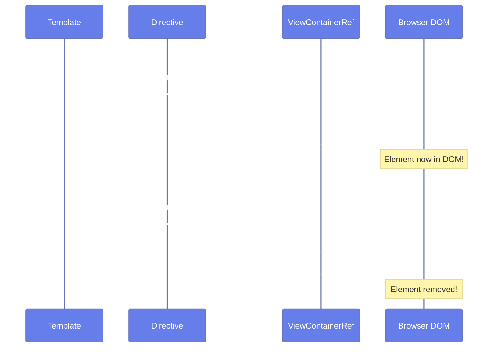
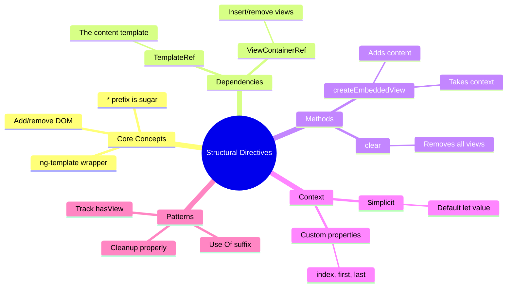

# 🔧 Use Case 5: Structural Directive Basics

> **💡 Lightbulb Moment**: Structural directives like *ngIf don't just "hide" elements - they physically add or remove them from the DOM!

---


## 1. 🔍 How It Works (The Concept)

### Core Mechanism

**Structural Directives** change the **DOM structure** by adding or removing elements. They're recognized by the `*` prefix in templates.

| Attribute Directive | Structural Directive |
|--------------------|--------------------|
| Modifies appearance | Modifies structure |
| Element always exists | Element added/removed |
| `[appHighlight]` | `*ngIf`, `*ngFor` |
| Uses ElementRef | Uses TemplateRef + ViewContainerRef |

### The * Prefix Magic

The `*` is **syntactic sugar** that Angular expands:

```html
<!-- What you write -->
<div *ngIf="show">Hello</div>

<!-- What Angular sees -->
<ng-template [ngIf]="show">
    <div>Hello</div>
</ng-template>
```

### 📊 Structural Directive Architecture

```mermaid
%%{init: {'theme': 'base', 'themeVariables': { 'primaryColor': '#667eea', 'primaryTextColor': '#fff', 'lineColor': '#4ade80'}}}%%
flowchart TB
    subgraph Template["📄 *appIf='condition'"]
        A["Syntactic Sugar"]
    end
    
    subgraph Expanded["📦 Expanded Form"]
        B["ng-template"]
        C["[appIf]='condition'"]
        D["Content inside"]
    end
    
    subgraph Directive["🎯 Directive"]
        E["TemplateRef"]
        F["ViewContainerRef"]
        G["condition ? create : clear"]
    end
    
    subgraph DOM["🌐 Result"]
        H["Content rendered"]
        I["or nothing"]
    end
    
    A -->|"Desugars to"| B
    B --> C
    B --> D
    C --> E
    E --> G
    F --> G
    G -->|"createEmbeddedView"| H
    G -->|"clear()"| I
    
    style Template fill:#e0e7ff,stroke:#667eea
    style Expanded fill:#f0fdf4,stroke:#4ade80
    style Directive fill:#fef3c7,stroke:#f59e0b
    style DOM fill:#fee2e2,stroke:#ef4444
```



### Key Dependencies

| Service | Purpose |
|---------|---------|
| **TemplateRef** | Reference to the content template |
| **ViewContainerRef** | Container where views are inserted |

---

## 2. 🚀 Step-by-Step Implementation Guide

### Step 1: Custom *appIf Directive

```typescript
import { Directive, Input, TemplateRef, ViewContainerRef, inject, OnChanges, SimpleChanges } from '@angular/core';

@Directive({
    selector: '[appIf]',
    standalone: true
})
export class AppIfDirective implements OnChanges {
    // 🛡️ CRITICAL: TemplateRef is the content wrapped by the directive
    private templateRef = inject(TemplateRef<any>);
    
    // 🛡️ CRITICAL: ViewContainerRef is where we insert/remove views
    private viewContainer = inject(ViewContainerRef);
    
    private hasView = false;

    @Input() appIf = false;

    ngOnChanges(changes: SimpleChanges): void {
        if (changes['appIf']) {
            this.updateView();
        }
    }

    private updateView(): void {
        if (this.appIf && !this.hasView) {
            // 🛡️ CRITICAL: Create the view when condition is true
            this.viewContainer.createEmbeddedView(this.templateRef);
            this.hasView = true;
        } else if (!this.appIf && this.hasView) {
            // 🛡️ CRITICAL: Clear the container when condition is false
            this.viewContainer.clear();
            this.hasView = false;
        }
    }
}
```

### Step 2: Usage in Template

```html
<!-- Toggle visibility with *appIf -->
<div *appIf="isVisible">
    This content is conditionally rendered!
</div>

<!-- With else-like behavior (two directives) -->
<div *appIf="isLoggedIn">Welcome, User!</div>
<div *appIf="!isLoggedIn">Please log in</div>
```

### 📊 createEmbeddedView Flow



### Step 3: Custom *appUnless (Opposite of *ngIf)

```typescript
@Directive({
    selector: '[appUnless]',
    standalone: true
})
export class AppUnlessDirective implements OnChanges {
    private templateRef = inject(TemplateRef<any>);
    private viewContainer = inject(ViewContainerRef);
    private hasView = false;

    @Input() appUnless = false;

    ngOnChanges(changes: SimpleChanges): void {
        if (changes['appUnless']) {
            // 🛡️ CRITICAL: Opposite logic - show when FALSE
            if (!this.appUnless && !this.hasView) {
                this.viewContainer.createEmbeddedView(this.templateRef);
                this.hasView = true;
            } else if (this.appUnless && this.hasView) {
                this.viewContainer.clear();
                this.hasView = false;
            }
        }
    }
}
```

```html
<!-- Shows when condition is FALSE -->
<div *appUnless="isLoading">
    Content loaded!
</div>
```

### Step 4: Custom *appFor with Context

```typescript
@Directive({
    selector: '[appFor]',
    standalone: true
})
export class AppForDirective implements OnChanges {
    private templateRef = inject(TemplateRef<any>);
    private viewContainer = inject(ViewContainerRef);

    // 🛡️ CRITICAL: "Of" suffix enables "let item of items" syntax
    @Input() appForOf: any[] = [];

    ngOnChanges(changes: SimpleChanges): void {
        if (changes['appForOf']) {
            // Clear existing views
            this.viewContainer.clear();

            // Create view for each item with context
            this.appForOf?.forEach((item, index) => {
                // 🛡️ CRITICAL: Context object makes variables available
                this.viewContainer.createEmbeddedView(this.templateRef, {
                    $implicit: item,    // Available as "let item"
                    index: index,       // Available as "let i = index"
                    count: this.appForOf.length,
                    first: index === 0,
                    last: index === this.appForOf.length - 1,
                    even: index % 2 === 0,
                    odd: index % 2 !== 0
                });
            });
        }
    }
}
```

```html
<!-- Usage with context variables -->
<div *appFor="let item of items; let i = index; let isFirst = first; let isLast = last">
    {{ i + 1 }}. {{ item }}
    <span *ngIf="isFirst">(First!)</span>
    <span *ngIf="isLast">(Last!)</span>
</div>
```

### 📊 Context Object Diagram

```mermaid
%%{init: {'theme': 'base', 'themeVariables': { 'primaryColor': '#667eea'}}}%%
flowchart LR
    subgraph Context["📦 Context Object"]
        A["$implicit: item"]
        B["index: 0"]
        C["first: true"]
        D["last: false"]
        E["even: true"]
    end
    
    subgraph Template["📄 Template Variables"]
        F["let item"]
        G["let i = index"]
        H["let isFirst = first"]
        I["let isLast = last"]
        J["let isEven = even"]
    end
    
    A -->|"Default"| F
    B -->|"Named"| G
    C --> H
    D --> I
    E --> J
    
    style Context fill:#e0e7ff,stroke:#667eea
    style Template fill:#f0fdf4,stroke:#4ade80
```



---

## 3. 🐛 Common Pitfalls & Debugging

### ❌ Bad Example: Not Tracking View State

```typescript
@Directive({ selector: '[appBadIf]' })
export class BadIfDirective implements OnChanges {
    @Input() appBadIf = false;

    ngOnChanges(): void {
        if (this.appBadIf) {
            // ❌ BAD: Creates duplicate views on every true!
            this.viewContainer.createEmbeddedView(this.templateRef);
        } else {
            this.viewContainer.clear();
        }
    }
}
```

**Why This Fails:**
- If `appBadIf` is true on multiple change detection cycles, it creates **duplicate elements**
- No tracking of whether view already exists
- Results in memory leaks and DOM pollution

### ✅ Good Example: Tracking View State

```typescript
@Directive({ selector: '[appGoodIf]' })
export class GoodIfDirective implements OnChanges {
    private hasView = false;  // 🛡️ Track state!

    @Input() appGoodIf = false;

    ngOnChanges(): void {
        if (this.appGoodIf && !this.hasView) {
            // ✅ Only create if doesn't exist
            this.viewContainer.createEmbeddedView(this.templateRef);
            this.hasView = true;
        } else if (!this.appGoodIf && this.hasView) {
            // ✅ Only clear if exists
            this.viewContainer.clear();
            this.hasView = false;
        }
    }
}
```

### ❌ Bad: Wrong Input Name for Microsyntax

```typescript
// ❌ BAD: "Of" suffix missing
@Input() appFor: any[] = [];  // Won't work with "let x of items"

// ✅ GOOD: "Of" suffix enables microsyntax
@Input() appForOf: any[] = [];  // Works with "let x of items"
```

---

## 4. ⚡ Performance & Architecture

### Performance: *ngIf vs [hidden]

```
*ngIf (Structural):
→ Adds/removes from DOM
→ Component destroyed/recreated
→ ngOnInit runs again
→ Better for heavy components rarely shown

[hidden] (Attribute):
→ Element stays in DOM (display: none)
→ Component stays alive
→ Faster toggle
→ Better for frequently toggled simple content

RULE OF THUMB:
Heavy/Rare → *ngIf
Light/Frequent → [hidden]
```

### Memory Management

```typescript
// Structural directives automatically handle cleanup
// When view is cleared, Angular:
// 1. Calls ngOnDestroy on child components
// 2. Removes event listeners
// 3. Cleans up subscriptions (with async pipe)
// 4. Removes DOM elements
```

---

## 5. 🌍 Real World Use Cases

### 1. 🔐 Feature Flags

```typescript
<div *appFeatureFlag="'newDashboard'">
    New dashboard content
</div>
```

### 2. 📊 Loading Skeletons

```typescript
<div *appLoading="isLoading; else content">
    Loading skeleton...
</div>
<ng-template #content>Actual content</ng-template>
```

### 3. 📋 Permission-Based Rendering

```typescript
<button *appPermission="'admin'">
    Delete User
</button>
```

---

## 🏨 Hotel Room Analogy (Easy to Remember!)

Think of structural directives like **hotel rooms**:

| Concept | Hotel Analogy | Memory Trick |
|---------|--------------|--------------| 
| ***ngIf="true"** | 🏨 **Room exists**: Fully built, furnished, guest is here | **"DOM created"** |
| ***ngIf="false"** | 🚧 **Room demolished**: No walls, no furniture, nothing | **"DOM destroyed"** |
| **[hidden]** | 🌑 **Lights off**: Room exists but dark | **"CSS hidden"** |
| **TemplateRef** | 📋 **Blueprint**: Instructions to build the room | **"Content template"** |
| **ViewContainerRef** | 🏗️ **Construction site**: Where rooms get built | **"Insert point"** |

### 📖 Story to Remember:

> 🏨 **The Angular Hotel**
>
> Your DOM is a hotel:
>
> **Structural (*ngIf):**
> ```
> *ngIf="hasReservation"
> 
> true  → 🏨 Build room, furnish it, welcome guest
>          (createEmbeddedView → ngOnInit runs)
> 
> false → 🚧 Demolish room, evict guest
>          (clear() → ngOnDestroy runs)
> ```
>
> **Attribute ([hidden]):**
> ```
> [hidden]="!hasReservation"
> 
> true  → 🌑 Turn off lights (guest stays, room exists)
> false → 🌞 Turn on lights (guest always there)
> ```
>
> **When to use which:**
> ```
> Heavy room (fancy suite) → *ngIf (demolish when empty)
> Light room (simple bed)  → [hidden] (just turn off lights)
> ```

### 🎯 Quick Reference:
```
🏨 *ngIf true    = Room built (component created)
🚧 *ngIf false   = Room demolished (component destroyed)
🌑 [hidden]      = Lights off (component alive, hidden)
📋 TemplateRef   = Blueprint (what to build)
🏗️ ViewContainer = Construction site (where to build)
```

---

## 7. ❓ Interview & Concept Questions

### Core Concepts

**Q1: What is the difference between *ngIf and [hidden]?**
> A: *ngIf adds/removes elements from DOM (destroys components). [hidden] keeps element in DOM but hides it with CSS (components stay alive).

**Q2: What does the * prefix actually do?**
> A: It's syntactic sugar. Angular unwraps `*appIf="x"` into `<ng-template [appIf]="x">...</ng-template>`.

### Debugging

**Q3: Your structural directive creates duplicate elements. Why?**
> A: You're not tracking view state. Add a `hasView` flag and only createEmbeddedView when `!hasView`.

**Q4: "let item of items" syntax isn't working. What's wrong?**
> A: Your input needs the "Of" suffix: `@Input() appForOf` not `@Input() appFor`.

### Implementation

**Q5: How do you pass context variables like index to the template?**
> A: Second parameter of createEmbeddedView: `{ $implicit: item, index: i }`. Use `let i = index` in template.

**Q6: What is $implicit in context?**
> A: The default value when using `let item` without assignment. `$implicit: 'hello'` makes `let x` equals 'hello'.

### Performance

**Q7: When is *ngIf better than [hidden] for performance?**
> A: For heavy components that are rarely shown. *ngIf destroys the component, freeing memory. [hidden] keeps it alive.

### Scenario Based

**Q8: Design a *appRepeat directive that repeats content N times.**
> A: Loop from 0 to N, calling createEmbeddedView each time with context `{ $implicit: i + 1, index: i }`.

**Q9: How would you implement *appIf with else template support?**
> A: Add `@Input() appIfElse: TemplateRef`. When condition is false, render elseTemplate instead of clearing.

---

## 🧠 Mind Map


