# 🔁 Use Case 6: Custom Structural Directives

> **💡 Lightbulb Moment**: With custom structural directives, you can create ANY control flow pattern - repeat N times, declare variables, generate ranges - the possibilities are endless!

---

## 1. 🔍 How It Works (The Concept)

### Core Mechanism

Custom structural directives extend beyond `*ngIf` and `*ngFor` to create **specialized control flow patterns**. The key is understanding **microsyntax** and **context variables**.

| Built-in | Custom Alternative |
|----------|-------------------|
| `*ngIf="x"` | `*appIf="x"` |
| `*ngFor="let i of items"` | `*appRepeat="5; let n"` |
| N/A | `*appLet="expr as var"` |
| N/A | `*appRange="1 to 10"` |

### Microsyntax Parsing

Angular parses `*` syntax into template inputs:

```html
<!-- Microsyntax -->
*appFor="let item of items; let i = index"

<!-- Becomes inputs -->
[appForOf]="items"        <!-- "Of" suffix from "of" keyword -->
<!-- Context provides: $implicit (item), index (i) -->
```

### 📊 Microsyntax Transformation

```mermaid
%%{init: {'theme': 'base', 'themeVariables': { 'primaryColor': '#667eea', 'primaryTextColor': '#fff', 'lineColor': '#4ade80'}}}%%
flowchart TB
    subgraph Input["📝 Microsyntax"]
        A["*appFor='let x of items; let i = index'"]
    end
    
    subgraph Parse["⚙️ Angular Parser"]
        B["Selector: appFor"]
        C["of → appForOf = items"]
        D["let x = $implicit"]
        E["let i = index"]
    end
    
    subgraph Output["📦 Expansion"]
        F["ng-template"]
        G["[appForOf]='items'"]
        H["Context: { $implicit, index }"]
    end
    
    A --> B
    A --> C
    A --> D
    A --> E
    B --> F
    C --> G
    D --> H
    E --> H
    
    style Input fill:#e0e7ff,stroke:#667eea
    style Parse fill:#f0fdf4,stroke:#4ade80
    style Output fill:#fef3c7,stroke:#f59e0b
```



---

## 2. 🚀 Step-by-Step Implementation Guide

### Step 1: *appRepeat - Repeat N Times

```typescript
import { Directive, Input, TemplateRef, ViewContainerRef, inject, OnChanges, SimpleChanges } from '@angular/core';

@Directive({
    selector: '[appRepeat]',
    standalone: true
})
export class AppRepeatDirective implements OnChanges {
    private templateRef = inject(TemplateRef<any>);
    private viewContainer = inject(ViewContainerRef);

    @Input() appRepeat = 0;  // Number of times to repeat

    ngOnChanges(changes: SimpleChanges): void {
        if (changes['appRepeat']) {
            // Clear previous views
            this.viewContainer.clear();
            
            // 🛡️ CRITICAL: Create N views with context
            for (let i = 0; i < this.appRepeat; i++) {
                this.viewContainer.createEmbeddedView(this.templateRef, {
                    $implicit: i + 1,  // 1-indexed for display
                    index: i,          // 0-indexed for logic
                    total: this.appRepeat,
                    first: i === 0,
                    last: i === this.appRepeat - 1
                });
            }
        }
    }
}
```

```html
<!-- Usage: Repeat 5 times -->
<div *appRepeat="5; let num; let i = index; let total = total">
    Item {{ num }} of {{ total }}
</div>

<!-- Creates: -->
<!-- Item 1 of 5 -->
<!-- Item 2 of 5 -->
<!-- Item 3 of 5 -->
<!-- Item 4 of 5 -->
<!-- Item 5 of 5 -->
```

### Step 2: *appLet - Variable Declaration

```typescript
@Directive({
    selector: '[appLet]',
    standalone: true
})
export class AppLetDirective<T> {
    private templateRef = inject(TemplateRef<{ $implicit: T; appLet: T }>);
    private viewContainer = inject(ViewContainerRef);
    private viewRef: any = null;

    @Input()
    set appLet(value: T) {
        if (!this.viewRef) {
            // 🛡️ CRITICAL: Create view once with initial value
            this.viewRef = this.viewContainer.createEmbeddedView(this.templateRef, {
                $implicit: value,
                appLet: value
            });
        } else {
            // 🛡️ CRITICAL: Update context on subsequent changes
            this.viewRef.context.$implicit = value;
            this.viewRef.context.appLet = value;
        }
    }

    // Type guard for template type checking
    static ngTemplateContextGuard<T>(
        dir: AppLetDirective<T>,
        ctx: unknown
    ): ctx is { $implicit: T; appLet: T } {
        return true;
    }
}
```

```html
<!-- Usage: Avoid duplicate async pipe calls -->
<ng-container *appLet="userData$ | async as user">
    <h1>{{ user.name }}</h1>
    <p>{{ user.email }}</p>
    <span>{{ user.role }}</span>
</ng-container>

<!-- Without appLet, you'd need: -->
<!-- (userData$ | async)?.name -->
<!-- (userData$ | async)?.email - subscribes again! -->
```

### 📊 *appLet Flow

```mermaid
%%{init: {'theme': 'base', 'themeVariables': { 'primaryColor': '#667eea'}}}%%
flowchart LR
    subgraph Observable["🔄 Observable"]
        A["userData$"]
    end
    
    subgraph Pipe["⚡ Async Pipe"]
        B["| async"]
    end
    
    subgraph Directive["🎯 *appLet"]
        C["Single subscription"]
        D["Context: { $implicit: user }"]
    end
    
    subgraph Template["📄 Template"]
        E["user.name"]
        F["user.email"]
        G["user.role"]
    end
    
    A --> B
    B -->|"One subscribe"| C
    C --> D
    D --> E
    D --> F
    D --> G
    
    style Observable fill:#fee2e2,stroke:#ef4444
    style Directive fill:#f0fdf4,stroke:#4ade80
    style Template fill:#e0e7ff,stroke:#667eea
```



### Step 3: *appRange - Number Range Generator

```typescript
@Directive({
    selector: '[appRange]',
    standalone: true
})
export class AppRangeDirective implements OnChanges {
    private templateRef = inject(TemplateRef<any>);
    private viewContainer = inject(ViewContainerRef);

    // 🛡️ CRITICAL: Input names match microsyntax keywords
    @Input() appRangeFrom = 1;   // "from" in syntax
    @Input() appRangeTo = 5;     // "to" in syntax
    @Input() appRangeStep = 1;   // "step" in syntax

    ngOnChanges(): void {
        this.viewContainer.clear();
        
        for (let i = this.appRangeFrom; i <= this.appRangeTo; i += this.appRangeStep) {
            this.viewContainer.createEmbeddedView(this.templateRef, {
                $implicit: i,
                first: i === this.appRangeFrom,
                last: i + this.appRangeStep > this.appRangeTo
            });
        }
    }
}
```

```html
<!-- Create 1-10 -->
<span *appRange="let n; from: 1; to: 10">{{ n }} </span>
<!-- Output: 1 2 3 4 5 6 7 8 9 10 -->

<!-- Odd numbers only -->
<span *appRange="let n; from: 1; to: 10; step: 2">{{ n }} </span>
<!-- Output: 1 3 5 7 9 -->
```

### Step 4: Type-Safe Template Context

```typescript
// Define context interface
interface RepeatContext {
    $implicit: number;
    index: number;
    total: number;
    first: boolean;
    last: boolean;
}

@Directive({ selector: '[appTypedRepeat]' })
export class TypedRepeatDirective {
    // 🛡️ CRITICAL: Type guard enables template type checking
    static ngTemplateContextGuard(
        dir: TypedRepeatDirective,
        ctx: unknown
    ): ctx is RepeatContext {
        return true;
    }
}
```

---

## 3. 🐛 Common Pitfalls & Debugging

### ❌ Bad Example: Wrong Input Naming

```typescript
@Directive({ selector: '[appRange]' })
export class BadRangeDirective {
    // ❌ BAD: Won't work with "from: 1" syntax
    @Input() from = 1;
    @Input() to = 5;
}
```

**Why This Fails:**
- Microsyntax `from:` becomes `appRangeFrom`
- Input names must be prefixed with directive selector

### ✅ Good Example: Correct Naming

```typescript
@Directive({ selector: '[appRange]' })
export class GoodRangeDirective {
    // ✅ GOOD: Matches microsyntax transformation
    @Input() appRangeFrom = 1;  // from: 1
    @Input() appRangeTo = 5;    // to: 5
    @Input() appRangeStep = 1;  // step: 1
}
```

### ❌ Bad: Not Clearing Old Views

```typescript
ngOnChanges(): void {
    // ❌ BAD: Creates new views without clearing old ones
    for (let i = 0; i < this.count; i++) {
        this.viewContainer.createEmbeddedView(this.templateRef);
    }
}
```

### ✅ Good: Clear Before Recreating

```typescript
ngOnChanges(): void {
    // ✅ GOOD: Clear first, then create
    this.viewContainer.clear();
    for (let i = 0; i < this.count; i++) {
        this.viewContainer.createEmbeddedView(this.templateRef);
    }
}
```

---

## 4. ⚡ Performance & Architecture

### Performance Optimization

```typescript
// 🚀 OPTIMIZATION: TrackBy equivalent for custom repeat
@Directive({ selector: '[appSmartRepeat]' })
export class SmartRepeatDirective implements OnChanges {
    private views: Map<number, any> = new Map();
    
    @Input() appSmartRepeatOf: any[] = [];
    @Input() appSmartRepeatTrackBy: (item: any) => any = (item) => item;
    
    ngOnChanges(): void {
        const newIds = new Set(this.appSmartRepeatOf.map(this.appSmartRepeatTrackBy));
        
        // Remove old views
        this.views.forEach((view, id) => {
            if (!newIds.has(id)) {
                const index = this.viewContainer.indexOf(view);
                this.viewContainer.remove(index);
                this.views.delete(id);
            }
        });
        
        // Add new views
        this.appSmartRepeatOf.forEach((item, index) => {
            const id = this.appSmartRepeatTrackBy(item);
            if (!this.views.has(id)) {
                const view = this.viewContainer.createEmbeddedView(this.templateRef, {
                    $implicit: item,
                    index
                });
                this.views.set(id, view);
            }
        });
    }
}
```

---

## 5. 🌍 Real World Use Cases

### 1. ⭐ Star Rating Component

```html
<span *appRepeat="5; let star; let i = index">
    <i [class.filled]="i < rating">★</i>
</span>
```

### 2. 📄 Pagination Numbers

```html
<button *appRange="let page; from: 1; to: totalPages">
    {{ page }}
</button>
```

### 3. 🔄 Observable Caching with *appLet

```html
<div *appLet="expensiveComputation$ | async as result">
    Used {{ result }} multiple times without recomputing
</div>
```

---

## 👨‍🍳 Recipe Instructions Analogy (Easy to Remember!)

Think of custom structural directives like **cooking recipe instructions**:

| Directive | Recipe Analogy | Memory Trick |
|-----------|---------------|--------------| 
| ***appRepeat="5"** | 🔄 **"Fold 5 times"**: Repeat the action | **"N iterations"** |
| ***appLet="x as v"** | 📝 **"Call this 'batter'"**: Name something | **"Variable alias"** |
| ***appRange="1 to 10"** | 📊 **"Steps 1-10"**: Numbered sequence | **"Number range"** |
| **Microsyntax** | 📋 **Recipe notation**: Shorthand instructions | **"DSL syntax"** |
| **Context** | 🧾 **Ingredient list**: What's available to use | **"let x = value"** |

### 📖 Story to Remember:

> 👨‍🍳 **Writing Your Cookbook**
>
> You're writing custom recipe instructions:
>
> **Repeat Directive (*appRepeat):**
> ```typescript
> // Recipe: "Fold batter 5 times"
> *appRepeat="5; let n"
> 
> // Like: "Repeat step N times"
> // Creates: Fold 1... Fold 2... Fold 3...
> ```
>
> **Let Directive (*appLet):**
> ```typescript
> // Recipe: "Let's call this mixture 'sauce'"
> *appLet="expensiveComputation$ | async as sauce"
> 
> // Now use 'sauce' multiple times!
> // One computation, many references.
> ```
>
> **Range Directive (*appRange):**
> ```typescript
> // Recipe: "Repeat steps 1 through 10"
> *appRange="let step; from: 1; to: 10"
> 
> // Creates: Step 1... Step 2... Step 10
> ```

### 🎯 Quick Reference:
```
🔄 *appRepeat   = "Fold N times" (repeat)
📝 *appLet      = "Call this X" (alias)
📊 *appRange    = "Steps 1-10" (sequence)
📋 Microsyntax  = Recipe shorthand
🧾 Context      = Ingredients available
```

---

## 7. ❓ Interview & Concept Questions

### Core Concepts

**Q1: How does `*appFor="let x of items"` become `[appForOf]="items"`?**
> A: Angular's microsyntax parser takes the keyword after `of` and appends it to the selector with capital letter: `appFor` + `Of` = `appForOf`.

**Q2: What is `$implicit` in context objects?**
> A: It's the default value assigned when using `let x` without explicit assignment. `{ $implicit: 42 }` means `let x` equals 42.

### Debugging

**Q3: Your `from: 1` syntax doesn't work. What's wrong?**
> A: Input name must be `appRangeFrom` not `from`. Microsyntax prefixes keyword with selector.

### Implementation

**Q4: How do you implement *appLet to avoid multiple async subscriptions?**
> A: Create view once, update context on changes. Single `| async` subscription, value stored in context for reuse.

**Q5: How do you add type checking to template context?**
> A: Implement static `ngTemplateContextGuard` method that returns type predicate.

### Performance

**Q6: How would you optimize a repeat directive for changing data?**
> A: Track views by identity (like trackBy), only add/remove changed items instead of clearing all.

### Scenario Based

**Q7: Design a *appPermission directive that shows content based on user role.**
> A: Inject AuthService, check role on init/change, createEmbeddedView if authorized, clear if not.

**Q8: How would you create a *appDebounce directive that delays rendering?**
> A: Use setTimeout in setter, clear previous timeout on new value, create view after debounce period.

---

## 🧠 Mind Map

```mermaid
mindmap
  root((Custom Structural))
    Directives
      *appRepeat
        Repeat N times
        Context: index, total
      *appLet
        Variable declaration
        Async pipe helper
      *appRange
        Number sequences
        from/to/step
    Microsyntax
      "of" → inputOf
      "from" → inputFrom
      "let x" → $implicit
      "let i = index" → context.index
    Context
      $implicit default
      Named properties
      Type guards
    Best Practices
      Clear before create
      Track views for perf
      Use type guards
      Name inputs correctly
```


