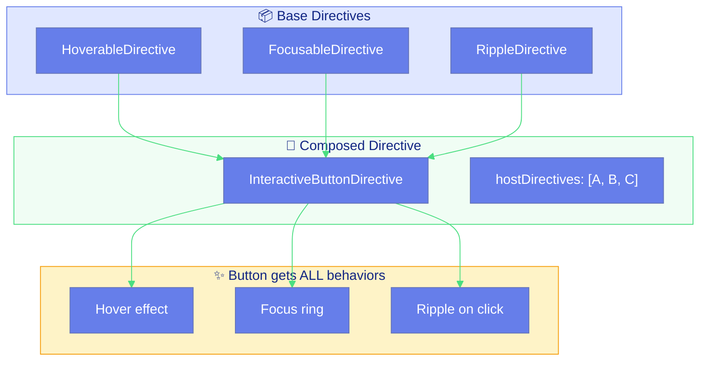
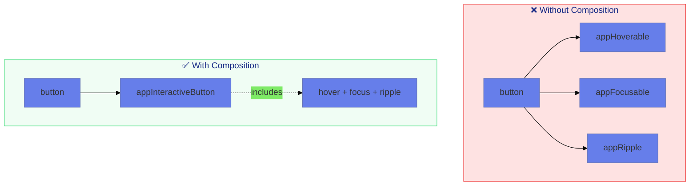
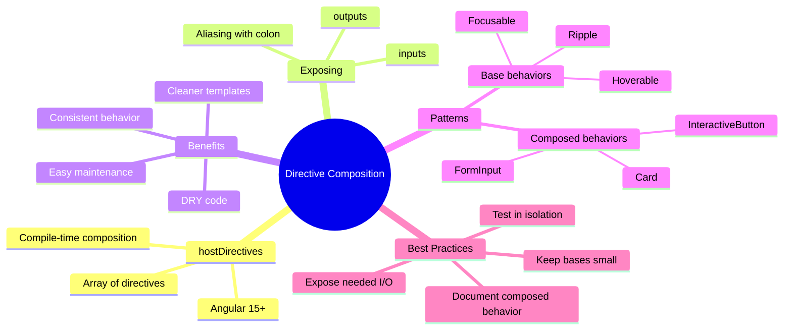

# 🧩 Use Case 7: Directive Composition

> **💡 Lightbulb Moment**: With `hostDirectives` (Angular 15+), you can compose multiple directive behaviors into one - like building with LEGO blocks!

---

## 1. 🔍 How It Works (The Concept)

### Core Mechanism

**Directive Composition** allows you to combine multiple directives into a single directive using the `hostDirectives` property. The composed directive inherits all behaviors.

| Traditional Approach | Composition Approach |
|---------------------|---------------------|
| Multiple attributes | Single attribute |
| `appHover appRipple appFocus` | `appInteractive` |
| Repeated in every template | Defined once |
| Hard to maintain | Easy to update |

### The Power of Composition

```html
<!-- Without composition: Repeat everywhere -->
<button appHoverable appFocusable appRipple>Click</button>
<button appHoverable appFocusable appRipple>Save</button>
<button appHoverable appFocusable appRipple>Delete</button>

<!-- With composition: One directive, all behaviors -->
<button appInteractiveButton>Click</button>
<button appInteractiveButton>Save</button>
<button appInteractiveButton>Delete</button>
```

### 📊 Composition Architecture



---

## 2. 🚀 Step-by-Step Implementation Guide

### Step 1: Create Base Directives

```typescript
// 🔹 Hoverable: Adds hover state tracking
@Directive({
    selector: '[appHoverable]',
    standalone: true
})
export class HoverableDirective {
    @HostBinding('class.hovered') isHovered = false;

    @HostListener('mouseenter')
    onEnter(): void { this.isHovered = true; }

    @HostListener('mouseleave')
    onLeave(): void { this.isHovered = false; }
}

// 🔹 Focusable: Adds focus state tracking
@Directive({
    selector: '[appFocusable]',
    standalone: true
})
export class FocusableDirective {
    @HostBinding('class.focused') isFocused = false;

    @HostListener('focus')
    onFocus(): void { this.isFocused = true; }

    @HostListener('blur')
    onBlur(): void { this.isFocused = false; }
}

// 🔹 Ripple: Adds click ripple effect
@Directive({
    selector: '[appRipple]',
    standalone: true
})
export class RippleDirective {
    private el = inject(ElementRef);
    private renderer = inject(Renderer2);

    @HostListener('click', ['$event'])
    onClick(event: MouseEvent): void {
        const ripple = this.renderer.createElement('span');
        const rect = this.el.nativeElement.getBoundingClientRect();
        
        this.renderer.setStyle(ripple, 'position', 'absolute');
        this.renderer.setStyle(ripple, 'left', `${event.clientX - rect.left}px`);
        this.renderer.setStyle(ripple, 'top', `${event.clientY - rect.top}px`);
        this.renderer.setStyle(ripple, 'background', 'rgba(255,255,255,0.5)');
        this.renderer.setStyle(ripple, 'borderRadius', '50%');
        this.renderer.setStyle(ripple, 'animation', 'ripple 0.6s linear');
        
        this.renderer.appendChild(this.el.nativeElement, ripple);
        setTimeout(() => this.renderer.removeChild(this.el.nativeElement, ripple), 600);
    }
}
```

### Step 2: Create Composed Directive

```typescript
@Directive({
    selector: '[appInteractiveButton]',
    standalone: true,
    // 🛡️ CRITICAL: hostDirectives composes behaviors
    hostDirectives: [
        HoverableDirective,
        FocusableDirective,
        RippleDirective
    ]
})
export class InteractiveButtonDirective implements OnInit {
    private el = inject(ElementRef);
    private renderer = inject(Renderer2);

    ngOnInit(): void {
        // Additional setup specific to this composed directive
        this.renderer.setStyle(this.el.nativeElement, 'position', 'relative');
        this.renderer.setStyle(this.el.nativeElement, 'overflow', 'hidden');
    }
}
```

### Step 3: Usage

```html
<!-- Single attribute, all behaviors included! -->
<button appInteractiveButton class="my-button">
    Click Me
</button>

<style>
    .my-button {
        padding: 1rem 2rem;
        background: #667eea;
        color: white;
        border: none;
        border-radius: 8px;
        cursor: pointer;
        transition: transform 0.2s, box-shadow 0.2s;
    }
    
    .my-button.hovered {
        transform: translateY(-2px);
        box-shadow: 0 4px 12px rgba(102, 126, 234, 0.4);
    }
    
    .my-button.focused {
        outline: 3px solid #4ade80;
        outline-offset: 2px;
    }
</style>
```

### 📊 Composition vs Individual Application



### Step 4: Exposing Inputs and Outputs

```typescript
@Directive({
    selector: '[appConfigurableButton]',
    standalone: true,
    hostDirectives: [
        {
            directive: HoverableDirective,
            // 🛡️ CRITICAL: Expose specific inputs/outputs
            inputs: ['hoverColor'],
            outputs: ['hoverChange']
        },
        {
            directive: RippleDirective,
            inputs: ['rippleColor']
        }
    ]
})
export class ConfigurableButtonDirective {}
```

```html
<!-- Now parent can configure child directive inputs -->
<button appConfigurableButton 
        [hoverColor]="'green'"
        [rippleColor]="'blue'"
        (hoverChange)="onHover($event)">
    Configurable!
</button>
```

### Step 5: Aliasing Inputs

```typescript
@Directive({
    selector: '[appButton]',
    standalone: true,
    hostDirectives: [
        {
            directive: TooltipDirective,
            // 🛡️ CRITICAL: Alias input for cleaner API
            inputs: ['tooltipText: buttonTooltip']  // Expose as buttonTooltip
        }
    ]
})
export class ButtonDirective {
    @Input() variant: 'primary' | 'secondary' = 'primary';
}
```

```html
<!-- Clean API with aliased input -->
<button appButton 
        variant="primary"
        buttonTooltip="Click to submit">
    Submit
</button>
```

---

## 3. 🐛 Common Pitfalls & Debugging

### ❌ Bad Example: Forgetting to Expose Inputs

```typescript
@Directive({
    selector: '[appBadComposed]',
    hostDirectives: [TooltipDirective]  // Has inputs, but not exposed!
})
export class BadComposedDirective {}

// ❌ Template can't access tooltip inputs!
// <div appBadComposed [tooltipText]="'Hi'"> - ERROR!
```

### ✅ Good Example: Exposing Required Inputs

```typescript
@Directive({
    selector: '[appGoodComposed]',
    hostDirectives: [{
        directive: TooltipDirective,
        inputs: ['tooltipText', 'tooltipPosition']  // ✅ Exposed!
    }]
})
export class GoodComposedDirective {}

// ✅ Now works!
// <div appGoodComposed [tooltipText]="'Hi'" tooltipPosition="bottom">
```

### ❌ Bad: Circular Composition

```typescript
// ❌ BAD: Causes infinite loop!
@Directive({
    hostDirectives: [DirectiveB]
})
export class DirectiveA {}

@Directive({
    hostDirectives: [DirectiveA]  // Circular!
})
export class DirectiveB {}
```

---

## 4. ⚡ Performance & Architecture

### Benefits of Composition

```
MAINTAINABILITY:
→ Change base directive: All composed directives update
→ Single source of truth
→ Reduced code duplication

PERFORMANCE:
→ Same as applying individually
→ No runtime overhead
→ Tree-shakeable if base unused elsewhere

TESTABILITY:
→ Test base directives in isolation
→ Test composed directive for integration
→ Mock individual behaviors
```

### Design System Architecture

```
┌──────────────────────────────────────────────────────────┐
│                     DESIGN SYSTEM                         │
│                                                          │
│  ┌────────────────┐  ┌────────────────┐  ┌────────────┐ │
│  │ appHoverable   │  │ appFocusable   │  │ appRipple  │ │
│  └────────────────┘  └────────────────┘  └────────────┘ │
│           │                  │                  │        │
│           └──────────────────┴──────────────────┘        │
│                              │                           │
│                     ┌────────┴────────┐                 │
│                     │ appInteractive   │                 │
│                     └────────┬────────┘                 │
│                              │                           │
│            ┌─────────────────┼─────────────────┐        │
│            │                 │                 │        │
│   ┌────────┴─────┐  ┌───────┴───────┐  ┌─────┴──────┐ │
│   │ appButton    │  │ appCard       │  │ appInput   │ │
│   └──────────────┘  └───────────────┘  └────────────┘ │
│                                                          │
└──────────────────────────────────────────────────────────┘
```

---

## 5. 🌍 Real World Use Cases

### 1. 🎨 Design System Buttons

```typescript
@Directive({
    selector: '[appPrimaryButton]',
    hostDirectives: [InteractiveDirective, TooltipDirective, LoadingDirective]
})
export class PrimaryButtonDirective {}
```

### 2. 📝 Form Controls

```typescript
@Directive({
    selector: '[appFormInput]',
    hostDirectives: [ValidationDirective, FocusDirective, ErrorDisplayDirective]
})
export class FormInputDirective {}
```

### 3. 🃏 Card Components

```typescript
@Directive({
    selector: '[appInteractiveCard]',
    hostDirectives: [HoverableDirective, ClickableDirective, AnimatedDirective]
})
export class InteractiveCardDirective {}
```

---

## 6. 📝 The Analogy

> **🧱 The "LEGO Blocks" Analogy**
>
> Think of directive composition like **LEGO building**:
>
> - **Base directives** = Individual LEGO bricks (hover, focus, ripple)
> - **Composed directive** = A pre-assembled LEGO set
> - **hostDirectives** = The instruction booklet that says "combine these bricks"
>
> Instead of assembling the same bricks every time you build a house,
> you create a "house kit" that includes all the right pieces! 🏠
>
> Now everyone can build a house with one package instead of gathering pieces! 🎁

---

## 7. ❓ Interview & Concept Questions

### Core Concepts

**Q1: What is directive composition and why use it?**
> A: It's combining multiple directives into one using `hostDirectives` (Angular 15+). Use it for DRY code, consistent behavior across components, and cleaner templates.

**Q2: How do you expose child directive inputs to the template?**
> A: Use the `inputs` array in hostDirectives config: `{ directive: X, inputs: ['inputName'] }`.

### Debugging

**Q3: Template can't bind to composed directive's child input. Why?**
> A: Child directive inputs aren't exposed by default. Add them to the `inputs` array in hostDirectives.

### Implementation

**Q4: How do you alias a child directive's input?**
> A: Use colon syntax: `inputs: ['originalName: aliasName']`.

**Q5: Can you access composed directive instances?**
> A: Yes, inject them in the parent directive's constructor: `constructor(private hover: HoverableDirective)`.

### Performance

**Q6: Is there runtime overhead for directive composition?**
> A: No, it's compile-time composition. Same performance as applying directives individually.

### Scenario Based

**Q7: Design a reusable "interactive" directive for buttons, cards, and links.**
> A: Create base directives (hover, focus, ripple), compose them into `appInteractive`, add element-specific styles in child directives.

**Q8: How would you make a composed directive that can optionally include tooltip?**
> A: Create two composed directives: `appButton` (basic) and `appButtonWithTooltip` (includes tooltip), or use conditional logic in a single directive.

---

## 🧠 Mind Map


