# 🌍 Use Case 8: Real-world Directives

> **💡 Lightbulb Moment**: Real-world directives solve actual production problems - permission-based access, clipboard operations, debouncing, and auto-focus are patterns you'll use daily!

---

## 0. 🏗️ The Directives Power Duo: TemplateRef & ViewContainerRef

Before building structural directives like `*appPermission`, you must understand these two concepts. They are the engine behind any `*asterisk` directive.

### 🧩 The Analogy
Imagine you are a **Printing Press Operator**:

1.  **TemplateRef (The Rubber Stamp) 🏷️**:
    *   This is the *blueprint*. It allows you to create copies of a specific design (HTML).
    *   Holding the stamp doesn't put ink on paper; it just holds the *potential* to create the image.
    *   In Angular: It holds the `<ng-template>` content but doesn't render it.

2.  **ViewContainerRef (The Paper Slot) 📄**:
    *   This is the *specific location* on the paper where you can press the stamp.
    *   It's an anchor point in the DOM.
    *   You can "clear" this slot (erase the page) or "create embedded view" (stamp the image).

### 💡 When to use?
*   **Structural Directives (`*`)**: Whenever you want to **add** or **remove** elements from the DOM based on logic (like permissions, roles, or loading state).
*   **Dynamic Components**: When you need to load a component simply by code, not by HTML selector.

### 🛠️ Use Cases
*   `*ngIf`, `*ngFor` (Built-in)
*   `*appPermission` (Show/Hide based on role)
*   `*appFeatureFlag` (Show/Hide based on configuration)
*   `*skeletonLoader` (Show skeleton while loading, then stamp the content)

---

## 1. 🔍 How It Works (The Concept)

### Core Mechanism

Real-world directives encapsulate **common cross-cutting concerns** that appear throughout applications. They're battle-tested patterns for production use.

| Directive | Purpose | Common Use |
|-----------|---------|------------|
| `*appPermission` | Role-based visibility | Admin panels |
| `appCopyToClipboard` | One-click copy | Code snippets |
| `appDebounceClick` | Prevent double-clicks | Form submissions |
| `appAutoFocus` | Focus on mount | Search bars |
| `appLazyLoad` | Lazy load images | Image galleries |

### 📊 Directive Categories

```mermaid
%%{init: {'theme': 'base', 'themeVariables': { 'primaryColor': '#667eea', 'primaryTextColor': '#fff', 'lineColor': '#4ade80'}}}%%
flowchart TB
    subgraph Security["🔐 Security"]
        A["*appPermission"]
        B["Role checking"]
    end
    
    subgraph UX["✨ User Experience"]
        C["appCopyToClipboard"]
        D["appDebounceClick"]
        E["appAutoFocus"]
    end
    
    subgraph Performance["⚡ Performance"]
        F["appLazyLoad"]
        G["IntersectionObserver"]
    end
    
    style Security fill:#fee2e2,stroke:#ef4444
    style UX fill:#e0e7ff,stroke:#667eea
    style Performance fill:#f0fdf4,stroke:#4ade80
```



---

## 2. 🚀 Step-by-Step Implementation Guide

### Directive 1: *appPermission (Structural)

```typescript
import { Directive, Input, TemplateRef, ViewContainerRef, inject, OnInit } from '@angular/core';

// Inject your auth service in real app
// import { AuthService } from './auth.service';

@Directive({
    selector: '[appPermission]',
    standalone: true
})
export class PermissionDirective implements OnInit {
    private templateRef = inject(TemplateRef<any>);
    private viewContainer = inject(ViewContainerRef);
    private hasView = false;

    // 🛡️ CRITICAL: Array of allowed roles
    @Input() appPermission: string[] = [];

    // In real app, inject AuthService
    // private auth = inject(AuthService);
    
    // Simulated user roles (replace with auth.currentUser.roles)
    private currentUserRoles = ['user', 'editor'];

    ngOnInit(): void {
        this.checkPermission();
    }

    private checkPermission(): void {
        // 🛡️ CRITICAL: Check if ANY role matches
        const hasPermission = this.appPermission.some(role => 
            this.currentUserRoles.includes(role)
        );

        if (hasPermission && !this.hasView) {
            this.viewContainer.createEmbeddedView(this.templateRef);
            this.hasView = true;
        } else if (!hasPermission && this.hasView) {
            this.viewContainer.clear();
            this.hasView = false;
        }
    }
}
```

```html
<!-- Only visible to users with 'admin' role -->
<button *appPermission="['admin']">Delete User</button>

<!-- Visible to 'editor' OR 'admin' -->
<button *appPermission="['editor', 'admin']">Edit Post</button>

<!-- Everyone with 'user' role can see -->
<div *appPermission="['user']">User Dashboard</div>
```

### Directive 2: appCopyToClipboard

```typescript
@Directive({
    selector: '[appCopyToClipboard]',
    standalone: true
})
export class CopyToClipboardDirective {
    private el = inject(ElementRef);
    private renderer = inject(Renderer2);

    // 🛡️ CRITICAL: Text to copy (or uses element textContent)
    @Input() appCopyToClipboard = '';
    
    @Output() copied = new EventEmitter<string>();
    @Output() copyError = new EventEmitter<Error>();

    constructor() {
        this.renderer.setStyle(this.el.nativeElement, 'cursor', 'pointer');
        this.renderer.listen(this.el.nativeElement, 'click', () => this.copy());
    }

    private copy(): void {
        const text = this.appCopyToClipboard || this.el.nativeElement.textContent?.trim();

        // 🛡️ CRITICAL: Use Clipboard API
        navigator.clipboard.writeText(text).then(() => {
            this.copied.emit(text);
            this.showFeedback();
        }).catch(err => {
            this.copyError.emit(err);
            console.error('Copy failed:', err);
        });
    }

    private showFeedback(): void {
        // Visual feedback
        const originalBg = this.el.nativeElement.style.backgroundColor;
        this.renderer.setStyle(this.el.nativeElement, 'backgroundColor', '#dcfce7');
        
        setTimeout(() => {
            this.renderer.setStyle(this.el.nativeElement, 'backgroundColor', originalBg);
        }, 500);
    }
}
```

```html
<!-- Copy specific text -->
<code [appCopyToClipboard]="'npm install angular'" (copied)="showToast('Copied!')">
    npm install angular
</code>

<!-- Copy element's text content -->
<pre appCopyToClipboard (copied)="showToast($event)">
    const x = 42;
</pre>
```

### 📊 Copy Flow


### Directive 3: appDebounceClick

```typescript
@Directive({
    selector: '[appDebounceClick]',
    standalone: true
})
export class DebounceClickDirective implements OnInit, OnDestroy {
    private el = inject(ElementRef);

    // 🛡️ CRITICAL: Debounce time in ms
    @Input() debounceTime = 500;
    
    @Output() debounceClick = new EventEmitter<MouseEvent>();

    private lastClickTime = 0;
    private subscription: Subscription | null = null;

    ngOnInit(): void {
        // Using RxJS for cleaner implementation
        this.subscription = fromEvent<MouseEvent>(this.el.nativeElement, 'click').pipe(
            throttleTime(this.debounceTime)
        ).subscribe(event => {
            this.debounceClick.emit(event);
        });
    }

    ngOnDestroy(): void {
        this.subscription?.unsubscribe();
    }
}

// Alternative: Simple implementation without RxJS
@Directive({
    selector: '[appSimpleDebounceClick]',
    standalone: true
})
export class SimpleDebounceClickDirective {
    @Input() debounceTime = 500;
    @Output() debounceClick = new EventEmitter<MouseEvent>();
    
    private lastClickTime = 0;

    @HostListener('click', ['$event'])
    onClick(event: MouseEvent): void {
        const now = Date.now();
        if (now - this.lastClickTime > this.debounceTime) {
            this.lastClickTime = now;
            this.debounceClick.emit(event);
        }
    }
}
```

```html
<!-- Prevent double-click on submit -->
<button appDebounceClick 
        [debounceTime]="1000" 
        (debounceClick)="submitForm()">
    Submit Order
</button>
```

### Directive 4: appAutoFocus

```typescript
@Directive({
    selector: '[appAutoFocus]',
    standalone: true
})
export class AutoFocusDirective implements AfterViewInit {
    private el = inject(ElementRef);

    // 🛡️ CRITICAL: Coerce string 'true'/'false' to boolean
    @Input() set appAutoFocus(value: boolean | string) {
        this._autoFocus = value !== false && value !== 'false';
    }
    private _autoFocus = true;
    
    @Input() focusDelay = 0;

    ngAfterViewInit(): void {
        if (this._autoFocus) {
            // 🛡️ CRITICAL: Delay ensures element is ready
            setTimeout(() => {
                this.el.nativeElement.focus();
            }, this.focusDelay);
        }
    }
}
```

```html
<!-- Auto-focus search input -->
<input appAutoFocus placeholder="Search...">

<!-- Focus after modal opens (100ms delay) -->
<input appAutoFocus [focusDelay]="100" placeholder="Enter name">

<!-- Conditional focus -->
<input [appAutoFocus]="shouldFocus" placeholder="Maybe focused">
```

### Directive 5: appLazyLoad (Images)

```typescript
@Directive({
    selector: '[appLazyLoad]',
    standalone: true
})
export class LazyLoadDirective implements AfterViewInit, OnDestroy {
    private el = inject(ElementRef);
    private renderer = inject(Renderer2);
    private observer: IntersectionObserver | null = null;

    // 🛡️ CRITICAL: Actual image URL
    @Input() appLazyLoad = '';
    
    // Placeholder while loading
    @Input() placeholder = 'data:image/gif;base64,R0lGODlhAQABAIAAAMLCwgAAACH5BAAAAAAALAAAAAABAAEAAAICRAEAOw==';
    
    @Output() loaded = new EventEmitter<void>();

    ngAfterViewInit(): void {
        // Set placeholder
        this.renderer.setAttribute(this.el.nativeElement, 'src', this.placeholder);

        // 🛡️ CRITICAL: IntersectionObserver for visibility detection
        this.observer = new IntersectionObserver(entries => {
            entries.forEach(entry => {
                if (entry.isIntersecting) {
                    this.loadImage();
                }
            });
        }, { 
            threshold: 0.1,  // Trigger when 10% visible
            rootMargin: '100px'  // Start loading 100px before visible
        });

        this.observer.observe(this.el.nativeElement);
    }

    private loadImage(): void {
        // Fade-in effect
        this.renderer.setStyle(this.el.nativeElement, 'opacity', '0');
        this.renderer.setStyle(this.el.nativeElement, 'transition', 'opacity 0.5s');

        // Load actual image
        this.renderer.setAttribute(this.el.nativeElement, 'src', this.appLazyLoad);

        // Fade in when loaded
        this.el.nativeElement.onload = () => {
            this.renderer.setStyle(this.el.nativeElement, 'opacity', '1');
            this.loaded.emit();
        };

        // Stop observing
        this.observer?.disconnect();
    }

    ngOnDestroy(): void {
        this.observer?.disconnect();
    }
}
```

```html
<!-- Lazy load image gallery -->

```

---

## 3. 🐛 Common Pitfalls & Debugging

### ❌ Bad Example: Permission Check on Init Only

```typescript
@Directive({ selector: '[appBadPermission]' })
export class BadPermissionDirective implements OnInit {
    @Input() appBadPermission: string[] = [];
    
    ngOnInit(): void {
        // ❌ BAD: Only checks once, ignores role changes
        if (this.hasRole()) {
            this.viewContainer.createEmbeddedView(this.templateRef);
        }
    }
}
```

**Why This Fails:**
- If user's role changes (login/logout), view doesn't update
- Must react to auth state changes

### ✅ Good Example: Subscribe to Auth Changes

```typescript
@Directive({ selector: '[appGoodPermission]' })
export class GoodPermissionDirective implements OnInit, OnDestroy {
    private auth = inject(AuthService);
    private sub: Subscription | null = null;
    
    @Input() appGoodPermission: string[] = [];
    
    ngOnInit(): void {
        // ✅ GOOD: React to auth changes
        this.sub = this.auth.currentUser$.subscribe(user => {
            this.checkPermission(user?.roles || []);
        });
    }
    
    ngOnDestroy(): void {
        this.sub?.unsubscribe();
    }
}
```

---

## 4. ⚡ Performance & Architecture

### Performance Considerations

```
LAZY LOAD DIRECTIVE:
→ IntersectionObserver: Native, efficient
→ Threshold + rootMargin: Control when to trigger
→ Disconnect after load: Cleanup resources

DEBOUNCE CLICK:
→ Simple approach: Date.now() comparison O(1)
→ RxJS approach: throttleTime operator (more features)
→ Both prevent wasteful API calls
```

### Architecture: Cross-Cutting Concerns

```
┌──────────────────────────────────────────────────────────┐
│                     APPLICATION                           │
│                                                          │
│  ┌─────────────────────────────────────────────────────┐│
│  │              CROSS-CUTTING DIRECTIVES               ││
│  │                                                      ││
│  │  Security         UX              Performance       ││
│  │  ──────────      ─────           ────────────       ││
│  │  *appPermission   appCopy         appLazyLoad       ││
│  │  *appFeatureFlag  appDebounce     appVirtualScroll  ││
│  │                   appAutoFocus                       ││
│  │                                                      ││
│  └─────────────────────────────────────────────────────┘│
│                          │                               │
│            ┌─────────────┼─────────────┐                │
│            ▼             ▼             ▼                │
│        Dashboard      Forms        Gallery              │
│                                                          │
└──────────────────────────────────────────────────────────┘
```

---

## 5. 🌍 Real World Use Cases

### 1. 🔐 Admin Panel Controls

```html
<div *appPermission="['admin', 'superuser']">
    <button (click)="deleteAllUsers()">⚠️ Delete All Users</button>
</div>
```

### 2. 📋 Code Documentation

```html
<pre [appCopyToClipboard]="snippet" class="code">
    {{ snippet }}
</pre>
```

### 3. 💳 Payment Forms

```html
<button appDebounceClick [debounceTime]="2000" (debounceClick)="processPayment()">
    Pay $99.99
</button>
```

---

## 6. 📝 The Analogy

> **🛠️ The "Swiss Army Knife" Analogy**
>
> Real-world directives are like a **Swiss Army knife**:
>
> - **appPermission** = The lock pick 🔐 (security access)
> - **appCopyToClipboard** = The scissors ✂️ (copy & paste)
> - **appDebounceClick** = The timing mechanism ⏱️ (controlled actions)
> - **appAutoFocus** = The magnifying glass 🔍 (directing attention)
> - **appLazyLoad** = The conservation mode 🔋 (save resources)
>
> Each tool solves a specific problem, and together they handle
> most situations you'll encounter in the wild! 🏕️

---

## 7. ❓ Interview & Concept Questions

### Core Concepts

**Q1: Why use *appPermission instead of *ngIf with role check?**
> A: Encapsulation and reusability. The permission logic is centralized, can integrate with auth service, and templates stay clean.

**Q2: How does appLazyLoad improve performance?**
> A: Uses IntersectionObserver to only load images when visible. Defers loading, saves bandwidth, faster initial page load.

### Debugging

**Q3: appCopyToClipboard doesn't work. What could be wrong?**
> A: 1) HTTPS required for Clipboard API, 2) User gesture required (click), 3) Check browser support, 4) Verify text isn't empty.

**Q4: Permission directive doesn't update on logout. Why?**
> A: Only checking on ngOnInit. Subscribe to auth state changes to react dynamically.

### Implementation

**Q5: How do you handle clipboard API failure gracefully?**
> A: Use try/catch or .catch(), emit error event, provide fallback (select + Ctrl+C instruction).

**Q6: Why use IntersectionObserver instead of scroll events?**
> A: More performant (native), no scroll jank, handles nested scrolling, easier threshold/margin config.

### Performance

**Q7: What's the performance impact of 100 lazy-loaded images?**
> A: Minimal! IntersectionObserver is efficient, and images only load when approaching viewport.

### Scenario Based

**Q8: Design a directive that tracks time spent viewing an element.**
> A: Use IntersectionObserver with timestamps. Record visibility start/end, emit duration on hide or destroy.

**Q9: How would you implement a "feature flag" directive?**
> A: Similar to permission, but check feature flag service. `*appFeature="'newCheckout'"` renders if flag is enabled.

**Q10: Create a directive that shows a confirmation tooltip before action.**
> A: Intercept click, show tooltip with confirm/cancel, emit (confirmed) only on confirm click.

---

## 🧠 Mind Map


