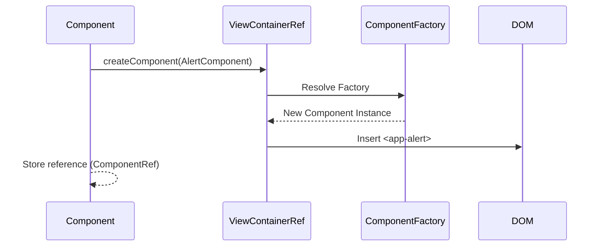
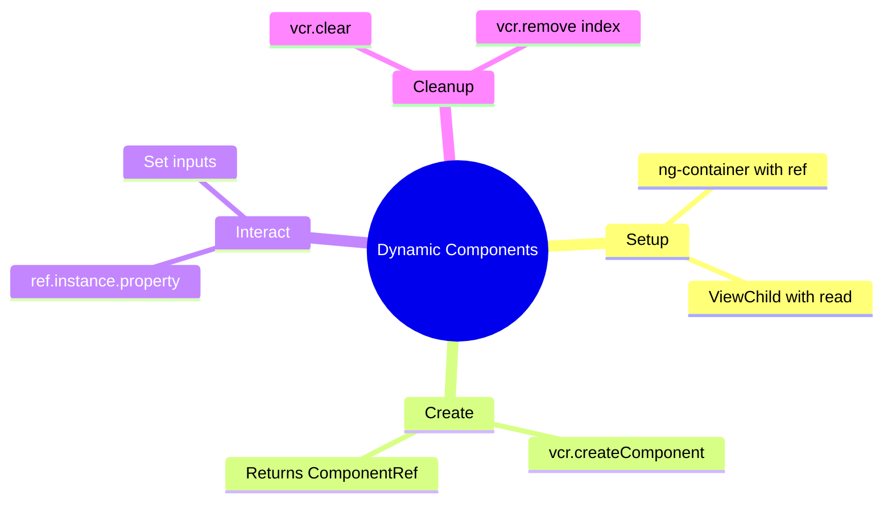

# 🌱 Basic Dynamic Component Creation


## 📋 Table of Contents
- [🔍 How It Works (The Concept)](#how-it-works-the-concept)
  - [Mermaid Diagram: Creation Flow](#mermaid-diagram-creation-flow)
- [🚀 Step-by-Step Implementation Guide](#step-by-step-implementation-guide)
  - [1. Define the Anchor](#1-define-the-anchor)
  - [2. Access ViewContainerRef](#2-access-viewcontainerref)
  - [3. Create the Component](#3-create-the-component)
- [🐛 Common Pitfalls & Debugging](#common-pitfalls--debugging)
  - [1. `read: ViewContainerRef`](#1-read-viewcontainerref)
  - [2. Garbage Collection](#2-garbage-collection)
- [⚡ Performance & Architecture](#performance--architecture)
- [🌍 Real World Use Cases](#real-world-use-cases)
  - [📦 Data Flow Summary (Visual Box Diagram)](#data-flow-summary-visual-box-diagram)
- [🤖 LEGO Robot Factory Analogy (Easy to Remember!)](#lego-robot-factory-analogy-easy-to-remember)
  - [📖 Story to Remember:](#story-to-remember)
  - [🎯 Quick Reference:](#quick-reference)
- [🧠 Mind Map](#mind-map)
- [🎯 What Problem Does This Solve?](#what-problem-does-this-solve)
  - [The Problem: Static Template Structure](#the-problem-static-template-structure)
  - [How Dynamic Components Solve This](#how-dynamic-components-solve-this)
- [🌍 Real-World Use Cases](#real-world-use-cases)
  - [1. Toast/Notification System](#1-toastnotification-system)
  - [2. Dynamic Dashboard](#2-dynamic-dashboard)
  - [3. Modal/Dialog Service](#3-modaldialog-service)
- [❓ Complete Interview Questions (25+)](#complete-interview-questions-25)
  - [Basic Conceptual Questions](#basic-conceptual-questions)
  - [Implementation Questions](#implementation-questions)
  - [Lifecycle Questions](#lifecycle-questions)
  - [Scenario Questions](#scenario-questions)
  - [Advanced Questions](#advanced-questions)
  - [Best Practice Questions](#best-practice-questions)

---
This guide explains how to create Angular components at runtime using `ViewContainerRef`.

## 🔍 How It Works (The Concept)

Normally, you write `<app-child>` in your HTML template. This is **declarative**.
Sometimes, you don't know *what* or *how many* components you need until runtime (e.g., dynamic dashboards, alert systems).

*   **ViewContainerRef**: A reference to a "slot" in the DOM where we can insert views.
*   **ng-container**: An ideal host element because it doesn't render any DOM node itself (no extra `<div>` wrappers).

### Mermaid Diagram: Creation Flow



## 🚀 Step-by-Step Implementation Guide

### 1. Define the Anchor
In your HTML, place an anchor where the dynamic components should go.

```html
<!-- The #container reference allows us to access this element in TS -->
<ng-container #container></ng-container>
```

### 2. Access ViewContainerRef
In your component class, use `@ViewChild` to get a reference to the container.

```typescript
// { read: ViewContainerRef } is CRITICAL. 
// Otherwise you just get ElementRef.
@ViewChild('container', { read: ViewContainerRef }) 
vcr!: ViewContainerRef;
```

### 3. Create the Component
Call the API to instantiate and insert the component.

```typescript
addComponent() {
    // Angular 13+ API (simplified)
    const ref = this.vcr.createComponent(AlertComponent);
    
    // Optional: Interact with the instance
    ref.instance.message = "Hello World";
}

clear() {
    this.vcr.clear(); // Destroys all components in this container
}
```

## 🐛 Common Pitfalls & Debugging

### 1. `read: ViewContainerRef`
If you forget `{ read: ViewContainerRef }` in `@ViewChild`, you will get an `ElementRef` error when trying to call `.createComponent()`.

### 2. Garbage Collection
When you call `vcr.clear()` or `vcr.remove(index)`, Angular automatically destroys the component and runs its `ngOnDestroy`. You don't need to manually unsubscribe (if you use standard component patterns).

## ⚡ Performance & Architecture

*   **Cost**: Creating components dynamically is slightly more expensive than static templates because Angular has to resolve the factory at runtime.
*   **Use Case**: Only use this when structure *truly* changes. For simple conditional display, `*ngIf` is faster and easier to read.

## 🌍 Real World Use Cases

1.  **Toasts/Snackbars**: Service appends alerts to a global container.
2.  **Modal Dialogs**: Opening a specific component in a generic modal shell.
3.  **Dashboards**: User chooses "Add Weather Widget" -> App dynamically creates `WeatherComponent`.

---

### 📦 Data Flow Summary (Visual Box Diagram)

```
┌─────────────────────────────────────────────────────────────┐
│  DYNAMIC COMPONENTS: CREATE AT RUNTIME                      │
│                                                             │
│   SETUP:                                                    │
│   ┌───────────────────────────────────────────────────────┐ │
│   │ Template:                                             │ │
│   │ <ng-container #container></ng-container>              │ │
│   │                                                       │ │
│   │ Component:                                            │ │
│   │ @ViewChild('container', { read: ViewContainerRef })   │ │
│   │ vcr!: ViewContainerRef;  // MUST use read option!     │ │
│   └───────────────────────────────────────────────────────┘ │
│                                                             │
│   CREATION FLOW:                                            │
│   ┌───────────────────────────────────────────────────────┐ │
│   │ User clicks "Add Widget"                              │ │
│   │        │                                              │ │
│   │        ▼                                              │ │
│   │ const ref = vcr.createComponent(WidgetComponent);     │ │
│   │        │                                              │ │
│   │        ▼                                              │ │
│   │ ref.instance.title = 'Weather';  // Set inputs        │ │
│   │        │                                              │ │
│   │        ▼                                              │ │
│   │ <app-widget> inserted into DOM at container location  │ │
│   └───────────────────────────────────────────────────────┘ │
│                                                             │
│   CLEANUP:                                                  │
│   ┌───────────────────────────────────────────────────────┐ │
│   │ vcr.clear()     → Remove ALL components               │ │
│   │ vcr.remove(0)   → Remove specific component by index  │ │
│   │ ref.destroy()   → Destroy specific component          │ │
│   └───────────────────────────────────────────────────────┘ │
└─────────────────────────────────────────────────────────────┘
```

> **Key Takeaway**: Use ViewContainerRef to create components dynamically. Always use `{ read: ViewContainerRef }` in @ViewChild!

---

## 🤖 LEGO Robot Factory Analogy (Easy to Remember!)


Think of dynamic components like a **LEGO robot factory**:

| Concept | Robot Factory Analogy | Memory Trick |
|---------|----------------------|--------------| 
| **ViewContainerRef** | 🏭 **Assembly station**: The spot on the conveyor belt where robots are built | **"The building spot"** |
| **ng-container** | 📍 **Invisible marker**: "Build robots HERE" without taking any space | **"Mark the spot"** |
| **createComponent()** | 🔧 **Build robot**: Assemble a new robot from blueprints | **"Create instance"** |
| **ComponentRef** | 🏷️ **Robot ID tag**: Reference to control this specific robot | **"Control handle"** |
| **vcr.clear()** | 🗑️ **Clear station**: Remove all robots from assembly line | **"Destroy all"** |

### 📖 Story to Remember:

> 🤖 **The LEGO Robot Factory**
>
> Your app is a LEGO factory with a special assembly station:
>
> **Static Way (Template):**
> ```html
> <app-robot></app-robot>  <!-- Robot always there -->
> <app-robot></app-robot>  <!-- Another robot always there -->
> ```
>
> **Dynamic Way (Factory):**
> ```typescript
> // 1. Mark the assembly station
> <ng-container #factory></ng-container>
>
> // 2. Build robots on demand!
> user.clicks("Add Robot") → vcr.createComponent(RobotComponent)
> user.clicks("Add Robot") → vcr.createComponent(RobotComponent)  
> user.clicks("Clear All") → vcr.clear()  // Robots removed!
> ```
>
> **You control WHEN and HOW MANY robots are built!**

### 🎯 Quick Reference:
```
🏭 ViewContainerRef     = Assembly station (where to build)
📍 ng-container         = Invisible marker (no DOM footprint)
🔧 createComponent()    = Build new instance
🏷️ ComponentRef         = Control handle (access .instance)
🗑️ clear()              = Remove all created components
```

---

## 🧠 Mind Map



---

## 🎯 What Problem Does This Solve?

### The Problem: Static Template Structure

**Without Dynamic Components (BAD):**
```typescript
// Must hardcode all possible widgets upfront!
@Component({
    template: `
        <app-weather-widget *ngIf="showWeather"/>
        <app-stock-widget *ngIf="showStock"/>
        <app-news-widget *ngIf="showNews"/>
        <!-- What about 50 more widget types?! -->
    `
})
```

**Problems:**
1. **Inflexible**: All component types must be known at compile time
2. **Bloated template**: Long list of conditional components
3. **No runtime decisions**: Can't create components based on user config
4. **Memory waste**: All components instantiated (even hidden ones)

### How Dynamic Components Solve This

**With ViewContainerRef (GOOD):**
```typescript
// Dashboard loads widgets from user config!
addWidget(type: string): void {
    const componentMap = {
        'weather': WeatherComponent,
        'stock': StockComponent,
        'news': NewsComponent
    };
    
    const ref = this.vcr.createComponent(componentMap[type]);
    ref.instance.config = this.getConfig(type);
}
```

| Problem | Dynamic Components Solution |
|---------|---------------------------|
| Static structure | **Runtime creation** |
| Bloated template | **One container, many components** |
| No flexibility | **Data-driven component selection** |
| Memory waste | **Only create what's needed** |

---

## 🌍 Real-World Use Cases

### 1. Toast/Notification System
```typescript
showToast(message: string, type: 'success' | 'error') {
    const ref = this.vcr.createComponent(ToastComponent);
    ref.instance.message = message;
    ref.instance.type = type;
    
    setTimeout(() => ref.destroy(), 3000);
}
```

### 2. Dynamic Dashboard
```typescript
loadWidgets(userConfig: Widget[]) {
    userConfig.forEach(widget => {
        const ref = this.vcr.createComponent(widget.component);
        ref.instance.data = widget.data;
    });
}
```

### 3. Modal/Dialog Service
```typescript
openModal<T>(component: Type<T>): Observable<T> {
    const ref = this.vcr.createComponent(ModalWrapperComponent);
    const contentRef = ref.instance.contentRef.createComponent(component);
    return contentRef.instance.result$;
}
```

---

## ❓ Complete Interview Questions (25+)

### Basic Conceptual Questions

**Q1: What is ViewContainerRef?**
> A: A reference to a container in the DOM where views can be dynamically inserted. It's the "slot" for dynamic components.

**Q2: Why use `{ read: ViewContainerRef }` in @ViewChild?**
> A: Without it, you get ElementRef by default. The `read` option tells Angular to provide ViewContainerRef instead.

**Q3: What's the difference between createComponent and NgComponentOutlet?**
> A: `createComponent` is imperative (TypeScript). `NgComponentOutlet` is declarative (template directive).

**Q4: What is ComponentRef?**
> A: A reference to the created component that provides access to the instance, change detection, and destruction.

---

### Implementation Questions

**Q5: How do you set inputs on a dynamic component?**
> A: Access `ref.instance` and set properties directly: `ref.instance.message = 'Hello'`.

**Q6: How do you subscribe to outputs?**
> A: Subscribe to the output EventEmitter: `ref.instance.closed.subscribe(...)`.

**Q7: How do you destroy a specific dynamic component?**
> A: Call `ref.destroy()` or `vcr.remove(index)`.

**Q8: How do you clear all dynamic components?**
> A: Call `vcr.clear()` to destroy all components in the container.

---

### Lifecycle Questions

**Q9: When can you call createComponent?**
> A: After `ngAfterViewInit` when ViewContainerRef is available via @ViewChild.

**Q10: Is ngOnInit called on dynamic components?**
> A: Yes! All lifecycle hooks run normally on dynamic components.

**Q11: What happens to subscriptions when component is destroyed?**
> A: Same as static components - you must manage cleanup (or use `takeUntilDestroyed`).

---

### Scenario Questions

**Q12: Implement a toast notification service.**
> A:
> ```typescript
> const ref = this.vcr.createComponent(ToastComponent);
> ref.instance.message = 'Saved!';
> setTimeout(() => ref.destroy(), 3000);
> ```

**Q13: Create a configurable dashboard.**
> A: Store widget types in config, loop through and `createComponent` for each.

**Q14: Open a modal with dynamic content.**
> A: Create modal wrapper, get its ViewContainerRef, create content component inside.

**Q15: Destroy component when user clicks close button.**
> A: Subscribe to component's output, call `ref.destroy()` in handler.

---

### Advanced Questions

**Q16: How do you pass services to dynamic components?**
> A: Dynamic components use normal DI - they get services from their injector hierarchy.

**Q17: What's the injector option in createComponent?**
> A: Pass custom injector to provide specific dependencies to the dynamic component.

**Q18: How do you create components at a specific index?**
> A: `vcr.createComponent(Component, { index: 0 })` inserts at position.

**Q19: Can you move a dynamic component?**
> A: Yes, use `vcr.move(viewRef, newIndex)`.

**Q20: How do you get count of dynamic components?**
> A: `vcr.length` returns the number of views in the container.

---

### Best Practice Questions

**Q21: When should you use dynamic components vs *ngIf?**
> A: Use `*ngIf` for simple conditionals. Use dynamic components when type is unknown at compile time or for plugin systems.

**Q22: How do you handle memory leaks?**
> A: Always destroy components when no longer needed. Store ComponentRefs and call `destroy()`.

**Q23: How do you test dynamic components?**
> A: Use TestBed, create the host component, verify child components are created.

**Q24: What's the performance impact?**
> A: Slightly slower than static components due to runtime factory resolution. Use sparingly.

**Q25: How do you type the component map?**
> A: 
> ```typescript
> componentMap: Record<string, Type<any>> = {
>     'weather': WeatherComponent
> };
> ```

