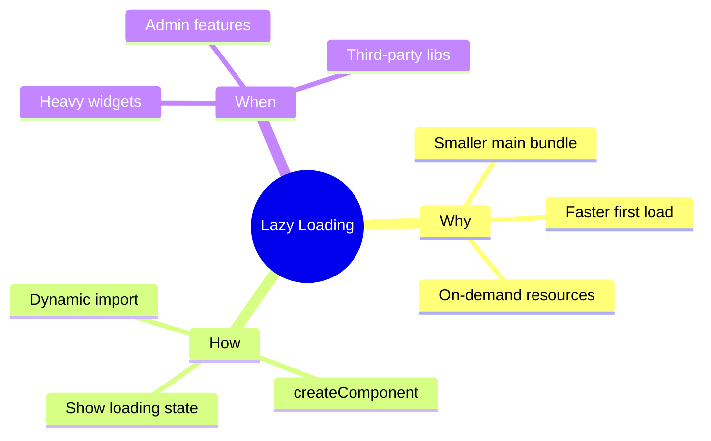

# 💤 Lazy Loading Dynamic Components


## 📋 Table of Contents
- [🔍 How It Works (The Concept)](#how-it-works-the-concept)
  - [Mermaid Diagram: Bundle Splitting](#mermaid-diagram-bundle-splitting)
- [🚀 Step-by-Step Implementation Guide](#step-by-step-implementation-guide)
  - [1. Structure](#1-structure)
  - [2. Use Dynamic Import](#2-use-dynamic-import)
  - [3. Handle Loading State](#3-handle-loading-state)
- [⚡ Performance Benefits](#performance-benefits)
- [🌍 Real World Use Cases](#real-world-use-cases)
  - [📦 Data Flow Summary (Visual Box Diagram)](#data-flow-summary-visual-box-diagram)
- [📦 Package Delivery Analogy (Easy to Remember!)](#package-delivery-analogy-easy-to-remember)
  - [📖 Story to Remember:](#story-to-remember)
  - [🎯 Quick Reference:](#quick-reference)
- [🧠 Mind Map](#mind-map)

---
This guide explains how to split your application into smaller chunks and load components only when needed.

## 🔍 How It Works (The Concept)

By default, Angular bundles all imported components into `main.js`. If you have a massive "Admin Dashboard" or "Chart Widget" that only 1% of users see, you are slowing down the app for everyone.

**Lazy Loading** allows you to keep that code in a separate file (e.g., `src_app_features_heavy-widget_ts.js`) that is only requested over the network when you call `import()`.

### Mermaid Diagram: Bundle Splitting

```mermaid
graph TD
    User[User]
    MainBundle[Main Bundle (Initial Load)]
    Chunk[Lazy Chunk (HeavyWidget)]
    
    User-->MainBundle
    MainBundle-.->|Click Button|Chunk
    Chunk-->|Render|User
```

## 🚀 Step-by-Step Implementation Guide

### 1. Structure
Create your heavy component in a separate file. **DO NOT** import it at the top of your parent component file using a standard `import`.

### 2. Use Dynamic Import
In your method (e.g., `onClick`), use the `import()` function.

```typescript
async loadWidget() {
    // 1. Fetch the code
    const module = await import('./heavy-widget.component');
    const ComponentClass = module.HeavyWidgetComponent;
    
    // 2. Render it
    this.vcr.createComponent(ComponentClass);
}
```

### 3. Handle Loading State
Since fetching code is an asynchronous network request, it can take time (slow 3G). Always show a spinner or loading indicator.

```typescript
this.isLoading = true;
try {
   const { Widget } = await import('./widget');
   this.vcr.createComponent(Widget);
} finally {
   this.isLoading = false;
}
```

## ⚡ Performance Benefits

1.  **Smaller Initial Bundle**: Users download less KB to see the first screen.
2.  **Faster TTI (Time to Interactive)**: Main thread is less busy parsing huge JS files.

## 🌍 Real World Use Cases

1.  **Complex Editors**: Loading a Rich Text Editor (like TinyMCE or Quill) only when the user clicks "Edit".
2.  **Admin Tools**: Loading heavy administrative grids/charts only for admin users.
3.  **Third-Party Libs**: Wrapping a heavy library (like `Three.js` or `D3.js`) in a component and lazy loading it.

---

### 📦 Data Flow Summary (Visual Box Diagram)

```
┌─────────────────────────────────────────────────────────────┐
│  LAZY LOADING DYNAMIC COMPONENTS                            │
│                                                             │
│   EAGER LOADING (default):                                  │
│   ┌───────────────────────────────────────────────────────┐ │
│   │ import { HeavyWidget } from './heavy-widget';         │ │
│   │                                                       │ │
│   │ ❌ Component included in main bundle (main.js)        │ │
│   │ ❌ User downloads everything on first load            │ │
│   └───────────────────────────────────────────────────────┘ │
│                                                             │
│   LAZY LOADING (on-demand):                                 │
│   ┌───────────────────────────────────────────────────────┐ │
│   │ async loadWidget() {                                  │ │
│   │   this.isLoading = true;                              │ │
│   │                                                       │ │
│   │   // Dynamic import = separate chunk file             │ │
│   │   const { HeavyWidget } = await import('./widget');   │ │
│   │                                                       │ │
│   │   this.vcr.createComponent(HeavyWidget);              │ │
│   │   this.isLoading = false;                             │ │
│   │ }                                                     │ │
│   │                                                       │ │
│   │ ✅ Separate chunk: widget_component.chunk.js          │ │
│   │ ✅ Downloaded only when user clicks button!           │ │
│   └───────────────────────────────────────────────────────┘ │
│                                                             │
│   BENEFIT: Smaller main.js = Faster first load!            │
└─────────────────────────────────────────────────────────────┘
```

> **Key Takeaway**: Use `await import()` for heavy widgets. Creates separate chunk, loaded on-demand!

---

## 📦 Package Delivery Analogy (Easy to Remember!)


Think of lazy loading like **on-demand package delivery**:

| Concept | Delivery Analogy | Memory Trick |
|---------|------------------|--------------| 
| **Eager loading** | 🏠 **All boxes at once**: Everything delivered on move-in day | **"Default Angular"** |
| **Lazy loading** | 📦 **On-demand delivery**: Order when you need it | **"import()"** |
| **Dynamic import** | 📞 **Call delivery service**: "Send me the chart widget" | **"await import()"** |
| **Separate chunk** | 📦 **Separate box**: Heavy item in own package | **"Bundle splitting"** |
| **Loading state** | ⏳ **Tracking package**: "In transit..." | **"Show spinner"** |

### 📖 Story to Remember:

> 📦 **Moving Into Your New App**
>
> You're moving into a new apartment (loading app):
>
> **The Old Way (Eager Loading):**
> ```
> Moving truck brings EVERYTHING 🚚
> - Kitchen stuff ✅
> - Bedroom stuff ✅
> - That piano you never play 🎹 ❌ (heavy, rarely used!)
> 
> → Slow move-in, tired users waiting ⏳
> ```
>
> **The Smart Way (Lazy Loading):**
> ```typescript
> // Only order the piano when you want to play!
> async loadPiano() {
>   const { Piano } = await import('./piano.component');  // 📞 Order now
>   this.vcr.createComponent(Piano);                      // 🎹 Delivered!
> }
> ```
>
> **Order heavy furniture only when needed!**

### 🎯 Quick Reference:
```
🏠 Eager          = All at once (main bundle)
📦 Lazy           = On-demand (separate chunk)
📞 import()       = Order delivery
⏳ Loading state  = Track package
🎹 Heavy widget   = Only load when needed
```

---

## 🧠 Mind Map


