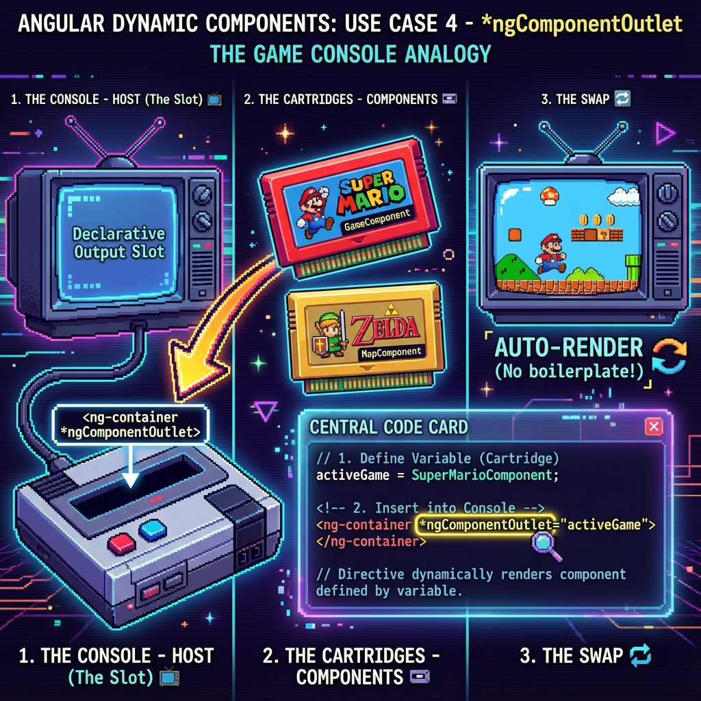

# 🧩 *ngComponentOutlet Directive


## 📋 Table of Contents
- [🔍 How It Works (The Concept)](#how-it-works-the-concept)
- [🎮 Game Console Analogy (Easy to Remember!)](#game-console-analogy-easy-to-remember)
  - [1. Import `NgComponentOutlet`](#1-import-ngcomponentoutlet)
  - [2. Define the Variable](#2-define-the-variable)
  - [3. Use in Template](#3-use-in-template)
  - [4. Passing Data (Inputs)](#4-passing-data-inputs)
- [⚡ Comparison](#comparison)
- [🌍 Real World Use Cases](#real-world-use-cases)
  - [📦 Data Flow Summary (Visual Box Diagram)](#data-flow-summary-visual-box-diagram)

---
This guide explains how to use the declarative `*ngComponentOutlet` directive for dynamic components.

## 🔍 How It Works (The Concept)

If you simply want to "render Component X here" based on a variable, writing `ViewContainerRef` boilerplate is overkill.
Angular provides a directive specifically for this.

```html
<ng-container *ngComponentOutlet="myComponentVariable"></ng-container>
```

When `myComponentVariable` changes, Angular destroys the old component and creates the new one automatically.

## 🎮 Game Console Analogy (Easy to Remember!)



Think of `*ngComponentOutlet` like a **game console cartridge slot**:

| Concept | Console Analogy | Memory Trick |
|---------|-----------------|--------------|
| **`*ngComponentOutlet`** | 📺 **Cartridge Slot**: The physical place to plugin a game | **"The Slot"** |
| **Component Type** | 📼 **Game Cartridge**: The actual game board (Mario, Zelda) | **"The Cartridge"** |
| **Variable Binding** | 🔄 **Swapping Games**: Changing cartridges changes the screen instantly | **"Hot Swap"** |


### 1. Import `NgComponentOutlet`
It's a standalone directive, so import it in your component.

```typescript
import { NgComponentOutlet } from '@angular/common';

@Component({
  imports: [NgComponentOutlet],
  // ...
})
```

### 2. Define the Variable
The variable must hold a **Class Reference** (`Type<any>`), not a string.

```typescript
import { MyComponent } from './my.component';

export class ParentComponent {
  activeComponent = MyComponent; 
}
```

### 3. Use in Template

```html
<ng-container *ngComponentOutlet="activeComponent"></ng-container>
```

### 4. Passing Data (Inputs)
To pass data, you need an **Injector**. `*ngComponentOutlet` does not support `[inputs]` binding directly in a simple way (though Angular 16+ added an `inputs` input to the directive!).

**Angular 16+ Way:**
```html
<ng-container *ngComponentOutlet="activeComponent; inputs: { name: 'Alice' }"></ng-container>
```

**Old Way (Injector):**
You had to create a custom injector to inject tokens into the child.

## ⚡ Comparison

| Feature | ViewContainerRef | *ngComponentOutlet |
| :--- | :--- | :--- |
| **Style** | Imperative (JS/TS) | Declarative (HTML) |
| **Complexity** | High | Low |
| **Flexibility** | High (Move, Insert, Detach) | Low (Only Swap) |
| **Use Case** | Modals, Complex Lists | Tab Switchers, Dynamic Pages |

## 🌍 Real World Use Cases

---

### 📦 Data Flow Summary (Visual Box Diagram)

```
┌─────────────────────────────────────────────────────────────┐
│  *ngComponentOutlet: DECLARATIVE DYNAMIC COMPONENTS         │
│                                                             │
│   IMPERATIVE (ViewContainerRef):                            │
│   ┌───────────────────────────────────────────────────────┐ │
│   │ // Lots of boilerplate code                           │ │
│   │ this.vcr.clear();                                     │ │
│   │ this.vcr.createComponent(MyComponent);                │ │
│   └───────────────────────────────────────────────────────┘ │
│                                                             │
│   DECLARATIVE (*ngComponentOutlet):                         │
│   ┌───────────────────────────────────────────────────────┐ │
│   │ // One line in template!                              │ │
│   │ <ng-container *ngComponentOutlet="activeComponent">   │ │
│   │ </ng-container>                                       │ │
│   │                                                       │ │
│   │ // Component class                                    │ │
│   │ activeComponent = TabOneComponent;  // Class reference│ │
│   │                                                       │ │
│   │ // Change it → Angular auto-swaps!                    │ │
│   │ switchToTwo() {                                       │ │
│   │   this.activeComponent = TabTwoComponent;             │ │
│   │ }                                                     │ │
│   └───────────────────────────────────────────────────────┘ │
│                                                             │
│   PASSING INPUTS (Angular 16+):                             │
│   ┌───────────────────────────────────────────────────────┐ │
│   │ *ngComponentOutlet="comp; inputs: { name: 'Alice' }"  │ │
│   └───────────────────────────────────────────────────────┘ │
└─────────────────────────────────────────────────────────────┘
```

> **Key Takeaway**: Use `*ngComponentOutlet` for simple swap-in components. Use ViewContainerRef for complex cases!

