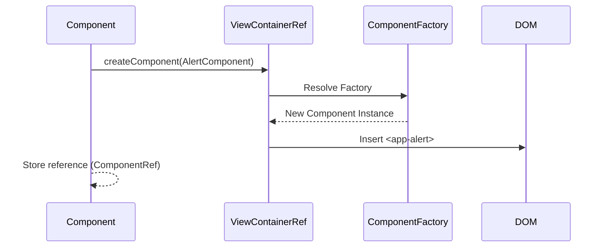
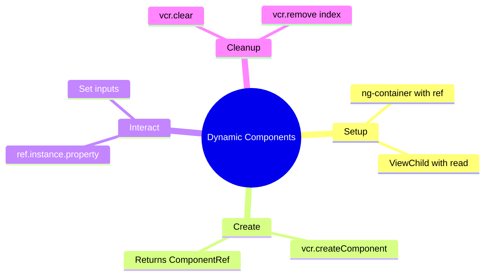

# 🌱 Basic Dynamic Component Creation

This guide explains how to create Angular components at runtime using `ViewContainerRef`.

## 🔍 How It Works (The Concept)

Normally, you write `<app-child>` in your HTML template. This is **declarative**.
Sometimes, you don't know *what* or *how many* components you need until runtime (e.g., dynamic dashboards, alert systems).

*   **ViewContainerRef**: A reference to a "slot" in the DOM where we can insert views.
*   **ng-container**: An ideal host element because it doesn't render any DOM node itself (no extra `<div>` wrappers).

### Mermaid Diagram: Creation Flow



## 🚀 Step-by-Step Implementation Guide

### 1. Define the Anchor
In your HTML, place an anchor where the dynamic components should go.

```html
<!-- The #container reference allows us to access this element in TS -->
<ng-container #container></ng-container>
```

### 2. Access ViewContainerRef
In your component class, use `@ViewChild` to get a reference to the container.

```typescript
// { read: ViewContainerRef } is CRITICAL. 
// Otherwise you just get ElementRef.
@ViewChild('container', { read: ViewContainerRef }) 
vcr!: ViewContainerRef;
```

### 3. Create the Component
Call the API to instantiate and insert the component.

```typescript
addComponent() {
    // Angular 13+ API (simplified)
    const ref = this.vcr.createComponent(AlertComponent);
    
    // Optional: Interact with the instance
    ref.instance.message = "Hello World";
}

clear() {
    this.vcr.clear(); // Destroys all components in this container
}
```

## 🐛 Common Pitfalls & Debugging

### 1. `read: ViewContainerRef`
If you forget `{ read: ViewContainerRef }` in `@ViewChild`, you will get an `ElementRef` error when trying to call `.createComponent()`.

### 2. Garbage Collection
When you call `vcr.clear()` or `vcr.remove(index)`, Angular automatically destroys the component and runs its `ngOnDestroy`. You don't need to manually unsubscribe (if you use standard component patterns).

## ⚡ Performance & Architecture

*   **Cost**: Creating components dynamically is slightly more expensive than static templates because Angular has to resolve the factory at runtime.
*   **Use Case**: Only use this when structure *truly* changes. For simple conditional display, `*ngIf` is faster and easier to read.

## 🌍 Real World Use Cases

1.  **Toasts/Snackbars**: Service appends alerts to a global container.
2.  **Modal Dialogs**: Opening a specific component in a generic modal shell.
3.  **Dashboards**: User chooses "Add Weather Widget" -> App dynamically creates `WeatherComponent`.

---

### 📦 Data Flow Summary (Visual Box Diagram)

```
┌─────────────────────────────────────────────────────────────┐
│  DYNAMIC COMPONENTS: CREATE AT RUNTIME                      │
│                                                             │
│   SETUP:                                                    │
│   ┌───────────────────────────────────────────────────────┐ │
│   │ Template:                                             │ │
│   │ <ng-container #container></ng-container>              │ │
│   │                                                       │ │
│   │ Component:                                            │ │
│   │ @ViewChild('container', { read: ViewContainerRef })   │ │
│   │ vcr!: ViewContainerRef;  // MUST use read option!     │ │
│   └───────────────────────────────────────────────────────┘ │
│                                                             │
│   CREATION FLOW:                                            │
│   ┌───────────────────────────────────────────────────────┐ │
│   │ User clicks "Add Widget"                              │ │
│   │        │                                              │ │
│   │        ▼                                              │ │
│   │ const ref = vcr.createComponent(WidgetComponent);     │ │
│   │        │                                              │ │
│   │        ▼                                              │ │
│   │ ref.instance.title = 'Weather';  // Set inputs        │ │
│   │        │                                              │ │
│   │        ▼                                              │ │
│   │ <app-widget> inserted into DOM at container location  │ │
│   └───────────────────────────────────────────────────────┘ │
│                                                             │
│   CLEANUP:                                                  │
│   ┌───────────────────────────────────────────────────────┐ │
│   │ vcr.clear()     → Remove ALL components               │ │
│   │ vcr.remove(0)   → Remove specific component by index  │ │
│   │ ref.destroy()   → Destroy specific component          │ │
│   └───────────────────────────────────────────────────────┘ │
└─────────────────────────────────────────────────────────────┘
```

> **Key Takeaway**: Use ViewContainerRef to create components dynamically. Always use `{ read: ViewContainerRef }` in @ViewChild!

---

## 🤖 LEGO Robot Factory Analogy (Easy to Remember!)


Think of dynamic components like a **LEGO robot factory**:

| Concept | Robot Factory Analogy | Memory Trick |
|---------|----------------------|--------------| 
| **ViewContainerRef** | 🏭 **Assembly station**: The spot on the conveyor belt where robots are built | **"The building spot"** |
| **ng-container** | 📍 **Invisible marker**: "Build robots HERE" without taking any space | **"Mark the spot"** |
| **createComponent()** | 🔧 **Build robot**: Assemble a new robot from blueprints | **"Create instance"** |
| **ComponentRef** | 🏷️ **Robot ID tag**: Reference to control this specific robot | **"Control handle"** |
| **vcr.clear()** | 🗑️ **Clear station**: Remove all robots from assembly line | **"Destroy all"** |

### 📖 Story to Remember:

> 🤖 **The LEGO Robot Factory**
>
> Your app is a LEGO factory with a special assembly station:
>
> **Static Way (Template):**
> ```html
> <app-robot></app-robot>  <!-- Robot always there -->
> <app-robot></app-robot>  <!-- Another robot always there -->
> ```
>
> **Dynamic Way (Factory):**
> ```typescript
> // 1. Mark the assembly station
> <ng-container #factory></ng-container>
>
> // 2. Build robots on demand!
> user.clicks("Add Robot") → vcr.createComponent(RobotComponent)
> user.clicks("Add Robot") → vcr.createComponent(RobotComponent)  
> user.clicks("Clear All") → vcr.clear()  // Robots removed!
> ```
>
> **You control WHEN and HOW MANY robots are built!**

### 🎯 Quick Reference:
```
🏭 ViewContainerRef     = Assembly station (where to build)
📍 ng-container         = Invisible marker (no DOM footprint)
🔧 createComponent()    = Build new instance
🏷️ ComponentRef         = Control handle (access .instance)
🗑️ clear()              = Remove all created components
```

---

## 🧠 Mind Map


