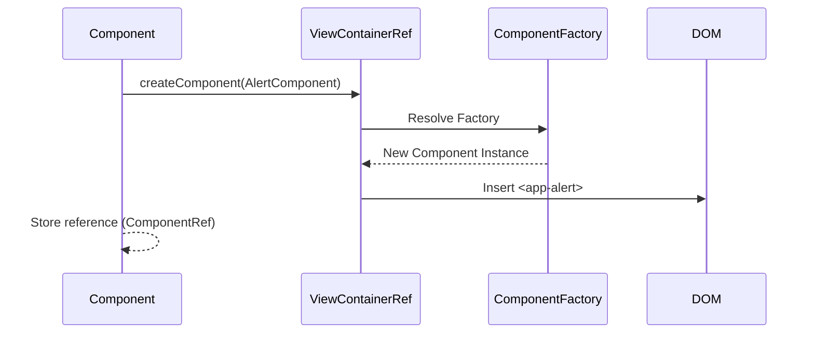

# 🌱 Basic Dynamic Component Creation

This guide explains how to create Angular components at runtime using `ViewContainerRef`.

## 🔍 How It Works (The Concept)

Normally, you write `<app-child>` in your HTML template. This is **declarative**.
Sometimes, you don't know *what* or *how many* components you need until runtime (e.g., dynamic dashboards, alert systems).

*   **ViewContainerRef**: A reference to a "slot" in the DOM where we can insert views.
*   **ng-container**: An ideal host element because it doesn't render any DOM node itself (no extra `<div>` wrappers).

### Mermaid Diagram: Creation Flow



## 🚀 Step-by-Step Implementation Guide

### 1. Define the Anchor
In your HTML, place an anchor where the dynamic components should go.

```html
<!-- The #container reference allows us to access this element in TS -->
<ng-container #container></ng-container>
```

### 2. Access ViewContainerRef
In your component class, use `@ViewChild` to get a reference to the container.

```typescript
// { read: ViewContainerRef } is CRITICAL. 
// Otherwise you just get ElementRef.
@ViewChild('container', { read: ViewContainerRef }) 
vcr!: ViewContainerRef;
```

### 3. Create the Component
Call the API to instantiate and insert the component.

```typescript
addComponent() {
    // Angular 13+ API (simplified)
    const ref = this.vcr.createComponent(AlertComponent);
    
    // Optional: Interact with the instance
    ref.instance.message = "Hello World";
}

clear() {
    this.vcr.clear(); // Destroys all components in this container
}
```

## 🐛 Common Pitfalls & Debugging

### 1. `read: ViewContainerRef`
If you forget `{ read: ViewContainerRef }` in `@ViewChild`, you will get an `ElementRef` error when trying to call `.createComponent()`.

### 2. Garbage Collection
When you call `vcr.clear()` or `vcr.remove(index)`, Angular automatically destroys the component and runs its `ngOnDestroy`. You don't need to manually unsubscribe (if you use standard component patterns).

## ⚡ Performance & Architecture

*   **Cost**: Creating components dynamically is slightly more expensive than static templates because Angular has to resolve the factory at runtime.
*   **Use Case**: Only use this when structure *truly* changes. For simple conditional display, `*ngIf` is faster and easier to read.

## 🌍 Real World Use Cases

1.  **Toasts/Snackbars**: Service appends alerts to a global container.
2.  **Modal Dialogs**: Opening a specific component in a generic modal shell.
3.  **Dashboards**: User chooses "Add Weather Widget" -> App dynamically creates `WeatherComponent`.
