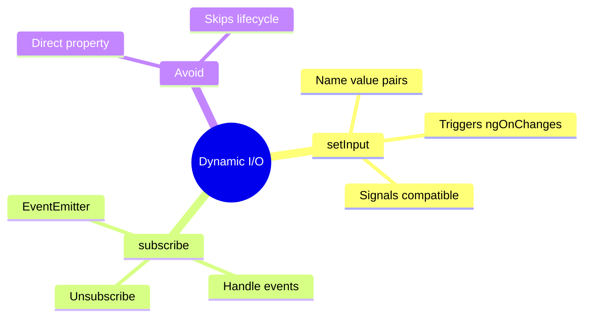

# 🔌 Dynamic Inputs & Outputs

This guide explains how to pass data into and receive events from dynamically created components.

## 🔍 How It Works (The Concept)

When you write `<app-user [name]="'Alice'" (delete)="onDelete()">` in HTML, Angular handles the binding and event subscription for you.
In dynamic code, **YOU** must handle this wiring manually.

### The `ComponentRef` Object
The `createComponent()` method returns a `ComponentRef<T>`, which is your handle to the live component instance.

## 🚀 Step-by-Step Implementation Guide

### 1. Setting Inputs (`setInput`)
Do not assign properties directly (`ref.instance.name = 'Alice'`). While it works for now, it bypasses Angular's change detection hooks (like `ngOnChanges`) and doesn't work with Signal Inputs.

**Correct Way:**
```typescript
const ref = vcr.createComponent(UserComponent);
ref.setInput('name', 'Alice'); 
```

### 2. Subscribing to Outputs
You must manually subscribe to the `EventEmitter` on the instance.

```typescript
const sub = ref.instance.deleteEvent.subscribe((payload) => {
    console.log('Delete requested!', payload);
    ref.destroy(); // Remove the component
});
```

### 3. Change Detection
When you use `setInput()`, Angular automatically marks the component for check. You generally do **not** need to call `ref.changeDetectorRef.detectChanges()`, unless you are running completely outside the zone or using `OnPush` in a very specific way.

## 🐛 Common Pitfalls & Debugging

### 1. Memory Leaks
If you subscribe to an Output, does it leak when the component is destroyed?
*   **Good News**: If you call `ref.destroy()`, the component instance is killed.
*   **Best Practice**: Store the subscription and `sub.unsubscribe()` just to be safe, especially if the parent component outlives the child components.

### 2. `ngOnChanges` not firing
If you do `ref.instance.name = 'Bob'`, `ngOnChanges` will **NOT** fire. usage of `setInput()` ensures lifecycle hooks run correctly.

## ⚡ Performance

*   **Signals**: If your inputs are Signals (`input<string>()`), `setInput` works seamlessly with them in newer Angular versions.
*   **Batching**: You can call `setInput` multiple times; Angular updates the view in the next tick.

## 🌍 Real World Use Cases

1.  **Form Generators**: Looping through a JSON config to create `InputComponent`, `SelectComponent`, etc., and binding their values.
2.  **Dashboard Widgets**: Configuring a generic `ChartComponent` with different `dataSet` inputs.

---

## 🎰 Vending Machine Analogy (Easy to Remember!)

Think of dynamic inputs/outputs like **programming a vending machine**:

| Concept | Vending Analogy | Memory Trick |
|---------|----------------|--------------| 
| **ComponentRef** | 🎰 **Machine handle**: Your control panel for the machine | **"Control reference"** |
| **setInput()** | 💰 **Insert coins**: "This machine needs price=$2" | **"Configure input"** |
| **subscribe()** | 👂 **Listen for product**: "Tell me when snack drops" | **"Handle output"** |
| **ref.destroy()** | 🗑️ **Remove machine**: Take machine out of service | **"Cleanup"** |
| **instance** | 🔌 **Machine internals**: Direct access to guts | **"Component instance"** |

### 📖 Story to Remember:

> 🎰 **The Vending Machine Factory**
>
> You're installing vending machines (dynamic components) at runtime:
>
> **Installing & Configuring:**
> ```typescript
> // 1. Install machine
> const machine = vcr.createComponent(SnackMachineComponent);
>
> // 2. Configure it (insert money value)
> machine.setInput('price', 2.50);      // ✅ Right way
> machine.setInput('snackType', 'chips');
>
> // ❌ WRONG: machine.instance.price = 2.50  // Bypasses Angular
>
> // 3. Listen for events (snack dispensed!)
> machine.instance.purchased.subscribe(snack => {
>   console.log('User bought:', snack);
> });
> ```
>
> **Why setInput matters:**
> ```
> ref.instance.value = X   → Machine works BUT no ngOnChanges 💔
> ref.setInput('value', X) → Machine works AND ngOnChanges fires ✅
> ```

### 🎯 Quick Reference:
```
🎰 ComponentRef     = Machine handle (control reference)
💰 setInput()       = Configure machine (right way!)
👂 subscribe()      = Listen for events
🗑️ destroy()        = Remove machine
⚠️ instance.prop=   = Bypass (avoid!)
```

---

## 🧠 Mind Map


