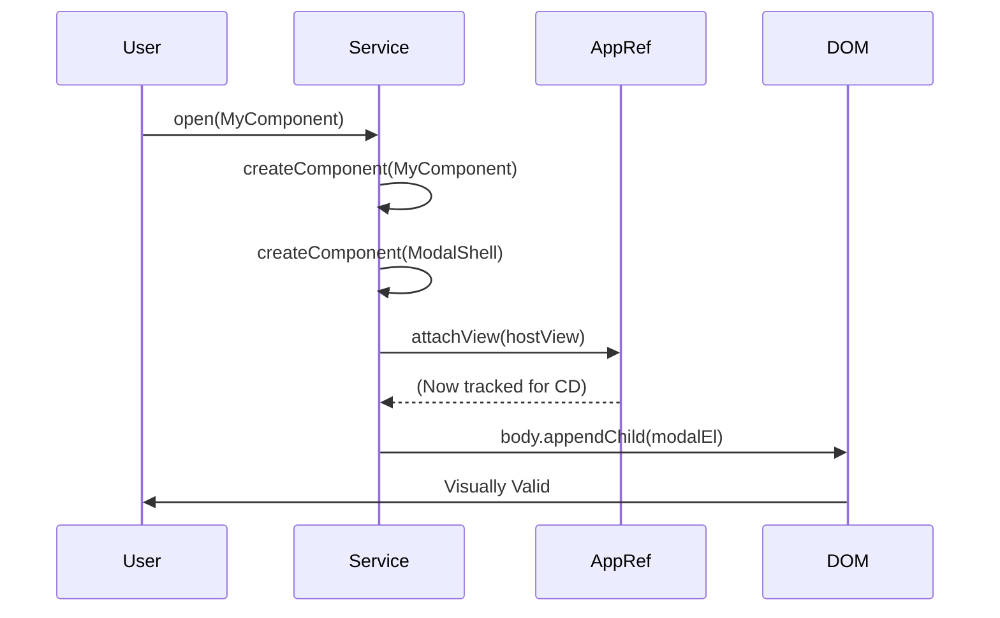

# 🪄 Dynamic Modal Service

This guide explains how to build a flexible Modal Service that can open ANY component.

## 🔍 How It Works (The Concept)

Usually, you put a `<app-modal>` in your template and toggle it with `*ngIf`.
But for global dialogs (Confirm, Alert, Prompt), you don't want to repeat that HTML everywhere.
You want to call `service.open(MyComponent)`.

To do this, we need to:
1.  **Create** the component instance.
2.  **Attach** it to Angular's Change Detection (`ApplicationRef`).
3.  **Append** it to the DOM (`document.body`).

### Mermaid Diagram: Service Flow



## 🚀 Step-by-Step Implementation Guide

### 1. The Service (`ModalService`)
We need `ApplicationRef` and `EnvironmentInjector`.

```typescript
open(component: Type<any>) {
    // 1. Create content
    const contentRef = createComponent(component, { environmentInjector: this.injector });
    
    // 2. Create shell (and project content into it)
    const modalRef = createComponent(ModalShellComponent, {
        environmentInjector: this.injector,
        projectableNodes: [[contentRef.location.nativeElement]] // <ng-content>
    });

    // 3. Attach to DOM
    this.appRef.attachView(modalRef.hostView);
    document.body.appendChild(modalRef.location.nativeElement);
}
```

### 2. Cleanup (`close`)
**Crucial**: You must detach the view and destroy the component, otherwise you leak memory and the component stays in the DOM (invisible or not).

```typescript
close() {
    this.appRef.detachView(this.ref.hostView);
    this.ref.destroy();
}
```

## 🐛 Common Pitfalls & Debugging

### 1. "ExpressionChangedAfterItHasBeenCheckedError"
Since you are manually attaching views, you might hit this if your modal tries to update a parent immediately. `setTimeout` or `ngZone.run` can help.

### 2. Routing
If the user navigates directly via URL while a modal is open, the modal might stay open unless you listen to Router events and close it.

## ⚡ Accessibility (A11y)

This basic demo is missing important A11y features:
*   **Focus Trap**: Tab should stay inside the modal.
*   **Escape Key**: Should close the modal.
*   **ARIA Attributes**: `role="dialog"`, `aria-modal="true"`.

For production, use the Angular CDK `Overlay` module, which handles all of this for you. This guide demonstrates the *underlying principle* of how CDK Overlay works.

---

### 📦 Data Flow Summary (Visual Box Diagram)

```
┌─────────────────────────────────────────────────────────────┐
│  DYNAMIC MODAL SERVICE: GLOBAL DIALOGS                      │
│                                                             │
│   WHY: Single modal service, open ANY component!            │
│   ┌───────────────────────────────────────────────────────┐ │
│   │ modalService.open(ConfirmDialogComponent)             │ │
│   │ modalService.open(AlertComponent)                     │ │
│   │ modalService.open(EditUserComponent)                  │ │
│   └───────────────────────────────────────────────────────┘ │
│                                                             │
│   HOW IT WORKS:                                             │
│   ┌───────────────────────────────────────────────────────┐ │
│   │ open(component) {                                     │ │
│   │   // 1. Create the component                          │ │
│   │   const ref = createComponent(component, {...});      │ │
│   │                                                       │ │
│   │   // 2. Attach to Angular's change detection          │ │
│   │   this.appRef.attachView(ref.hostView);               │ │
│   │                                                       │ │
│   │   // 3. Append to DOM (body)                          │ │
│   │   document.body.appendChild(ref.location.nativeElement);│ │
│   │ }                                                     │ │
│   └───────────────────────────────────────────────────────┘ │
│                                                             │
│   CLEANUP (critical!):                                      │
│   ┌───────────────────────────────────────────────────────┐ │
│   │ close() {                                             │ │
│   │   this.appRef.detachView(ref.hostView);  // Detach CD │ │
│   │   ref.destroy();                          // Cleanup   │ │
│   │ }                                                     │ │
│   └───────────────────────────────────────────────────────┘ │
└─────────────────────────────────────────────────────────────┘
```

> **Key Takeaway**: Attach with `appRef.attachView()`, append to `document.body`. Always `destroy()` on close!

