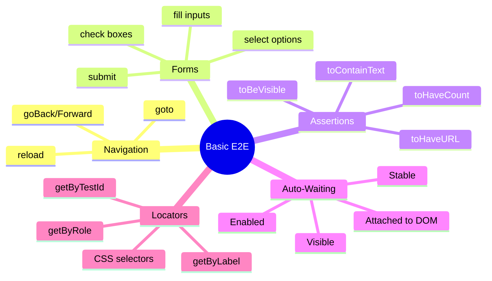

# 🧪 Basic E2E Tests

> **💡 Lightbulb Moment**: Playwright auto-waits for elements to be ready - no more `sleep()` or flaky tests!


## 📋 Table of Contents
- [1. 🔍 What are Basic E2E Tests?](#1--what-are-basic-e2e-tests)
  - [Key Patterns](#key-patterns)
- [2. 🚀 Common Test Patterns](#2--common-test-patterns)
  - [Pattern 1: Navigation Testing](#pattern-1-navigation-testing)
  - [Pattern 2: Form Submission](#pattern-2-form-submission)
  - [Pattern 3: Dropdown Selection](#pattern-3-dropdown-selection)
  - [Pattern 4: Checkbox & Radio](#pattern-4-checkbox--radio)
- [3. 🎯 Auto-Waiting Explained](#3--auto-waiting-explained)
  - [What Playwright Waits For](#what-playwright-waits-for)
  - [Custom Timeouts](#custom-timeouts)
- [4. 🔍 Locator Strategies](#4--locator-strategies)
  - [Best to Worst](#best-to-worst)
  - [Chaining Locators](#chaining-locators)
- [5. 🌍 Real-World Examples](#5--real-world-examples)
  - [Example 1: Login Flow](#example-1-login-flow)
  - [Example 2: Search Functionality](#example-2-search-functionality)
  - [Example 3: Multi-Step Form](#example-3-multi-step-form)
- [❓ Complete Interview Questions (25+)](#complete-interview-questions-25)
  - [Navigation Questions](#navigation-questions)
  - [Form Interaction Questions](#form-interaction-questions)
  - [Assertion Questions](#assertion-questions)
  - [Waiting Questions](#waiting-questions)
  - [Locator Questions](#locator-questions)
- [🧠 Mind Map](#mind-map)

---
---

## 1. 🔍 What are Basic E2E Tests?

E2E tests simulate real user interactions to validate complete workflows from start to finish.

### Key Patterns
- **Navigation**: Moving between pages
- **Form interactions**: Filling inputs, submitting
- **Assertions**: Verifying expected outcomes
- **Auto-waiting**: Playwright waits automatically

---

## 2. 🚀 Common Test Patterns

### Pattern 1: Navigation Testing

```typescript
import { test, expect } from '@playwright/test';

test('homepage navigation', async ({ page }) => {
  // Go to page
  await page.goto('/');
  
  // Assert URL and title
  await expect(page).toHaveURL('/');
  await expect(page).toHaveTitle(/Angular Features/);
  
  // Click navigation link
  await page.click('a[href="/about"]');
  
  // Assert navigation occurred
  await expect(page).toHaveURL('/about');
});
```

### Pattern 2: Form Submission

```typescript
test('contact form submission', async ({ page }) => {
  await page.goto('/contact');
  
  // Fill form fields
  await page.fill('[name="name"]', 'John Doe');
  await page.fill('[name="email"]', 'john@example.com');
  await page.fill('textarea[name="message"]', 'Test message');
  
  // Submit form
  await page.click('button[type="submit"]');
  
  // Wait for success message
  await expect(page.locator('.alert-success')).toBeVisible();
  await expect(page.locator('.alert-success')).toContainText('Thank you');
});
```

### Pattern 3: Dropdown Selection

```typescript
test('select dropdown option', async ({ page }) => {
  await page.goto('/products');
  
  // Select by value
  await page.selectOption('select[name="category"]', 'electronics');
  
  // Select by label
  await page.selectOption('select[name="sort"]', { label: 'Price: Low to High' });
  
  // Verify selection
  const value = await page.locator('select[name="category"]').inputValue();
  expect(value).toBe('electronics');
});
```

### Pattern 4: Checkbox & Radio

```typescript
test('checkbox and radio interactions', async ({ page }) => {
  await page.goto('/settings');
  
  // Check checkbox
  await page.check('input[name="newsletter"]');
  await expect(page.locator('input[name="newsletter"]')).toBeChecked();
  
  // Uncheck
  await page.uncheck('input[name="newsletter"]');
  
  // Select radio button
  await page.check('input[value="monthly"]');
});
```

---

## 3. 🎯 Auto-Waiting Explained

### What Playwright Waits For

Before performing actions, Playwright automatically waits for elements to be:
1. **Attached** to DOM
2. **Visible** (not `display:none`)
3. **Enabled** (not `disabled`)
4. **Stable** (not animating)
5. **Receives events** (not covered by other elements)

```typescript
test('auto-waiting demonstration', async ({ page }) => {
  await page.goto('/dynamic-content');
  
  // Click button that triggers delayed content
  await page.click('.load-data'); // Waits for button to be ready
  
  // Element appears after 2 seconds
  // Playwright waits automatically - no sleep needed!
  await expect(page.locator('.data-loaded')).toBeVisible();
});
```

### Custom Timeouts

```typescript
test('custom timeout', async ({ page }) => {
  // Override default 30s timeout
  await page.goto('/', { timeout: 60000 });
  
  // Wait for specific element (max 5s)
  await page.locator('.slow-element').waitFor({ timeout: 5000 });
});
```

---

## 4. 🔍 Locator Strategies

### Best to Worst

```typescript
// ✅ BEST: Role-based (accessibility)
await page.getByRole('button', { name: 'Submit' }).click();

// ✅ GOOD: Test ID
await page.getByTestId('submit-button').click();

// ⚠️ OK: Label text
await page.getByLabel('Email address').fill('test@test.com');

// ⚠️ OK: Placeholder
await page.getByPlaceholder('Enter email').fill('test@test.com');

// ❌ FRAGILE: CSS selector
await page.locator('.btn.btn-primary').click();
```

### Chaining Locators

```typescript
// Find button inside specific card
const card = page.locator('.product-card').filter({ hasText: 'iPhone' });
await card.getByRole('button', { name: 'Add to Cart' }).click();
```

---

## 5. 🌍 Real-World Examples

### Example 1: Login Flow

```typescript
test('successful login', async ({ page }) => {
  await page.goto('/login');
  
  await page.getByLabel('Email').fill('user@test.com');
  await page.getByLabel('Password').fill('password123');
  await page.getByRole('button', { name: 'Sign In' }).click();
  
  // Redirected to dashboard
  await expect(page).toHaveURL('/dashboard');
  await expect(page.getByText('Welcome back')).toBeVisible();
});
```

### Example 2: Search Functionality

```typescript
test('product search', async ({ page }) => {
  await page.goto('/');
  
  await page.getByPlaceholder('Search products').fill('laptop');
  await page.keyboard.press('Enter');
  
  // Wait for results
  await expect(page.locator('.product-item')).toHaveCount(5);
  await expect(page.locator('.product-item').first()).toContainText('laptop');
});
```

### Example 3: Multi-Step Form

```typescript
test('wizard form', async ({ page }) => {
  await page.goto('/signup');
  
  // Step 1: Personal Info
  await page.fill('[name="firstName"]', 'John');
  await page.fill('[name="lastName"]', 'Doe');
  await page.click('button:text("Next")');
  
  // Step 2: Account Details
  await page.fill('[name="email"]', 'john@test.com');
  await page.fill('[name="password"]', 'SecurePass123');
  await page.click('button:text("Next")');
  
  // Step 3: Confirmation
  await page.check('[name="terms"]');
  await page.click('button:text("Complete")');
  
  await expect(page.locator('.success')).toBeVisible();
});
```

---

## ❓ Complete Interview Questions (25+)

### Navigation Questions

**Q1: How do you navigate to a page in Playwright?**
> A: `await page.goto('/path')` or `await page.goto('https://example.com')`.

**Q2: How to wait for page load to complete?**
> A: Playwright auto-waits. Use `waitUntil: 'networkidle'` for specific needs.

**Q3: How do you navigate back/forward?**
> A: `await page.goBack()` and `await page.goForward()`.

**Q4: How to reload a page?**
> A: `await page.reload()` or `await page.reload({ waitUntil: 'networkidle' })`.

---

### Form Interaction Questions

**Q5: How do you fill an input field?**
> A: `await page.fill('input[name="email"]', 'test@test.com')` or `await page.getByLabel('Email').fill('...')`.

**Q6: What's the difference between fill() and type()?**
> A: `fill()` clears then sets value; `type()` simulates keystrokes one by one.

**Q7: How to submit a form?**
> A: Click submit button or `await page.locator('form').press('Enter')`.

**Q8: How do you select dropdown options?**
> A: `await page.selectOption('select', 'value')` or `{ label: 'Text' }` or `{ index: 2 }`.

**Q9: How to check/uncheck checkboxes?**
> A: `await page.check('input[type="checkbox"]')` or `await page.uncheck(...)`.

**Q10: How to upload files?**
> A: `await page.setInputFiles('input[type="file"]', 'path/to/file.pdf')`.

---

### Assertion Questions

**Q11: How to assert element visibility?**
> A: `await expect(page.locator('.element')).toBeVisible()`.

**Q12: How to assert text content?**
> A: `await expect(page.locator('.title')).toContainText('Welcome')`.

**Q13: How to assert exact count of elements?**
> A: `await expect(page.locator('.item')).toHaveCount(5)`.

**Q14: How to assert URL?**
> A: `await expect(page).toHaveURL('/dashboard')` or regex: `/dashboard/`.

**Q15: How to assert attribute value?**
> A: `await expect(page.locator('a')).toHaveAttribute('href', '/about')`.

---

### Waiting Questions

**Q16: What is auto-waiting?**
> A: Playwright automatically waits for elements to be actionable before performing actions.

**Q17: How to wait for element to appear?**
> A: `await page.locator('.element').waitFor()` or use expect: `await expect(...).toBeVisible()`.

**Q18: How to wait for element to disappear?**
> A: `await page.locator('.spinner').waitFor({ state: 'hidden' })`.

**Q19: How to wait for network to be idle?**
> A: `await page.waitForLoadState('networkidle')`.

**Q20: How to set custom timeout?**
> A: `await page.locator('.slow').click({ timeout: 60000 })`.

---

### Locator Questions

**Q21: What's the most reliable locator strategy?**
> A: Role-based or test-id: `getByRole()`, `getByTestId()`.

**Q22: How do you find element by text?**
> A: `page.getByText('Submit')` or `page.locator('button:text("Submit")')`.

**Q23: How to select nth element?**
> A: `page.locator('.item').nth(2)` or `.first()` or `.last()`.

**Q24: How to filter locators?**
> A: `page.locator('.card').filter({ hasText: 'iPhone' })`.

**Q25: How do you chain locators?**
> A: `page.locator('.parent').locator('.child')` or simplified: `page.locator('.parent .child')`.

---

## 🧠 Mind Map


