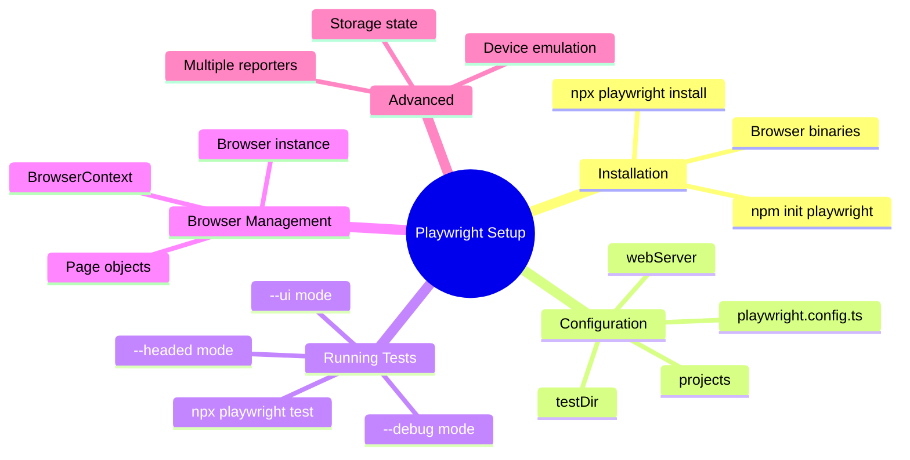

# 🎭 Use Case 1: Playwright Setup & Configuration

> **💡 Lightbulb Moment**: Playwright is a modern E2E testing framework that works across all browsers with reliable auto-waiting and no flaky tests!

---

## 1. 🔍 What is Playwright?

Playwright is a Node.js library for browser automation that enables reliable end-to-end testing.

### Key Features
- **Cross-browser**: Chromium, Firefox, WebKit (Safari)
- **Auto-waiting**: Automatically waits for elements
- **Network control**: Mock and intercept requests
- **Component testing**: Test components in isolation
- **Visual regression**: Screenshot comparison

---

## 2. 🚀 Installation & Setup

### Step 1: Install Playwright

```bash
# Initialize with prompts
npm init playwright@latest

# Manual install
npm install -D @playwright/test
npx playwright install
```

### Step 2: Create Configuration

```typescript
// playwright.config.ts
import { defineConfig, devices } from '@playwright/test';

export default defineConfig({
  testDir: './e2e',
  fullyParallel: true,
  forbidOnly: !!process.env.CI,
  retries: process.env.CI ? 2 : 0,
  workers: process.env.CI ? 1 : undefined,
  
  reporter: [
    ['html'],
    ['json', { outputFile: 'test-results/results.json' }]
  ],
  
  use: {
    baseURL: 'http://localhost:4200',
    trace: 'on-first-retry',
    screenshot: 'only-on-failure',
    video: 'retain-on-failure',
  },

  projects: [
    {
      name: 'chromium',
      use: { ...devices['Desktop Chrome'] },
    },
    {
      name: 'firefox',
      use: { ...devices['Desktop Firefox'] },
    },
    {
      name: 'webkit',
      use: { ...devices['Desktop Safari'] },
    },
    // Mobile emulation
    {
      name: 'Mobile Chrome',
      use: { ...devices['Pixel 5'] },
    },
  ],

  // Start dev server before tests
  webServer: {
    command: 'npm run start',
    url: 'http://localhost:4200',
    reuseExistingServer: !process.env.CI,
    timeout: 120 * 1000,
  },
});
```

### Step 3: First Test

```typescript
// e2e/example.spec.ts
import { test, expect } from '@playwright/test';

test('homepage has title', async ({ page }) => {
  await page.goto('/');
  await expect(page).toHaveTitle(/Angular Features/);
});
```

---

## 3. 📊 Configuration Options Explained

### Test Directory Structure
```
e2e/
├── tests/
│   ├── auth.spec.ts
│   ├── navigation.spec.ts
│   └── forms.spec.ts
├── fixtures/
│   └── test-data.json
└── page-objects/
    └── login.page.ts
```

### Key Config Properties

| Property | Purpose | Example |
|----------|---------|---------|
| `testDir` | Where tests live | `'./e2e'` |
| `fullyParallel` | Run tests in parallel | `true` |
| `retries` | Retry failed tests | `2` (in CI) |
| `workers` | Parallel workers | `4` |
| `use.baseURL` | Default URL | `'http://localhost:4200'` |
| `use.trace` | Debug traces | `'on-first-retry'` |

---

## 4. 🎯 Running Tests

### CLI Commands

```bash
# Run all tests
npx playwright test

# Run specific file
npx playwright test auth.spec.ts

# Run in headed mode (see browser)
npx playwright test --headed

# Run in UI mode (interactive)
npx playwright test --ui

# Run specific browser
npx playwright test --project=chromium

# Debug mode
npx playwright test --debug

# Generate code
npx playwright codegen http://localhost:4200
```

---

## 5. 🔬 Browser Contexts & Pages

### Browser vs Context vs Page

```typescript
import { test } from '@playwright/test';

test('understanding contexts', async ({ browser }) => {
  // Browser: Chrome instance
  const browser = await chromium.launch();
  
  // Context: Isolated session (cookies, storage)
  const context = await browser.newContext({
    viewport: { width: 1920, height: 1080 },
    userAgent: 'My Custom Agent'
  });
  
  // Page: Individual tab
  const page = await context.newPage();
  await page.goto('/');
  
  await context.close();
  await browser.close();
});
```

### Multiple Pages Example

```typescript
test('multiple tabs', async ({ context }) => {
  const page1 = await context.newPage();
  const page2 = await context.newPage();
  
  await page1.goto('/login');
  await page2.goto('/dashboard');
  
  // Both pages share same cookies/storage
});
```

---

## 6. 🌍 Real-World Use Cases

### Use Case 1: CI/CD Pipeline
```typescript
// GitHub Actions-friendly config
export default defineConfig({
  workers: 1,  // Sequential in CI
  retries: 2,  // Retry flaky tests
  reporter: [['github'], ['html']],
  webServer: {
    command: 'npm run start',
    timeout: 180000,  // 3 minutes
  },
});
```

### Use Case 2: Mobile Testing
```typescript
projects: [
  {
    name: 'iPhone 13',
    use: {
      ...devices['iPhone 13'],
      isMobile: true,
      hasTouch: true,
    },
  },
]
```

### Use Case 3: Authentication State
```typescript
// Save auth state
test('login once', async ({ page }) => {
  await page.goto('/login');
  await page.fill('[name="email"]', 'user@test.com');
  await page.fill('[name="password"]', 'password');
  await page.click('button[type="submit"]');
  
  // Save storage state
  await page.context().storageState({ 
    path: 'auth.json' 
  });
});

// Reuse in tests
test.use({ storageState: 'auth.json' });
```

---

## 7. 🐛 Common Pitfalls

### ❌ Not Installing Browsers
```bash
# Error: Executable doesn't exist
# Fix: Install browsers
npx playwright install
```

### ❌ Wrong Base URL
```typescript
// BAD: Hardcoded URLs
await page.goto('http://localhost:4200/dashboard');

// GOOD: Use baseURL
await page.goto('/dashboard');
```

### ❌ Forgetting to Start Server
```typescript
// Ensure webServer is configured
webServer: {
  command: 'npm run start',
  url: 'http://localhost:4200',
}
```

---

## ❓ Complete Interview Questions (25+)

### Installation & Setup Questions

**Q1: How do you install Playwright?**
> A: `npm init playwright@latest` or `npm install -D @playwright/test && npx playwright install`.

**Q2: What does `npx playwright install` do?**
> A: Downloads browser binaries (Chromium, Firefox, WebKit).

**Q3: Where should Playwright config file be located?**
> A: Root directory as `playwright.config.ts` or `playwright.config.js`.

**Q4: How do you install only Chromium?**
> A: `npx playwright install chromium`.

---

### Configuration Questions

**Q5: What is `fullyParallel` option?**
> A: Runs all tests in parallel across workers for faster execution.

**Q6: What's the difference between `workers` and `fullyParallel`?**
> A: `workers` sets number of parallel processes; `fullyParallel` enables parallel execution within files.

**Q7: When should you set `retries`?**
> A: In CI environments to handle flaky network issues: `retries: process.env.CI ? 2 : 0`.

**Q8: What is `baseURL` used for?**
> A: Default URL for `page.goto()` calls - makes tests more maintainable.

**Q9: What reporters are available?**
> A: `html`, `json`, `junit`, `line`, `list`, `github`, `dot`.

**Q10: How do you configure multiple reporters?**
> A: `reporter: [['html'], ['json', { outputFile: 'results.json' }]]`.

---

### Browser & Context Questions

**Q11: What's the difference between Browser and BrowserContext?**
> A: Browser = Chrome instance; Context = isolated session (cookies, storage).

**Q12: Why use contexts instead of separate browsers?**
> A: Contexts are lightweight, share browser process, faster to create.

**Q13: How do you set viewport size?**
> A: In context: `{ viewport: { width: 1920, height: 1080 } }`.

**Q14: Can contexts share cookies?**
> A: No - each context is isolated (like incognito mode).

---

### Mobile & Device Questions

**Q15: How do you emulate mobile devices?**
> A: Use device descriptors: `use: { ...devices['iPhone 13'] }`.

**Q16: How to test touch interactions?**
> A: Set `hasTouch: true` and `isMobile: true` in device config.

**Q17: List available device emulations.**
> A: Import from `@playwright/test`: `devices['Pixel 5']`, `devices['iPad Pro']`, etc.

---

### Web Server Questions

**Q18: What is `webServer` option?**
> A: Automatically starts dev server before tests, stops after.

**Q19: When should you set `reuseExistingServer`?**
> A: `!process.env.CI` - reuse locally, fresh server in CI.

**Q20: How to increase server startup timeout?**
> A: `webServer: { timeout: 180000 }` (milliseconds).

---

### Running Tests Questions

**Q21: How to run tests in headed mode?**
> A: `npx playwright test --headed`.

**Q22: How to run specific test file?**
> A: `npx playwright test auth.spec.ts`.

**Q23: How to run only Chromium tests?**
> A: `npx playwright test --project=chromium`.

**Q24: What is UI mode?**
> A: Interactive test runner: `npx playwright test --ui`.

**Q25: How to generate test code?**
> A: `npx playwright codegen <url>` - records actions as code.

---

### Debugging Questions

**Q26: How to enable debug mode?**
> A: `npx playwright test --debug` or set `PWDEBUG=1`.

**Q27: What is trace viewer?**
> A: Visual timeline of test execution: `npx playwright show-trace trace.zip`.

**Q28: When are screenshots captured?**
> A: Set in config: `screenshot: 'only-on-failure'` or `'on'`.

---

## 🎯 Best Practices

1. **Use TypeScript** - Better autocomplete and type safety
2. **Set baseURL** - Avoid hardcoded URLs
3. **Enable retries in CI** - Handle network flakiness
4. **Use data-testid** - Avoid CSS selectors
5. **Parallelize tests** - Faster feedback
6. **Save auth state** - Reuse login across tests
7. **Configure timeouts** - Adjust for slow CI

---

## 🧠 Mind Map


