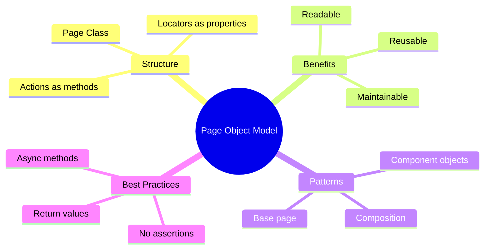

# 📄 Use Case 3: Page Object Model Pattern

> **💡 Lightbulb Moment**: Page Objects encapsulate page logic - change the page once, all tests update automatically!

---

## 1. 🔍 What is Page Object Model?

Design pattern that creates object repository for UI elements, making tests maintainable and reusable.

### Benefits
- **Maintainability**: Change locators in one place
- **Reusability**: Share page logic across tests
- **Readability**: Tests read like user stories
- **Reduced duplication**: DRY principle

---

## 2. 🏗️ Creating Page Objects

### Basic Page Object

```typescript
// pages/login.page.ts
import { Page, Locator } from '@playwright/test';

export class LoginPage {
  readonly page: Page;
  readonly emailInput: Locator;
  readonly passwordInput: Locator;
  readonly submitButton: Locator;
  readonly errorMessage: Locator;

  constructor(page: Page) {
    this.page = page;
    this.emailInput = page.getByLabel('Email');
    this.passwordInput = page.getByLabel('Password');
    this.submitButton = page.getByRole('button', { name: 'Sign In' });
    this.errorMessage = page.locator('.alert-error');
  }

  async goto() {
    await this.page.goto('/login');
  }

  async login(email: string, password: string) {
    await this.emailInput.fill(email);
    await this.passwordInput.fill(password);
    await this.submitButton.click();
  }

  async getErrorMessage() {
    return await this.errorMessage.textContent();
  }

  async isErrorVisible() {
    return await this.errorMessage.isVisible();
  }
}
```

### Using Page Object in Tests

```typescript
// tests/login.spec.ts
import { test, expect } from '@playwright/test';
import { LoginPage } from '../pages/login.page';

test.describe('Login Tests', () => {
  let loginPage: LoginPage;

  test.beforeEach(async ({ page }) => {
    loginPage = new LoginPage(page);
    await loginPage.goto();
  });

  test('successful login redirects to dashboard', async ({ page }) => {
    await loginPage.login('user@test.com', 'password123');
    await expect(page).toHaveURL('/dashboard');
  });

  test('shows error for invalid credentials', async () => {
    await loginPage.login('wrong@test.com', 'wrongpass');
    
    const isErrorVisible = await loginPage.isErrorVisible();
    expect(isErrorVisible).toBeTruthy();
    
    const errorText = await loginPage.getErrorMessage();
    expect(errorText).toContain('Invalid credentials');
  });

  test('email field is required', async () => {
    await loginPage.login('', 'password123');
    await expect(loginPage.emailInput).toHaveAttribute('aria-invalid', 'true');
  });
});
```

---

## 3. 🎯 Advanced Patterns

### Component Objects

```typescript
// components/header.component.ts
export class HeaderComponent {
  readonly page: Page;

  constructor(page: Page) {
    this.page = page;
  }

  get userMenu() {
    return this.page.locator('[data-testid="user-menu"]');
  }

  get logoutButton() {
    return this.page.getByRole('button', { name: 'Logout' });
  }

  async logout() {
    await this.userMenu.click();
    await this.logoutButton.click();
  }

  async getUserName() {
    return await this.page.locator('.user-name').textContent();
  }
}
```

### Composing Page Objects

```typescript
// pages/dashboard.page.ts
import { HeaderComponent } from '../components/header.component';

export class DashboardPage {
  readonly page: Page;
  readonly header: HeaderComponent;

  constructor(page: Page) {
    this.page = page;
    this.header = new HeaderComponent(page);
  }

  async goto() {
    await this.page.goto('/dashboard');
  }

  async logoutUser() {
    await this.header.logout();
  }
}

// In test
const dashboard = new DashboardPage(page);
await dashboard.logoutUser(); // Uses composed component
```

---

## 4. 🌍 Real-World Example

### E-Commerce Product Page

```typescript
// pages/product.page.ts
export class ProductPage {
  readonly page: Page;

  constructor(page: Page) {
    this.page = page;
  }

  // Locators
  get productTitle() {
    return this.page.locator('h1.product-title');
  }

  get priceLabel() {
    return this.page.locator('.price');
  }

  get addToCartButton() {
    return this.page.getByRole('button', { name: 'Add to Cart' });
  }

  get quantityInput() {
    return this.page.locator('input[name="quantity"]');
  }

  // Actions
  async goto(productId: string) {
    await this.page.goto(`/products/${productId}`);
  }

  async addToCart(quantity: number = 1) {
    await this.quantityInput.fill(quantity.toString());
    await this.addToCartButton.click();
  }

  async getProductDetails() {
    return {
      title: await this.productTitle.textContent(),
      price: await this.priceLabel.textContent(),
    };
  }

  async isInStock() {
    const stockStatus = await this.page.locator('.stock-status').textContent();
    return stockStatus.includes('In Stock');
  }
}
```

---

## ❓ Complete Interview Questions (25+)

**Q1: What is Page Object Model?**
> A: Design pattern that encapsulates page elements and actions into reusable classes.

**Q2: Benefits of POM?**
> A: Maintainability, reusability, readability, reduced duplication.

**Q3: How to create a page object?**
> A: Create class with Page parameter, define locators as readonly properties, add action methods.

**Q4: Should locators be public or private?**
> A: Public (readonly) for flexibility in tests.

**Q5: Where to put navigation logic?**
> A: In page object: `async goto() { await this.page.goto('/path'); }`.

**Q6: How to compose page objects?**
> A: Inject component objects into page objects.

**Q7: Should assertions be in page objects?**
> A: No - keep page objects pure, assertions in tests.

**Q8: How to handle dynamic locators?**
> A: Use methods that return locators: `getProductById(id)`.

**Q9: How to reuse common components?**
> A: Create component classes (Header, Footer) and compose.

**Q10: When to use getters vs methods?**
> A: Getters for locators, methods for actions.

**Q11: How to organize page objects?**
> A: `pages/` folder for pages, `components/` for reusable UI components.

**Q12: Should page objects return values?**
> A: Yes - for verification in tests.

**Q13: How to handle waits in POM?**
> A: Playwright auto-waits; no explicit waits needed usually.

**Q14: Can page objects navigate?**
> A: Yes - common pattern: `async goto()` method.

**Q15: How to test page objects?**
> A: Integration tests using actual page objects.

**Q16: Should POM include test data?**
> A: No - separate test data from page logic.

**Q17: How to handle forms in POM?**
> A: Create method like `async fillForm(data)`.

**Q18: Can POMs inherit from base class?**
> A: Yes - create `BasePage` with common functionality.

**Q19: How to handle modals in POM?**
> A: Create separate modal component class.

**Q20: Should POMs be synchronous?**
> A: No - use async/await for all Playwright calls.

**Q21: How many page objects per test?**
> A: As many as needed - usually 1-3.

**Q22: How to version page objects?**
> A: Git with tests; refactor when page changes.

**Q23: Can POMs share state?**
> A: Avoid - keep stateless, pass data via methods.

**Q24: How to handle conditional elements?**
> A: Use optional methods or check visibility first.

**Q25: Best practices for POM naming?**
> A: `PageName + Page` or `PageName + Component`.

---

## 🧠 Mind Map


