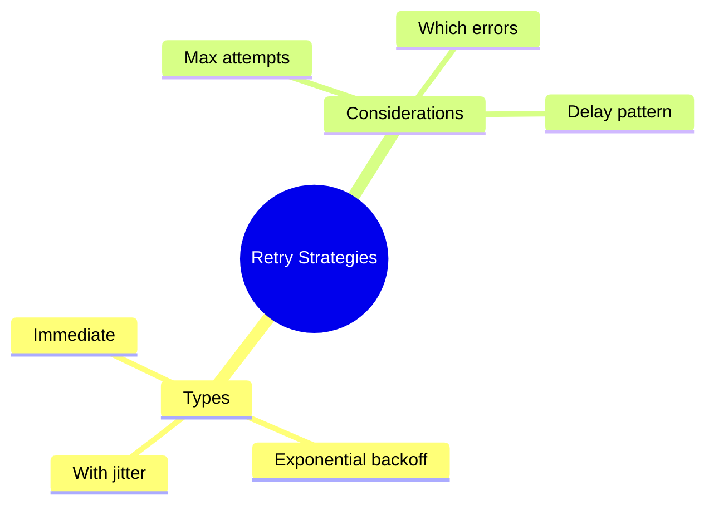

# 🔁 Retry Strategies

> **💡 Lightbulb Moment**: Don't fail immediately - retry with exponential backoff for transient failures!


## 📋 Table of Contents
- [1. 🔍 Basic Retry](#1--basic-retry)
- [2. 🚀 Exponential Backoff](#2--exponential-backoff)
- [3. ❓ Interview Questions](#3--interview-questions)
  - [Basic Questions](#basic-questions)
    - [Q1: When to retry vs fail immediately?](#q1-when-to-retry-vs-fail-immediately)
    - [Q2: What is exponential backoff?](#q2-what-is-exponential-backoff)
  - [Scenario-Based Questions](#scenario-based-questions)
    - [Scenario: Retry with Jitter](#scenario-retry-with-jitter)
  - [📦 Data Flow Summary (Visual Box Diagram)](#data-flow-summary-visual-box-diagram)
- [🧠 Mind Map](#mind-map)

---
---

## 1. 🔍 Basic Retry

```typescript
this.http.get('/api/data').pipe(
    retry(3)  // Retry up to 3 times immediately
)
```

---

## 2. 🚀 Exponential Backoff

```typescript
this.http.get('/api/data').pipe(
    retry({
        count: 3,
        delay: (error, retryCount) => {
            // Don't retry client errors
            if (error.status >= 400 && error.status < 500) {
                throw error;
            }
            // Exponential backoff: 2s, 4s, 8s
            const delayMs = Math.pow(2, retryCount) * 1000;
            console.log(`Retry ${retryCount} in ${delayMs}ms`);
            return timer(delayMs);
        }
    })
)
```

---

## 3. ❓ Interview Questions

### Basic Questions

#### Q1: When to retry vs fail immediately?
**Answer:**
| Retry | Fail Immediately |
|-------|------------------|
| 5xx server errors | 4xx client errors |
| Network timeouts | Auth errors (401) |
| Transient failures | Validation errors |

#### Q2: What is exponential backoff?
**Answer:** Wait time doubles with each retry: 1s → 2s → 4s → 8s. Prevents overwhelming a struggling server.

---

### Scenario-Based Questions

#### Scenario: Retry with Jitter
**Question:** Add randomness to prevent thundering herd.

**Answer:**
```typescript
delay: (error, retryCount) => {
    const base = Math.pow(2, retryCount) * 1000;
    const jitter = Math.random() * 1000;  // 0-1s random
    return timer(base + jitter);
}
```

---

### 📦 Data Flow Summary (Visual Box Diagram)

```
┌─────────────────────────────────────────────────────────────┐
│  RETRY STRATEGIES: DON'T FAIL IMMEDIATELY                   │
│                                                             │
│   BASIC RETRY:                                              │
│   ┌───────────────────────────────────────────────────────┐ │
│   │ http.get('/api/data').pipe(                           │ │
│   │   retry(3)  // Retry up to 3 times immediately        │ │
│   │ )                                                     │ │
│   └───────────────────────────────────────────────────────┘ │
│                                                             │
│   EXPONENTIAL BACKOFF:                                      │
│   ┌───────────────────────────────────────────────────────┐ │
│   │ retry({                                               │ │
│   │   count: 3,                                           │ │
│   │   delay: (error, retryCount) => {                     │ │
│   │     if (error.status < 500) throw error; // No retry! │ │
│   │     const delayMs = Math.pow(2, retryCount) * 1000;   │ │
│   │     return timer(delayMs); // 2s, 4s, 8s              │ │
│   │   }                                                   │ │
│   │ })                                                    │ │
│   └───────────────────────────────────────────────────────┘ │
│                                                             │
│   WHEN TO RETRY:                                            │
│   ✅ 5xx server errors, network timeouts                   │
│   ❌ 4xx client errors, 401 auth errors (don't retry!)     │
│                                                             │
│   ADD JITTER: const jitter = Math.random() * 1000;         │
└─────────────────────────────────────────────────────────────┘
```

> **Key Takeaway**: Retry 5xx, not 4xx. Use exponential backoff (2s→4s→8s). Add jitter to prevent thundering herd!

---

## 🧠 Mind Map


