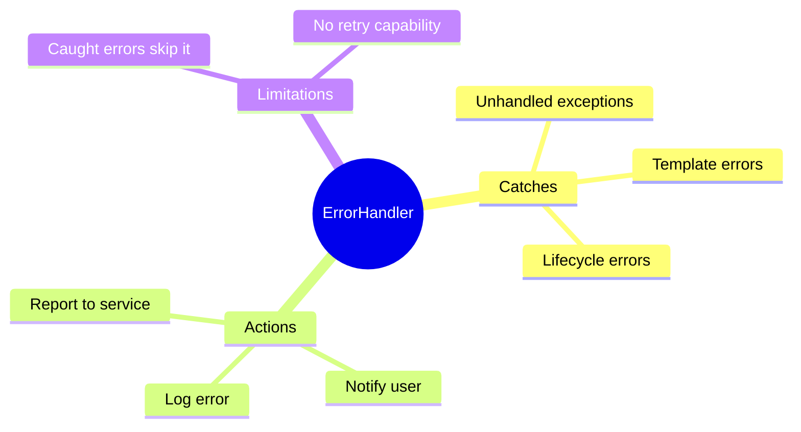

# ⚠️ Use Case 1: Global Error Handler

> **💡 Lightbulb Moment**: Catch ALL unhandled errors in one place with Angular's ErrorHandler!

---

## 1. 🔍 What is ErrorHandler?

Angular's global error handler catches all unhandled exceptions.

```typescript
@Injectable()
export class GlobalErrorHandler implements ErrorHandler {
    handleError(error: any): void {
        console.error('Global error:', error);
        
        // Log to monitoring service
        this.loggingService.logError(error);
        
        // Show user-friendly message
        this.notificationService.showError('Something went wrong');
    }
}

// Register in app.config.ts
providers: [
    { provide: ErrorHandler, useClass: GlobalErrorHandler }
]
```

---

## 2. 🚀 What It Catches

- Unhandled exceptions in components
- Errors in lifecycle hooks
- Errors in event handlers
- Template errors

---

## 3. ❓ Interview Questions

### Basic Questions

#### Q1: Does ErrorHandler catch HTTP errors?
**Answer:** Only if they're unhandled. HTTP errors caught by catchError in RxJS won't reach ErrorHandler.

#### Q2: How to distinguish error types?
**Answer:**
```typescript
handleError(error: any) {
    if (error instanceof HttpErrorResponse) {
        // HTTP error
    } else if (error instanceof TypeError) {
        // JavaScript type error
    } else {
        // Unknown error
    }
}
```

---

### Scenario-Based Questions

#### Scenario: Log to Service
**Question:** Send errors to monitoring service (Sentry/Azure).

**Answer:**
```typescript
handleError(error: any) {
    const errorInfo = {
        message: error.message,
        stack: error.stack,
        url: window.location.href,
        timestamp: new Date().toISOString()
    };
    
    this.http.post('/api/log-error', errorInfo).subscribe();
}
```

---

## 🧠 Mind Map


