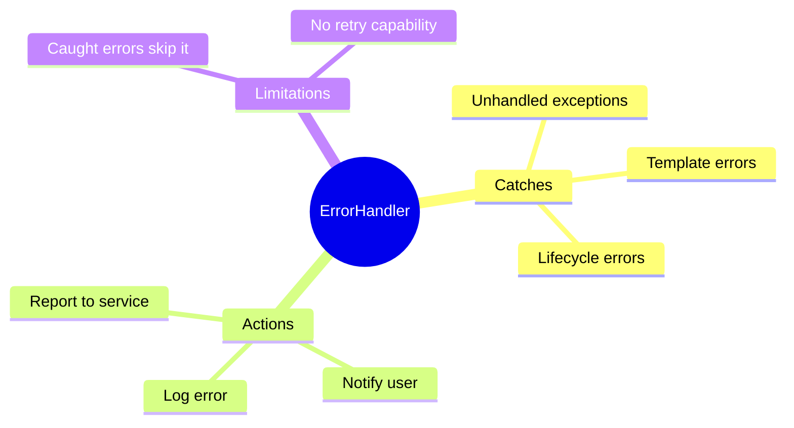

# ⚠️ Use Case 1: Global Error Handler

> **💡 Lightbulb Moment**: Catch ALL unhandled errors in one place with Angular's ErrorHandler!

---

## 1. 🔍 What is ErrorHandler?

Angular's global error handler catches all unhandled exceptions.

```typescript
@Injectable()
export class GlobalErrorHandler implements ErrorHandler {
    handleError(error: any): void {
        console.error('Global error:', error);
        
        // Log to monitoring service
        this.loggingService.logError(error);
        
        // Show user-friendly message
        this.notificationService.showError('Something went wrong');
    }
}

// Register in app.config.ts
providers: [
    { provide: ErrorHandler, useClass: GlobalErrorHandler }
]
```

---

## 2. 🚀 What It Catches

- Unhandled exceptions in components
- Errors in lifecycle hooks
- Errors in event handlers
- Template errors

---

## 3. ❓ Interview Questions

### Basic Questions

#### Q1: Does ErrorHandler catch HTTP errors?
**Answer:** Only if they're unhandled. HTTP errors caught by catchError in RxJS won't reach ErrorHandler.

#### Q2: How to distinguish error types?
**Answer:**
```typescript
handleError(error: any) {
    if (error instanceof HttpErrorResponse) {
        // HTTP error
    } else if (error instanceof TypeError) {
        // JavaScript type error
    } else {
        // Unknown error
    }
}
```

---

### Scenario-Based Questions

#### Scenario: Log to Service
**Question:** Send errors to monitoring service (Sentry/Azure).

**Answer:**
```typescript
handleError(error: any) {
    const errorInfo = {
        message: error.message,
        stack: error.stack,
        url: window.location.href,
        timestamp: new Date().toISOString()
    };
    
    this.http.post('/api/log-error', errorInfo).subscribe();
}
```

---

## 🏥 Hospital Emergency Room Analogy (Easy to Remember!)

Think of Global Error Handler like a **Hospital Emergency Room**:

| Concept | ER Analogy | Memory Trick |
|---------|------------|--------------| 
| **ErrorHandler** | 🏥 **ER department**: Catches ALL serious cases that weren't handled elsewhere | **"Last line of defense"** |
| **handleError()** | 👨‍⚕️ **ER Doctor**: Receives patient, diagnoses, treats | **"Process the error"** |
| **Logging Service** | 📋 **Medical records**: Document everything for later review | **"Log to Sentry/Azure"** |
| **Notify User** | 📢 **Nurse announcement**: "Your doctor will see you shortly" | **"User-friendly message"** |
| **Caught errors skip** | 🏠 **Treated at home**: Minor issues handled locally never reach ER | **"Already handled"** |

### 📖 Story to Remember:

> 🏥 **The Angular Hospital**
>
> Your app is a hospital. Errors are patients:
>
> **Minor Issues (Caught locally):**
> ```typescript
> try {
>   riskyOperation();  // Patient feels sick
> } catch (e) {
>   // Treated at home (catchError)
>   // Never goes to ER!
> }
> ```
>
> **Serious Issues (Unhandled):**
> ```typescript
> throw new Error("Critical!");  // 🚨 
> ↓
> GlobalErrorHandler catches it  // 🏥 ER receives patient
> ↓
> handleError(error)             // 👨‍⚕️ Doctor examines
> ↓
> Log to monitoring              // 📋 File paperwork
> Show user message              // 📢 "We're working on it"
> ```
>
> **The ER exists for cases that weren't handled anywhere else!**

### 🎯 Quick Reference:
```
🏥 ErrorHandler       = ER (catches unhandled errors)
👨‍⚕️ handleError()      = Doctor (process the error)
📋 Log to service     = Medical records (Sentry, Azure)
📢 Notify user        = "Something went wrong" message
🏠 try/catch          = Treated at home (doesn't reach ER)
```

---

## 🧠 Mind Map


