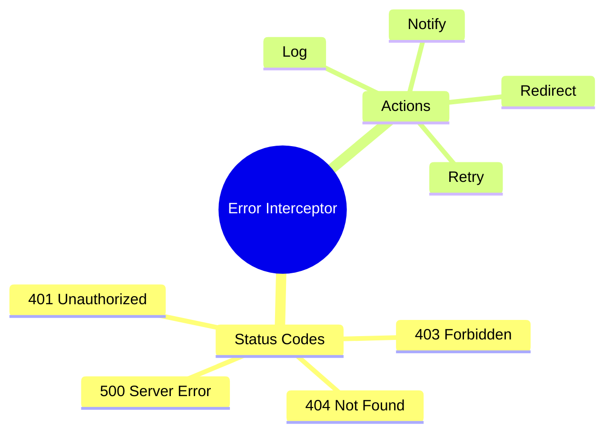

# 🔄 Use Case 2: HTTP Error Interceptor

> **💡 Lightbulb Moment**: Handle ALL HTTP errors in one interceptor - logging, retries, and user notifications!

---

## 1. 🔍 Error Interceptor

```typescript
export const errorInterceptor: HttpInterceptorFn = (req, next) => {
    return next(req).pipe(
        catchError((error: HttpErrorResponse) => {
            let message = 'An error occurred';
            
            switch (error.status) {
                case 401:
                    message = 'Please log in again';
                    // Redirect to login
                    break;
                case 403:
                    message = 'Access denied';
                    break;
                case 404:
                    message = 'Resource not found';
                    break;
                case 500:
                    message = 'Server error. Please try later.';
                    break;
            }
            
            // Show notification
            inject(NotificationService).showError(message);
            
            return throwError(() => error);
        })
    );
};
```

---

## 2. 🚀 Advanced: Retry on Failure

```typescript
export const retryInterceptor: HttpInterceptorFn = (req, next) => {
    return next(req).pipe(
        retry({
            count: 3,
            delay: (error, retryCount) => {
                if (error.status < 500) throw error;  // Don't retry 4xx
                return timer(Math.pow(2, retryCount) * 1000);  // Exponential backoff
            }
        })
    );
};
```

---

## 3. ❓ Interview Questions

### Basic Questions

#### Q1: Why use interceptor for errors?
**Answer:**
- Centralized error handling
- Consistent behavior across all requests
- Single place for retry logic, logging

#### Q2: Should you rethrow the error?
**Answer:** Usually yes! So calling code can also handle it:
```typescript
catchError(err => {
    this.log(err);
    return throwError(() => err);  // Rethrow
})
```

---

### Scenario-Based Questions

#### Scenario: Auto-Logout on 401
**Question:** Redirect to login on unauthorized response.

**Answer:**
```typescript
if (error.status === 401) {
    inject(AuthService).logout();
    inject(Router).navigate(['/login']);
}
```

---

### 📦 Data Flow Summary (Visual Box Diagram)

```
┌─────────────────────────────────────────────────────────────┐
│  HTTP ERROR INTERCEPTOR: CENTRALIZED ERROR HANDLING         │
│                                                             │
│   INTERCEPTOR SETUP:                                        │
│   ┌───────────────────────────────────────────────────────┐ │
│   │ export const errorInterceptor: HttpInterceptorFn =    │ │
│   │   (req, next) => next(req).pipe(                      │ │
│   │     catchError((error: HttpErrorResponse) => {        │ │
│   │       switch (error.status) {                         │ │
│   │         case 401: redirect('/login'); break;          │ │
│   │         case 403: showError('Access denied'); break;  │ │
│   │         case 500: showError('Server error'); break;   │ │
│   │       }                                               │ │
│   │       return throwError(() => error); // Rethrow!     │ │
│   │     })                                                │ │
│   │   );                                                  │ │
│   └───────────────────────────────────────────────────────┘ │
│                                                             │
│   WITH RETRY:                                               │
│   ┌───────────────────────────────────────────────────────┐ │
│   │ retry({                                               │ │
│   │   count: 3,                                           │ │
│   │   delay: (error, retryCount) =>                       │ │
│   │     timer(Math.pow(2, retryCount) * 1000) // Exp backoff│ │
│   │ })                                                    │ │
│   └───────────────────────────────────────────────────────┘ │
└─────────────────────────────────────────────────────────────┘
```

> **Key Takeaway**: Centralized error handling! 401→login, 403→denied, 500→retry. Always rethrow!

---

## 🚧 Toll Booth Analogy (Easy to Remember!)

Think of HTTP error interceptor like a **toll booth inspector**:

| Concept | Toll Booth Analogy | Memory Trick |
|---------|-------------------|--------------| 
| **Interceptor** | 🚧 **Toll booth**: Every car must pass through | **"All requests pass here"** |
| **catchError** | 🚨 **Inspector**: "Let me check this response..." | **"Error handler"** |
| **401 status** | 🪪 **No valid pass**: "Come back with ID!" | **"Unauthorized"** |
| **500 status** | 🔥 **Road on fire**: "Road closed, try later" | **"Server error"** |
| **retry** | 🔄 **"Try again lane"**: Give another chance | **"Automatic retry"** |

### 📖 Story to Remember:

> 🚧 **The Toll Booth Inspector**
>
> Every HTTP response passes through your toll booth:
>
> **The Inspection Process:**
> ```typescript
> // Inspector at every booth
> return next(req).pipe(
>   catchError((error) => {
>     switch (error.status) {
>       case 401:  // 🪪 No valid pass
>         message = "Show your ID! (Login again)";
>         break;
>       case 403:  // 🚫 Wrong lane
>         message = "You can't use this road!";
>         break;
>       case 500:  // 🔥 Road on fire
>         message = "Road closed, try later!";
>         break;
>     }
>     notify(message);
>     return throwError(() => error);  // Report to headquarters
>   })
> );
> ```
>
> **One inspector handles ALL roads (requests)!**

### 🎯 Quick Reference:
```
🚧 Interceptor   = Toll booth (all requests pass through)
🚨 catchError    = Inspector (checks responses)
🪪 401           = No valid pass (login needed)
🔥 500           = Road on fire (server error)
🔄 retry         = Try again lane
```

---

## 🧠 Mind Map


