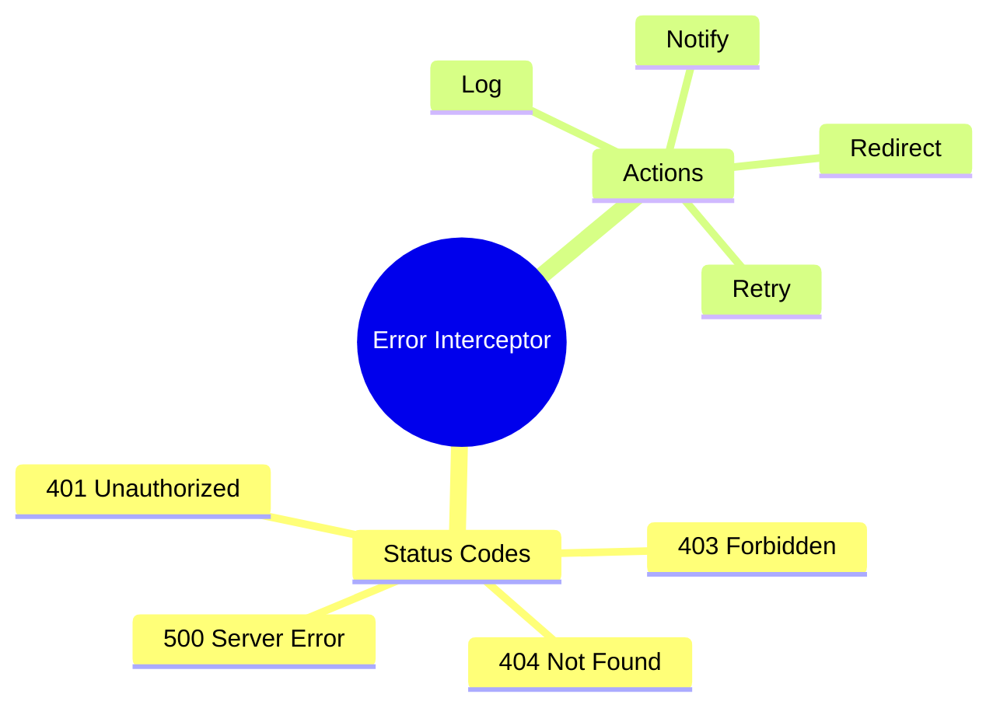

# 🔄 Use Case 2: HTTP Error Interceptor

> **💡 Lightbulb Moment**: Handle ALL HTTP errors in one interceptor - logging, retries, and user notifications!

---

## 1. 🔍 Error Interceptor

```typescript
export const errorInterceptor: HttpInterceptorFn = (req, next) => {
    return next(req).pipe(
        catchError((error: HttpErrorResponse) => {
            let message = 'An error occurred';
            
            switch (error.status) {
                case 401:
                    message = 'Please log in again';
                    // Redirect to login
                    break;
                case 403:
                    message = 'Access denied';
                    break;
                case 404:
                    message = 'Resource not found';
                    break;
                case 500:
                    message = 'Server error. Please try later.';
                    break;
            }
            
            // Show notification
            inject(NotificationService).showError(message);
            
            return throwError(() => error);
        })
    );
};
```

---

## 2. 🚀 Advanced: Retry on Failure

```typescript
export const retryInterceptor: HttpInterceptorFn = (req, next) => {
    return next(req).pipe(
        retry({
            count: 3,
            delay: (error, retryCount) => {
                if (error.status < 500) throw error;  // Don't retry 4xx
                return timer(Math.pow(2, retryCount) * 1000);  // Exponential backoff
            }
        })
    );
};
```

---

## 3. ❓ Interview Questions

### Basic Questions

#### Q1: Why use interceptor for errors?
**Answer:**
- Centralized error handling
- Consistent behavior across all requests
- Single place for retry logic, logging

#### Q2: Should you rethrow the error?
**Answer:** Usually yes! So calling code can also handle it:
```typescript
catchError(err => {
    this.log(err);
    return throwError(() => err);  // Rethrow
})
```

---

### Scenario-Based Questions

#### Scenario: Auto-Logout on 401
**Question:** Redirect to login on unauthorized response.

**Answer:**
```typescript
if (error.status === 401) {
    inject(AuthService).logout();
    inject(Router).navigate(['/login']);
}
```

---

## 🧠 Mind Map


