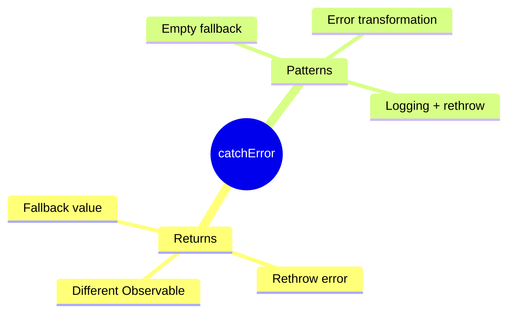

# 🎯 Use Case 3: catchError in RxJS

> **💡 Lightbulb Moment**: catchError handles Observable errors gracefully - provide fallbacks or rethrow!

---

## 1. 🔍 Basic catchError

```typescript
this.http.get<User[]>('/api/users').pipe(
    catchError(error => {
        console.error('Failed to load users:', error);
        return of([]);  // Return empty array as fallback
    })
).subscribe(users => this.users = users);
```

---

## 2. 🚀 Common Patterns

### Return Fallback
```typescript
catchError(() => of({ data: [], error: true }))
```

### Rethrow
```typescript
catchError(err => {
    this.log(err);
    return throwError(() => err);  // Pass to caller
})
```

### Transform Error
```typescript
catchError(err => throwError(() => new AppError('Custom message', err)))
```

---

## 3. ❓ Interview Questions

### Basic Questions

#### Q1: catchError vs global ErrorHandler?
**Answer:**
| catchError | ErrorHandler |
|------------|-------------|
| Per-Observable | Global |
| Prevents error bubbling | Catches unhandled |
| Can provide fallback | Can only log/notify |

#### Q2: What happens if you don't use catchError?
**Answer:** Error propagates, subscription fails, and if unhandled, reaches ErrorHandler.

---

### Scenario-Based Questions

#### Scenario: Multiple API Fallback
**Question:** Try primary server, fallback to backup on failure.

**Answer:**
```typescript
this.http.get(primaryUrl).pipe(
    catchError(() => this.http.get(backupUrl)),
    catchError(() => of(defaultData))  // Final fallback
)
```

---

### 📦 Data Flow Summary (Visual Box Diagram)

```
┌─────────────────────────────────────────────────────────────┐
│  catchError: HANDLE OBSERVABLE ERRORS GRACEFULLY            │
│                                                             │
│   BASIC PATTERN:                                            │
│   ┌───────────────────────────────────────────────────────┐ │
│   │ http.get('/api/users').pipe(                          │ │
│   │   catchError(error => {                               │ │
│   │     console.error('Failed:', error);                  │ │
│   │     return of([]);  // Fallback: empty array          │ │
│   │   })                                                  │ │
│   │ )                                                     │ │
│   └───────────────────────────────────────────────────────┘ │
│                                                             │
│   OPTIONS WHEN CAUGHT:                                      │
│   ┌───────────────────────────────────────────────────────┐ │
│   │ return of([]);            // 🧘 Return fallback value │ │
│   │ return throwError(err);   // 📢 Rethrow to caller     │ │
│   │ return this.backupApi();  // 🎭 Try alternate source  │ │
│   └───────────────────────────────────────────────────────┘ │
│                                                             │
│   CHAINED FALLBACKS:                                        │
│   ┌───────────────────────────────────────────────────────┐ │
│   │ http.get(primaryUrl).pipe(                            │ │
│   │   catchError(() => http.get(backupUrl)),  // Try backup│ │
│   │   catchError(() => of(defaultData))       // Final fallback│ │
│   │ )                                                     │ │
│   └───────────────────────────────────────────────────────┘ │
└─────────────────────────────────────────────────────────────┘
```

> **Key Takeaway**: catchError = per-Observable error handling. Return fallback OR rethrow. Chain for multiple fallbacks!

---

## 🎪 Safety Net Analogy (Easy to Remember!)

Think of catchError like a **circus safety net**:

| Concept | Circus Analogy | Memory Trick |
|---------|---------------|--------------| 
| **Observable** | 🎪 **Trapeze artist**: Performing tricks (API call) | **"The risky action"** |
| **catchError** | 🕸️ **Safety net**: Catches if artist falls | **"Error handler"** |
| **Fallback value** | 🧘 **Bounce back**: Artist lands safely, show continues | **"Return default"** |
| **throwError** | 📢 **Call medic**: "Someone else needs to handle this!" | **"Rethrow to caller"** |
| **No net** | 💀 **Crash**: Show stops, audience leaves | **"Unhandled error"** |

### 📖 Story to Remember:

> 🎪 **The Circus Show**
>
> Your API call is a trapeze act:
>
> **With Safety Net (catchError):**
> ```typescript
> this.http.get('/api/users').pipe(
>   catchError(error => {
>     // 🕸️ Caught by net!
>     console.log('Artist fell, but caught safely');
>     return of([]);  // 🧘 Show continues with empty act
>   })
> );
> ```
>
> **Options when caught:**
> ```typescript
> return of([]);           // 🧘 Continue with fallback
> return throwError(err);  // 📢 Call for help (pass to caller)
> return this.backupApi(); // 🎭 Send in backup performer
> ```
>
> **Always have a safety net under risky acts!**

### 🎯 Quick Reference:
```
🎪 API call       = Trapeze act (risky)
🕸️ catchError     = Safety net (catches errors)
🧘 return of(x)   = Bounce back with fallback
📢 throwError     = Call for help (rethrow)
💀 No handler     = Show crashes
```

---

## 🧠 Mind Map


