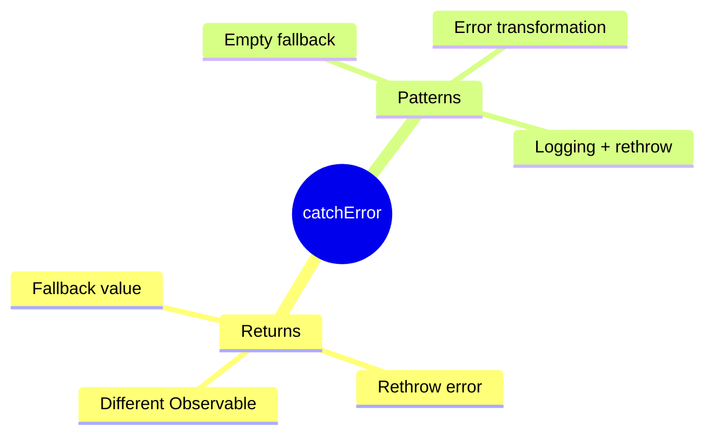

# 🎯 Use Case 3: catchError in RxJS

> **💡 Lightbulb Moment**: catchError handles Observable errors gracefully - provide fallbacks or rethrow!

---

## 1. 🔍 Basic catchError

```typescript
this.http.get<User[]>('/api/users').pipe(
    catchError(error => {
        console.error('Failed to load users:', error);
        return of([]);  // Return empty array as fallback
    })
).subscribe(users => this.users = users);
```

---

## 2. 🚀 Common Patterns

### Return Fallback
```typescript
catchError(() => of({ data: [], error: true }))
```

### Rethrow
```typescript
catchError(err => {
    this.log(err);
    return throwError(() => err);  // Pass to caller
})
```

### Transform Error
```typescript
catchError(err => throwError(() => new AppError('Custom message', err)))
```

---

## 3. ❓ Interview Questions

### Basic Questions

#### Q1: catchError vs global ErrorHandler?
**Answer:**
| catchError | ErrorHandler |
|------------|-------------|
| Per-Observable | Global |
| Prevents error bubbling | Catches unhandled |
| Can provide fallback | Can only log/notify |

#### Q2: What happens if you don't use catchError?
**Answer:** Error propagates, subscription fails, and if unhandled, reaches ErrorHandler.

---

### Scenario-Based Questions

#### Scenario: Multiple API Fallback
**Question:** Try primary server, fallback to backup on failure.

**Answer:**
```typescript
this.http.get(primaryUrl).pipe(
    catchError(() => this.http.get(backupUrl)),
    catchError(() => of(defaultData))  // Final fallback
)
```

---

## 🧠 Mind Map


