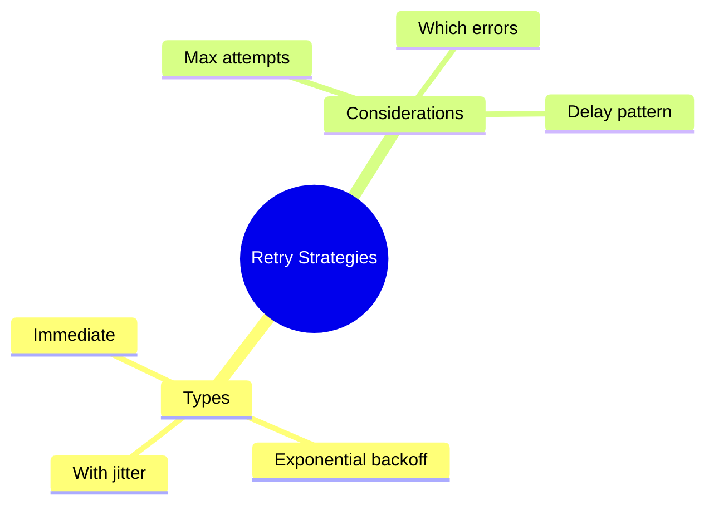

# 🔁 Use Case 4: Retry Strategies

> **💡 Lightbulb Moment**: Don't fail immediately - retry with exponential backoff for transient failures!

---

## 1. 🔍 Basic Retry

```typescript
this.http.get('/api/data').pipe(
    retry(3)  // Retry up to 3 times immediately
)
```

---

## 2. 🚀 Exponential Backoff

```typescript
this.http.get('/api/data').pipe(
    retry({
        count: 3,
        delay: (error, retryCount) => {
            // Don't retry client errors
            if (error.status >= 400 && error.status < 500) {
                throw error;
            }
            // Exponential backoff: 2s, 4s, 8s
            const delayMs = Math.pow(2, retryCount) * 1000;
            console.log(`Retry ${retryCount} in ${delayMs}ms`);
            return timer(delayMs);
        }
    })
)
```

---

## 3. ❓ Interview Questions

### Basic Questions

#### Q1: When to retry vs fail immediately?
**Answer:**
| Retry | Fail Immediately |
|-------|------------------|
| 5xx server errors | 4xx client errors |
| Network timeouts | Auth errors (401) |
| Transient failures | Validation errors |

#### Q2: What is exponential backoff?
**Answer:** Wait time doubles with each retry: 1s → 2s → 4s → 8s. Prevents overwhelming a struggling server.

---

### Scenario-Based Questions

#### Scenario: Retry with Jitter
**Question:** Add randomness to prevent thundering herd.

**Answer:**
```typescript
delay: (error, retryCount) => {
    const base = Math.pow(2, retryCount) * 1000;
    const jitter = Math.random() * 1000;  // 0-1s random
    return timer(base + jitter);
}
```

---

## 🧠 Mind Map


