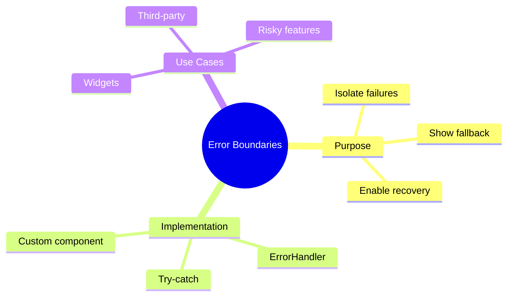

# 🎨 Use Case 5: Error Boundaries

> **💡 Lightbulb Moment**: Isolate errors to prevent entire app crashes - show fallback UI instead!

---

## 1. 🔍 Error Boundary Pattern

```typescript
@Component({
    selector: 'app-error-boundary',
    template: `
        @if (hasError) {
            <div class="error-fallback">
                <h3>Something went wrong</h3>
                <button (click)="retry()">Try Again</button>
            </div>
        } @else {
            <ng-content></ng-content>
        }
    `
})
export class ErrorBoundaryComponent implements ErrorHandler {
    hasError = false;
    
    handleError(error: any) {
        this.hasError = true;
        console.error('Caught by boundary:', error);
    }
    
    retry() {
        this.hasError = false;
    }
}
```

---

## 2. 🚀 Usage

```html
<app-error-boundary>
    <app-risky-component></app-risky-component>
</app-error-boundary>
```

---

## 3. ❓ Interview Questions

### Basic Questions

#### Q1: What is an error boundary?
**Answer:** A pattern that catches errors in child components and displays fallback UI instead of crashing the whole app.

#### Q2: Angular vs React error boundaries?
**Answer:** React has built-in error boundaries. Angular requires custom implementation using ErrorHandler or try-catch patterns.

---

### Scenario-Based Questions

#### Scenario: Widget Dashboard
**Question:** Dashboard has 5 widgets. One failing shouldn't break others.

**Answer:**
```html
@for (widget of widgets; track widget.id) {
    <app-error-boundary>
        <app-widget [config]="widget"></app-widget>
    </app-error-boundary>
}
```

---

## 🧠 Mind Map


