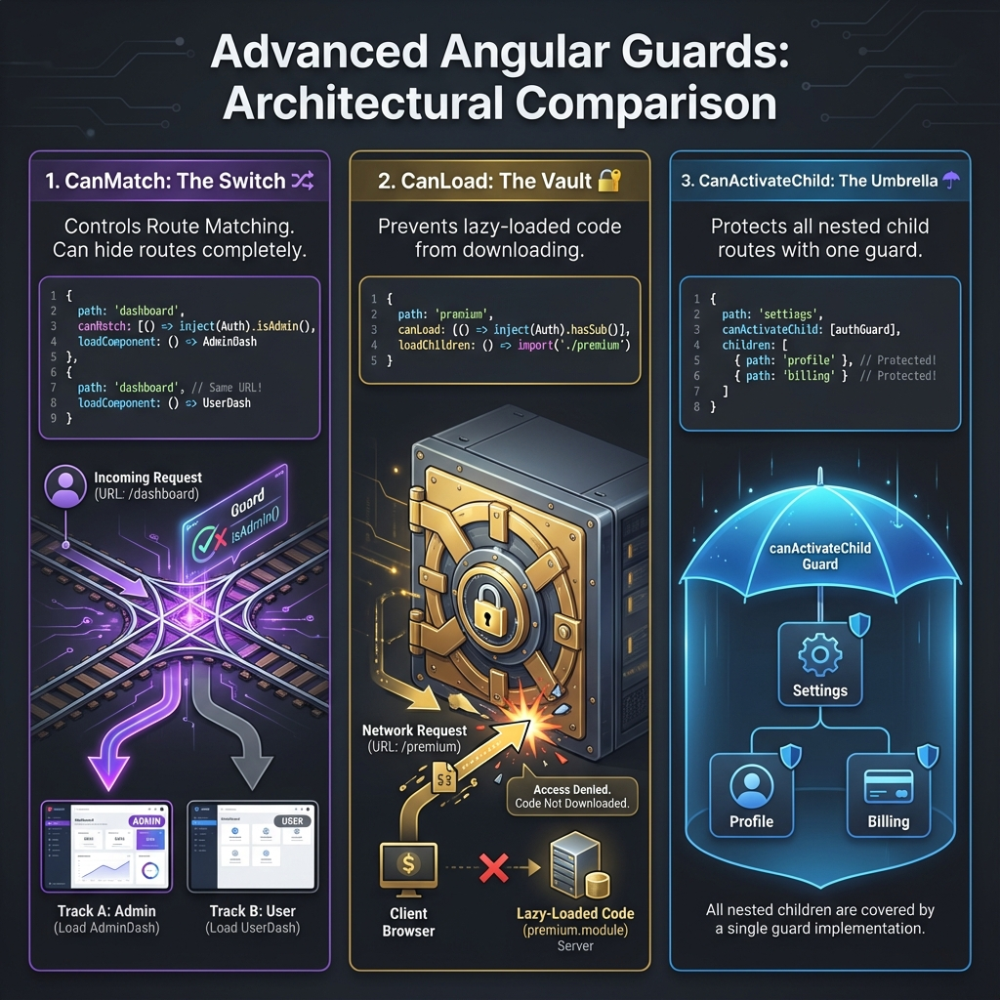

# canMatch Guard


## 📋 Table of Contents
- [🎯 What is canMatch?](#what-is-canmatch)
- [🆚 canMatch vs canActivate](#canmatch-vs-canactivate)
- [💡 Real-World Use Case](#real-world-use-case)
- [📝 Implementation](#implementation)
  - [1. Create the Guard](#1-create-the-guard)
  - [2. Configure Routes](#2-configure-routes)
- [🔑 Key Points](#key-points)
  - [📦 Data Flow Summary (Visual Box Diagram)](#data-flow-summary-visual-box-diagram)
- [⚠️ Common Pitfalls](#common-pitfalls)
- [🦎 Chameleon Analogy (Easy to Remember!)](#chameleon-analogy-easy-to-remember)
  - [📖 Story to Remember:](#story-to-remember)
- [1. 🔍 How It Works:**](#1--how-it-works)
  - [🎯 Quick Reference:](#quick-reference)

---
## 🎯 What is canMatch?

`canMatch` is Angular's **newest guard** (introduced in Angular 14.1+). It determines whether a route should even be **matched** in the first place.

## 🆚 canMatch vs canActivate

| Feature | canActivate | canMatch |
|---------|-------------|----------|
| **When it runs** | AFTER route matches | BEFORE route matches |
| **On false** | Blocks navigation (redirects) | Skips route, tries next match |
| **User experience** | User sees redirect happening | User never knows route existed |
| **Best for** | Access control with feedback | Role-based component selection |

## 💡 Real-World Use Case

**Same URL, Different Components Based on Role:**
```
/dashboard → Admin sees AdminDashboard
/dashboard → Premium user sees PremiumDashboard
/dashboard → Regular user sees UserDashboard
```

## 📝 Implementation

### 1. Create the Guard

```typescript
// role-match.guard.ts
import { inject } from '@angular/core';
import { CanMatchFn, Route, UrlSegment } from '@angular/router';
import { RoleService } from './role.service';

export const adminMatchGuard: CanMatchFn = (
    route: Route,
    segments: UrlSegment[]
) => {
    const roleService = inject(RoleService);
    
    // Return true to match, false to skip
    return roleService.hasRole('admin');
};
```

### 2. Configure Routes

```typescript
// guards.routes.ts
{
    path: 'dashboard',
    canMatch: [adminMatchGuard],  // Only matches for admins
    component: AdminDashboardComponent
},
{
    path: 'dashboard',
    canMatch: [premiumMatchGuard],  // Fallback for premium
    component: PremiumDashboardComponent
},
{
    path: 'dashboard',  // Fallback for everyone else (no guard)
    component: UserDashboardComponent
}
```

## 🔑 Key Points

1. **Order matters!** Routes are evaluated top-to-bottom
2. **Fallback route** should have no canMatch guard
3. **No redirect** - user doesn't know other routes exist
4. **Functional guards** are simpler than class-based

### 📦 Data Flow Summary (Visual Box Diagram)

```
┌─────────────────────────────────────────────────────────────┐
│  canMatch: ROLE-BASED ROUTE SELECTION                       │
│                                                             │
│   User navigates to: /dashboard                             │
│                                                             │
│   ┌───────────────────────────────────────────────────────┐ │
│   │  ROUTE MATCHING (Top to Bottom)                       │ │
│   │                                                       │ │
│   │  ① { path: 'dashboard', canMatch: [isAdmin] }         │ │
│   │     → Admin? YES → AdminDashboard 🔴 (MATCH!)         │ │
│   │     → Admin? NO  → Skip, try next...                  │ │
│   │                                                       │ │
│   │  ② { path: 'dashboard', canMatch: [isPremium] }       │ │
│   │     → Premium? YES → PremiumDashboard 🟡 (MATCH!)     │ │
│   │     → Premium? NO  → Skip, try next...                │ │
│   │                                                       │ │
│   │  ③ { path: 'dashboard' }  // No guard = fallback      │ │
│   │     → Always matches → UserDashboard 🟢               │ │
│   └───────────────────────────────────────────────────────┘ │
│                                                             │
│   KEY DIFFERENCE FROM canActivate:                          │
│   ┌───────────────────────────────────────────────────────┐ │
│   │ canActivate: Route matches, THEN blocks/redirects     │ │
│   │              User sees something happening 👀          │ │
│   │                                                       │ │
│   │ canMatch:    Route doesn't match at all if false      │ │
│   │              User never knows route existed 🥷         │ │
│   └───────────────────────────────────────────────────────┘ │
└─────────────────────────────────────────────────────────────┘
```

> **Key Takeaway**: canMatch = "Does this route apply to you?" Different users get different components for the SAME URL, seamlessly!

---

## ⚠️ Common Pitfalls

1. **Forgetting the fallback route** - Users get 404
2. **Wrong order** - Less restrictive route matches first
3. **Async operations** - canMatch supports Observables too!

---

## 🦎 Chameleon Analogy (Easy to Remember!)

Think of canMatch like a **chameleon changing colors**:

| Concept | Chameleon Analogy | Memory Trick |
|---------|------------------|--------------| 
| **canMatch** | 🦎 **Chameleon**: Changes appearance based on environment | **"Route disguise"** |
| **Same URL** | 🏠 **Same address**: "123 Main St" | **"One path"** |
| **Different components** | 🎨 **Different colors**: Admin=Red, User=Green | **"Role-based look"** |
| **Route order** | ⬇️ **Try colors**: Red first, then Green, then Blue | **"Order matters"** |
| **No redirect** | 🥷 **Invisible switch**: User doesn't see the change | **"Seamless"** |

### 📖 Story to Remember:

> 🦎 **The Chameleon Dashboard**
>
> Your app's dashboard is a chameleon:
>
> **Same Address, Different Views:**
> ```typescript
> // All routes are for /dashboard, but...
> { path: 'dashboard', canMatch: [isAdmin], component: AdminDash },   // 🔴 Red
> { path: 'dashboard', canMatch: [isPremium], component: PremiumDash }, // 🟡 Gold
> { path: 'dashboard', component: UserDash }                          // 🟢 Green
> ```
>
>

## 1. 🔍 How It Works:**
> ```
> Admin visits /dashboard → Sees AdminDash 🔴
> Premium visits /dashboard → Sees PremiumDash 🟡
> User visits /dashboard → Sees UserDash 🟢
> 
> All same URL! No redirect! User never knows! 🥷
> ```

### 🎯 Quick Reference:
```
🦎 canMatch       = Chameleon (route selector)
🏠 Same URL       = Same address, different looks
🎨 Components     = Different dashboard views
⬇️ Order          = Try top-to-bottom
🥷 No redirect    = Seamless to user
```
