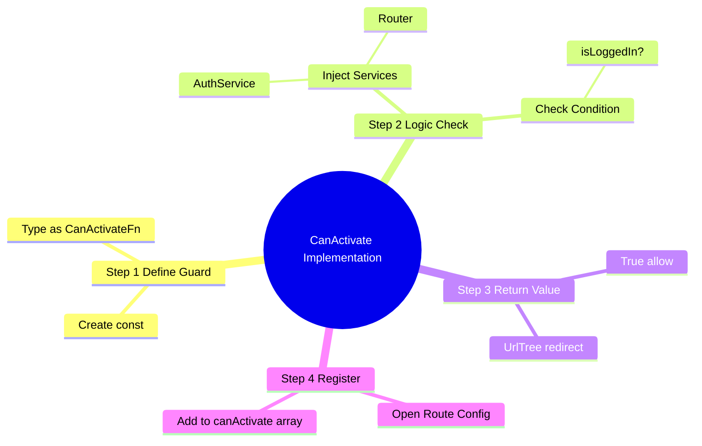
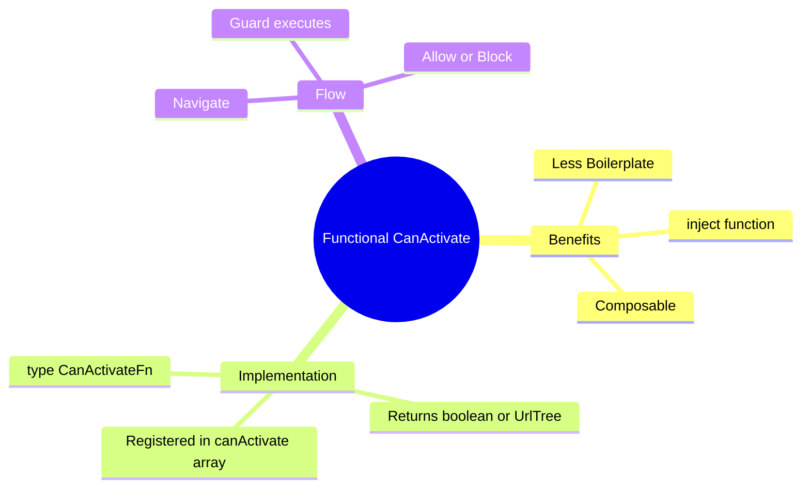

# 🔒 Use Case 1: CanActivate (Functional)

> **Goal**: Protect routes from unauthorized access using modern Angular **Functional Guards**.

---


## 1. 🔍 How It Works (The Concept)

### Old vs New
*   **Legacy (Class-based)**: You created a class `AuthGuard implements CanActivate`. It required a lot of boilerplate and had to be provided in modules.
*   **Modern (Functional)**: You create a simple constant function `authGuard: CanActivateFn`. It's lightweight, composable, and easier to test. It uses `inject()` for dependencies.

### 📊 Guard Flow


```mermaid
graph TD
    User([User]) -->|Clicks Link| Router
    Router -->|Checks| Guard{authGuard}
    
    Guard -->|inject(AuthService)| Service[AuthService]
    Service -->|isLoggedIn?| Decision
    
    Decision -- Yes --> Route[AdminComponent]
    Decision -- No --> Reject[Redirect /login]
    
    style Guard fill:#e1f5fe,stroke:#01579b
    style Route fill:#dcfce7,stroke:#166534
    style Reject fill:#fee2e2,stroke:#b91c1c
```

### 📦 Data Flow Summary (Visual Box Diagram)

```
┌─────────────────────────────────────────────────────────────┐
│  USER NAVIGATION                                            │
│                                                             │
│   User clicks: router.navigate(['/admin'])                  │
│          │                                                  │
│          ▼                                                  │
│   ┌───────────────────────────────────────────────────────┐ │
│   │  🚪 CanActivate GUARD (Bouncer)                       │ │
│   │                                                       │ │
│   │  export const authGuard: CanActivateFn = () => {      │ │
│   │    const auth = inject(AuthService);                  │ │
│   │    const router = inject(Router);                     │ │
│   │                                                       │ │
│   │    if (auth.isLoggedIn()) {                           │ │
│   │      return true;       // ✅ "Welcome in!"           │ │
│   │    }                                                  │ │
│   │    return router.createUrlTree(['/login']); // 🔄     │ │
│   │  };                                                   │ │
│   └───────────────────────────────────────────────────────┘ │
│          │                                                  │
│          ▼                                                  │
│   ┌──────────────────────┬────────────────────────────────┐ │
│   │                      │                                │ │
│   │  return true         │    return UrlTree              │ │
│   │       │              │         │                      │ │
│   │       ▼              │         ▼                      │ │
│   │  ┌────────────┐      │    ┌────────────┐              │ │
│   │  │ ✅ ALLOW   │      │    │ 🔄 REDIRECT │              │ │
│   │  │            │      │    │            │              │ │
│   │  │ /admin     │      │    │ /login     │              │ │
│   │  │ loads      │      │    │ loads      │              │ │
│   │  └────────────┘      │    └────────────┘              │ │
│   │                      │                                │ │
│   └──────────────────────┴────────────────────────────────┘ │
└─────────────────────────────────────────────────────────────┘
```

> **Key Takeaway**: CanActivate = "Can you enter?" guard. Return `true` to allow, `false` to block, or `UrlTree` to redirect elsewhere!

---

## 2. 🚀 Step-by-Step Implementation

### Step 1: The Functional Guard
Defined as a `const` of type `CanActivateFn`.

```typescript
// auth.guard.ts
export const authGuard: CanActivateFn = (route, state) => {
  const authService = inject(AuthService);
  const router = inject(Router);

  if (authService.isLoggedIn()) {
    return true; // ✅ Allow
  } else {
    return router.createUrlTree(['/login']); // 🛑 Redirect
  }
};
```

### Step 2: Registering in Routes
Just pass the function reference in the `canActivate` array.

```typescript
// app.routes.ts
{
  path: 'admin',
  component: AdminComponent,
  canActivate: [authGuard] // <--- Functional guard here
}
```

---

## 🔧 Implementation Flow Mindmap

This mindmap shows **how the use case is implemented** step-by-step:



---

## 🚪 Nightclub Bouncer Analogy (Easy to Remember!)

Think of route guards like **bouncers at a nightclub**:

| Concept | Bouncer Analogy | Memory Trick |
|---------|----------------|--------------| 
| **CanActivate** | 🚪 **Door bouncer**: "Show your ID before entering" | **"Can you come in?"** |
| **AuthService** | 🆔 **ID check system**: Verify if guest is on the list | **"Check credentials"** |
| **return true** | ✅ **Bouncer opens door**: "Welcome in!" | **"Access granted"** |
| **return UrlTree** | 🔄 **Redirect**: "VIP entrance is that way" / "Go to registration" | **"Wrong door, go there"** |
| **canActivateChild** | 🎪 **VIP section bouncer**: Guard the area inside the club | **"Guard inner areas"** |

### 📖 Story to Remember:

> 🚪 **Night at Club Angular**
>
> You're trying to enter Club Angular's Admin VIP section:
>
> **At the door (Route Guard):**
> ```
> You: "I want to go to /admin"
> Bouncer (authGuard): "Let me check..."
> 
> → Checks AuthService: "Are they logged in?"
> → If YES: "Welcome to Admin!" ✅ (return true)
> → If NO:  "Go sign up first!" 🔄 (return UrlTree(['/login']))
> ```
>
> **The bouncer doesn't CREATE the VIP area. They just CONTROL ACCESS.**

### 🎯 Quick Reference:
```
🚪 CanActivate    = "Can you enter this route?"
🆔 inject(Auth)   = Check their credentials
✅ return true    = "Come on in!"
🔄 return UrlTree = "Go to this other place"
❌ return false   = "Access denied, stay here"
```

---

## 3. 🧠 Mind Map: Quick Visual Reference



---

## 🎯 What Problem Does This Solve?

### The Problem: Unprotected Routes Allow Unauthorized Access

**Without Guards (BAD):**
```typescript
// No protection at all!
const routes: Routes = [
    { path: 'admin', component: AdminComponent },
    { path: 'settings', component: SettingsComponent }
];

// Problems:
// 1. ANY user can access /admin - even not logged in!
// 2. Must check auth in EVERY component's ngOnInit
// 3. Component loads before we can redirect
// 4. No centralized access control
```

**Problems:**
1. **Security holes**: Anyone can access protected routes
2. **Duplicated logic**: Auth checks scattered in components
3. **Wasted resources**: Component loads before checking auth
4. **Hard to maintain**: No single point of control

### How Guards Solve This

**With CanActivate Guard (GOOD):**
```typescript
export const authGuard: CanActivateFn = () => {
    const authService = inject(AuthService);
    const router = inject(Router);
    
    if (authService.isLoggedIn()) {
        return true;  // ✅ Allow
    }
    return router.createUrlTree(['/login']);  // 🔄 Redirect
};

// Route is PROTECTED
const routes: Routes = [
    { 
        path: 'admin', 
        component: AdminComponent,
        canActivate: [authGuard]  // 🛡️ Guard protects!
    }
];
```

| Problem | Guard Solution |
|---------|---------------|
| Security holes | **Centralized**: Single point of access control |
| Duplicated logic | **DRY**: One guard, many routes |
| Wasted resources | **Early check**: Before component loads |
| Hard to maintain | **Declarative**: Clear in route config |

---

## 📚 Key Types & Patterns Explained

### 1. `CanActivateFn` Type (Functional Guard)

```typescript
import { CanActivateFn } from '@angular/router';

export const authGuard: CanActivateFn = (route, state) => {
    // route: ActivatedRouteSnapshot - route being accessed
    // state: RouterStateSnapshot - current router state
    
    return true;  // or false, Observable<boolean>, Promise<boolean>, UrlTree
};
```

**Return Types:**
| Return Value | Effect |
|--------------|--------|
| `true` | Allow navigation |
| `false` | Block navigation (stays on current page) |
| `UrlTree` | Redirect to specified URL |
| `Observable<boolean>` | Async decision |
| `Promise<boolean>` | Async decision |

---

### 2. `inject()` in Guards

```typescript
export const authGuard: CanActivateFn = () => {
    // inject() works in functional guards!
    const authService = inject(AuthService);
    const router = inject(Router);
    const http = inject(HttpClient);
    
    // Use services as needed
    return authService.isLoggedIn();
};
```

---

### 3. `UrlTree` for Redirects

```typescript
import { Router } from '@angular/router';

export const authGuard: CanActivateFn = () => {
    const router = inject(Router);
    
    // Create redirect URL tree
    return router.createUrlTree(['/login']);
    
    // With query params
    return router.createUrlTree(['/login'], { 
        queryParams: { returnUrl: router.url } 
    });
};
```

---

### 4. Composable Guards

```typescript
// Multiple guards run in order
const routes: Routes = [
    { 
        path: 'admin',
        component: AdminComponent,
        canActivate: [authGuard, roleGuard, subscriptionGuard]
        // ALL must return true for navigation to proceed
    }
];
```

---

## 🌍 Real-World Use Cases

### 1. Authentication Guard
```typescript
export const authGuard: CanActivateFn = () => {
    const auth = inject(AuthService);
    return auth.isLoggedIn() ? true : inject(Router).createUrlTree(['/login']);
};
```

### 2. Role-Based Access Guard
```typescript
export const adminGuard: CanActivateFn = () => {
    const auth = inject(AuthService);
    return auth.hasRole('ADMIN') ? true : inject(Router).createUrlTree(['/forbidden']);
};
```

### 3. Feature Flag Guard
```typescript
export const featureGuard: CanActivateFn = (route) => {
    const featureService = inject(FeatureService);
    const featureName = route.data['feature'];
    return featureService.isEnabled(featureName);
};
```

### 4. Subscription Guard
```typescript
export const subscriptionGuard: CanActivateFn = () => {
    const billing = inject(BillingService);
    return billing.hasActiveSubscription() 
        ? true 
        : inject(Router).createUrlTree(['/upgrade']);
};
```

### 5. Onboarding Complete Guard
```typescript
export const onboardedGuard: CanActivateFn = () => {
    const user = inject(UserService);
    return user.hasCompletedOnboarding() 
        ? true 
        : inject(Router).createUrlTree(['/onboarding']);
};
```

---

## ❓ Complete Interview Questions (25+)

### Basic Conceptual Questions

**Q1: What is a CanActivate guard?**
> A: A function that runs before a route activates to determine if navigation should proceed.

**Q2: What can a CanActivate guard return?**
> A: `true`, `false`, `UrlTree`, `Observable<boolean|UrlTree>`, or `Promise<boolean|UrlTree>`.

**Q3: When does the guard run?**
> A: Before the component is created, during the navigation process.

**Q4: What's the difference between functional and class-based guards?**
> A: Functional guards are simpler (just a function), use `inject()`, and are the modern approach. Class-based guards implement an interface and are legacy.

**Q5: How do you inject services in a functional guard?**
> A: Use `inject()`:
> ```typescript
> const authService = inject(AuthService);
> ```

---

### Implementation Questions

**Q6: How do you redirect instead of blocking?**
> A: Return a UrlTree:
> ```typescript
> return router.createUrlTree(['/login']);
> ```

**Q7: How do you pass the return URL during redirect?**
> A:
> ```typescript
> return router.createUrlTree(['/login'], { 
>     queryParams: { returnUrl: state.url } 
> });
> ```

**Q8: How do you apply a guard to multiple routes?**
> A: Add it to each route's `canActivate` array:
> ```typescript
> { path: 'admin', canActivate: [authGuard] },
> { path: 'settings', canActivate: [authGuard] }
> ```

**Q9: Can you chain multiple guards?**
> A: Yes! Pass an array. All must return true:
> ```typescript
> canActivate: [authGuard, roleGuard, subscriptionGuard]
> ```

**Q10: How do you access route data in a guard?**
> A: Use the `route` parameter:
> ```typescript
> const requiredRole = route.data['role'];
> ```

---

### Async Guard Questions

**Q11: How do you make an async guard?**
> A: Return an Observable or Promise:
> ```typescript
> export const asyncGuard: CanActivateFn = () => {
>     return inject(HttpClient).get<boolean>('/api/can-access');
> };
> ```

**Q12: How do you handle errors in async guards?**
> A: Use RxJS operators:
> ```typescript
> return http.get('/api/check').pipe(
>     map(() => true),
>     catchError(() => of(router.createUrlTree(['/error'])))
> );
> ```

---

### Scenario Questions

**Q13: User should only access /admin if logged in. Implement it.**
> A:
> ```typescript
> export const authGuard: CanActivateFn = () => {
>     const auth = inject(AuthService);
>     const router = inject(Router);
>     return auth.isLoggedIn() ? true : router.createUrlTree(['/login']);
> };
> ```

**Q14: Only users with 'ADMIN' role can access a route. Implement it.**
> A:
> ```typescript
> export const adminGuard: CanActivateFn = () => {
>     const auth = inject(AuthService);
>     return auth.hasRole('ADMIN') 
>         ? true 
>         : inject(Router).createUrlTree(['/forbidden']);
> };
> ```

**Q15: Check with API if user can access route. Implement it.**
> A:
> ```typescript
> export const apiGuard: CanActivateFn = (route) => {
>     const http = inject(HttpClient);
>     return http.get<boolean>(`/api/can-access/${route.url}`);
> };
> ```

**Q16: Redirect to different pages based on role.**
> A:
> ```typescript
> export const homeGuard: CanActivateFn = () => {
>     const auth = inject(AuthService);
>     const router = inject(Router);
>     
>     if (auth.hasRole('ADMIN')) return router.createUrlTree(['/admin']);
>     if (auth.hasRole('USER')) return router.createUrlTree(['/dashboard']);
>     return router.createUrlTree(['/login']);
> };
> ```

---

### Advanced Questions

**Q17: What is canActivateChild?**
> A: Guards all child routes of a parent. Runs before each child route activation.

**Q18: What happens if one guard in the array fails?**
> A: Navigation is cancelled. Guards are evaluated in order, first failure stops.

**Q19: How do you test a functional guard?**
> A:
> ```typescript
> TestBed.runInInjectionContext(() => {
>     const result = authGuard(mockRoute, mockState);
>     expect(result).toBe(true);
> });
> ```

**Q20: Can guards be async?**
> A: Yes! Return Observable or Promise. Router waits for resolution.

**Q21: How do you make a reusable guard factory?**
> A:
> ```typescript
> export const roleGuard = (requiredRole: string): CanActivateFn => {
>     return () => {
>         const auth = inject(AuthService);
>         return auth.hasRole(requiredRole);
>     };
> };
> // Usage: canActivate: [roleGuard('ADMIN')]
> ```

---

### Best Practice Questions

**Q22: Should you block with false or redirect with UrlTree?**
> A: Usually redirect. False leaves user on current page with no feedback.

**Q23: Where do you put guard files?**
> A: Create a `guards/` folder or place with related feature. Export from a barrel file.

**Q24: How do you handle multiple auth scenarios?**
> A: Create specific guards (authGuard, roleGuard, subscriptionGuard) and compose them.

**Q25: When NOT to use guards?**
> A: For hiding UI elements (use structural directives). For API protection (use backend auth).

