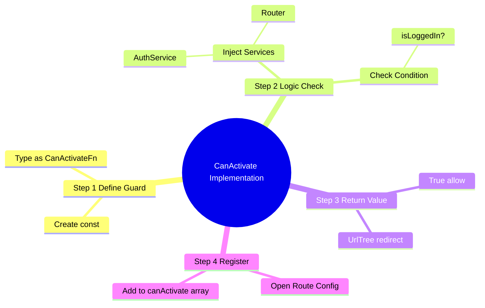
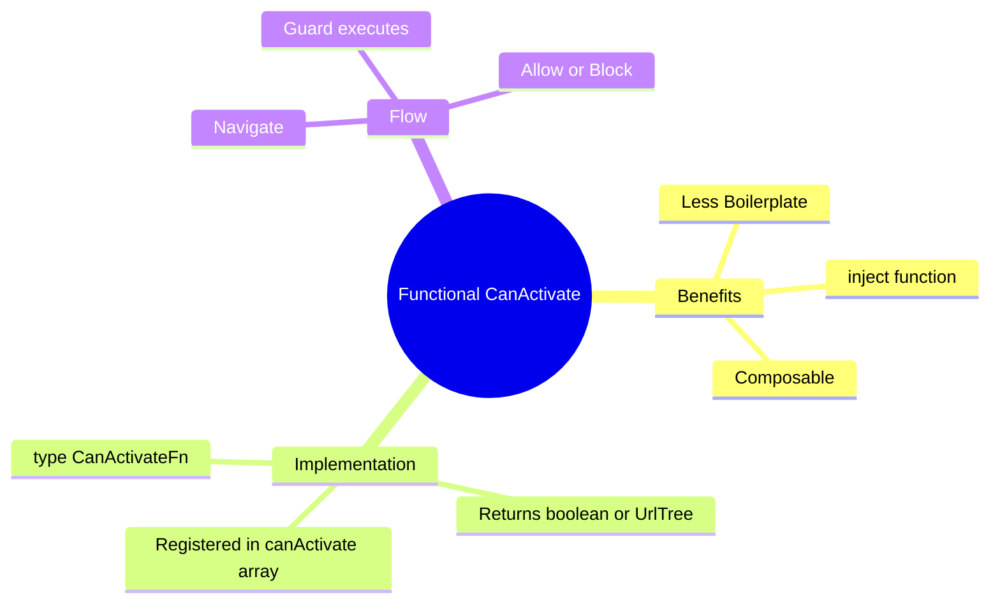

# 🔒 Use Case 1: CanActivate (Functional)

> **Goal**: Protect routes from unauthorized access using modern Angular **Functional Guards**.

---

## 1. 🔍 How It Works (The Concept)

### Old vs New
*   **Legacy (Class-based)**: You created a class `AuthGuard implements CanActivate`. It required a lot of boilerplate and had to be provided in modules.
*   **Modern (Functional)**: You create a simple constant function `authGuard: CanActivateFn`. It's lightweight, composable, and easier to test. It uses `inject()` for dependencies.

### 📊 Guard Flow


```mermaid
graph TD
    User([User]) -->|Clicks Link| Router
    Router -->|Checks| Guard{authGuard}
    
    Guard -->|inject(AuthService)| Service[AuthService]
    Service -->|isLoggedIn?| Decision
    
    Decision -- Yes --> Route[AdminComponent]
    Decision -- No --> Reject[Redirect /login]
    
    style Guard fill:#e1f5fe,stroke:#01579b
    style Route fill:#dcfce7,stroke:#166534
    style Reject fill:#fee2e2,stroke:#b91c1c
```

### 📦 Data Flow Summary (Visual Box Diagram)

```
┌─────────────────────────────────────────────────────────────┐
│  USER NAVIGATION                                            │
│                                                             │
│   User clicks: router.navigate(['/admin'])                  │
│          │                                                  │
│          ▼                                                  │
│   ┌───────────────────────────────────────────────────────┐ │
│   │  🚪 CanActivate GUARD (Bouncer)                       │ │
│   │                                                       │ │
│   │  export const authGuard: CanActivateFn = () => {      │ │
│   │    const auth = inject(AuthService);                  │ │
│   │    const router = inject(Router);                     │ │
│   │                                                       │ │
│   │    if (auth.isLoggedIn()) {                           │ │
│   │      return true;       // ✅ "Welcome in!"           │ │
│   │    }                                                  │ │
│   │    return router.createUrlTree(['/login']); // 🔄     │ │
│   │  };                                                   │ │
│   └───────────────────────────────────────────────────────┘ │
│          │                                                  │
│          ▼                                                  │
│   ┌──────────────────────┬────────────────────────────────┐ │
│   │                      │                                │ │
│   │  return true         │    return UrlTree              │ │
│   │       │              │         │                      │ │
│   │       ▼              │         ▼                      │ │
│   │  ┌────────────┐      │    ┌────────────┐              │ │
│   │  │ ✅ ALLOW   │      │    │ 🔄 REDIRECT │              │ │
│   │  │            │      │    │            │              │ │
│   │  │ /admin     │      │    │ /login     │              │ │
│   │  │ loads      │      │    │ loads      │              │ │
│   │  └────────────┘      │    └────────────┘              │ │
│   │                      │                                │ │
│   └──────────────────────┴────────────────────────────────┘ │
└─────────────────────────────────────────────────────────────┘
```

> **Key Takeaway**: CanActivate = "Can you enter?" guard. Return `true` to allow, `false` to block, or `UrlTree` to redirect elsewhere!

---

## 2. 🚀 Step-by-Step Implementation

### Step 1: The Functional Guard
Defined as a `const` of type `CanActivateFn`.

```typescript
// auth.guard.ts
export const authGuard: CanActivateFn = (route, state) => {
  const authService = inject(AuthService);
  const router = inject(Router);

  if (authService.isLoggedIn()) {
    return true; // ✅ Allow
  } else {
    return router.createUrlTree(['/login']); // 🛑 Redirect
  }
};
```

### Step 2: Registering in Routes
Just pass the function reference in the `canActivate` array.

```typescript
// app.routes.ts
{
  path: 'admin',
  component: AdminComponent,
  canActivate: [authGuard] // <--- Functional guard here
}
```

---

## 🔧 Implementation Flow Mindmap

This mindmap shows **how the use case is implemented** step-by-step:



---

## 🚪 Nightclub Bouncer Analogy (Easy to Remember!)

Think of route guards like **bouncers at a nightclub**:

| Concept | Bouncer Analogy | Memory Trick |
|---------|----------------|--------------| 
| **CanActivate** | 🚪 **Door bouncer**: "Show your ID before entering" | **"Can you come in?"** |
| **AuthService** | 🆔 **ID check system**: Verify if guest is on the list | **"Check credentials"** |
| **return true** | ✅ **Bouncer opens door**: "Welcome in!" | **"Access granted"** |
| **return UrlTree** | 🔄 **Redirect**: "VIP entrance is that way" / "Go to registration" | **"Wrong door, go there"** |
| **canActivateChild** | 🎪 **VIP section bouncer**: Guard the area inside the club | **"Guard inner areas"** |

### 📖 Story to Remember:

> 🚪 **Night at Club Angular**
>
> You're trying to enter Club Angular's Admin VIP section:
>
> **At the door (Route Guard):**
> ```
> You: "I want to go to /admin"
> Bouncer (authGuard): "Let me check..."
> 
> → Checks AuthService: "Are they logged in?"
> → If YES: "Welcome to Admin!" ✅ (return true)
> → If NO:  "Go sign up first!" 🔄 (return UrlTree(['/login']))
> ```
>
> **The bouncer doesn't CREATE the VIP area. They just CONTROL ACCESS.**

### 🎯 Quick Reference:
```
🚪 CanActivate    = "Can you enter this route?"
🆔 inject(Auth)   = Check their credentials
✅ return true    = "Come on in!"
🔄 return UrlTree = "Go to this other place"
❌ return false   = "Access denied, stay here"
```

---

## 3. 🧠 Mind Map: Quick Visual Reference


