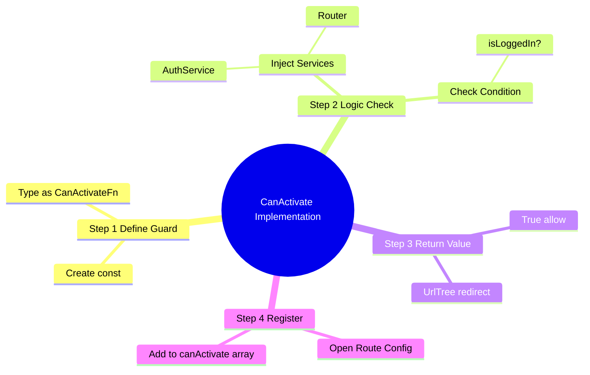
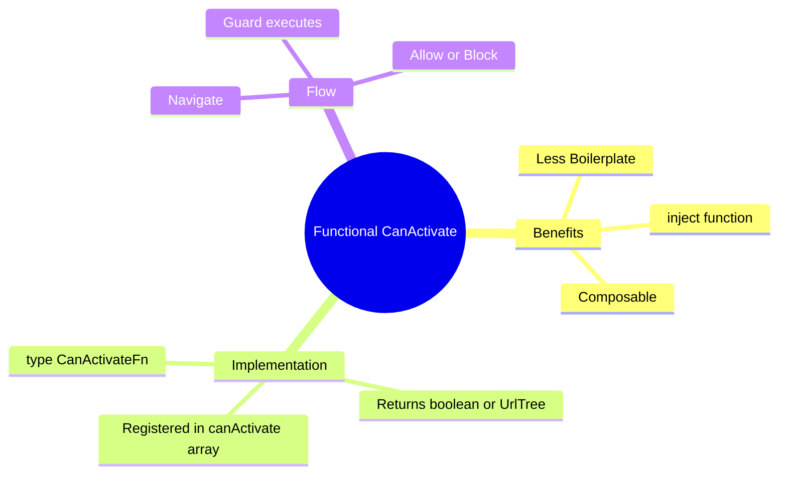

# 🔒 Use Case 1: CanActivate (Functional)

> **Goal**: Protect routes from unauthorized access using modern Angular **Functional Guards**.

---

## 1. 🔍 How It Works (The Concept)

### Old vs New
*   **Legacy (Class-based)**: You created a class `AuthGuard implements CanActivate`. It required a lot of boilerplate and had to be provided in modules.
*   **Modern (Functional)**: You create a simple constant function `authGuard: CanActivateFn`. It's lightweight, composable, and easier to test. It uses `inject()` for dependencies.

### 📊 Guard Flow

```mermaid
graph TD
    User([User]) -->|Clicks Link| Router
    Router -->|Checks| Guard{authGuard}
    
    Guard -->|inject(AuthService)| Service[AuthService]
    Service -->|isLoggedIn?| Decision
    
    Decision -- Yes --> Route[AdminComponent]
    Decision -- No --> Reject[Redirect /login]
    
    style Guard fill:#e1f5fe,stroke:#01579b
    style Route fill:#dcfce7,stroke:#166534
    style Reject fill:#fee2e2,stroke:#b91c1c
```

---

## 2. 🚀 Step-by-Step Implementation

### Step 1: The Functional Guard
Defined as a `const` of type `CanActivateFn`.

```typescript
// auth.guard.ts
export const authGuard: CanActivateFn = (route, state) => {
  const authService = inject(AuthService);
  const router = inject(Router);

  if (authService.isLoggedIn()) {
    return true; // ✅ Allow
  } else {
    return router.createUrlTree(['/login']); // 🛑 Redirect
  }
};
```

### Step 2: Registering in Routes
Just pass the function reference in the `canActivate` array.

```typescript
// app.routes.ts
{
  path: 'admin',
  component: AdminComponent,
  canActivate: [authGuard] // <--- Functional guard here
}
```

---

## 🔧 Implementation Flow Mindmap

This mindmap shows **how the use case is implemented** step-by-step:



---

## 3. 🧠 Mind Map: Quick Visual Reference


