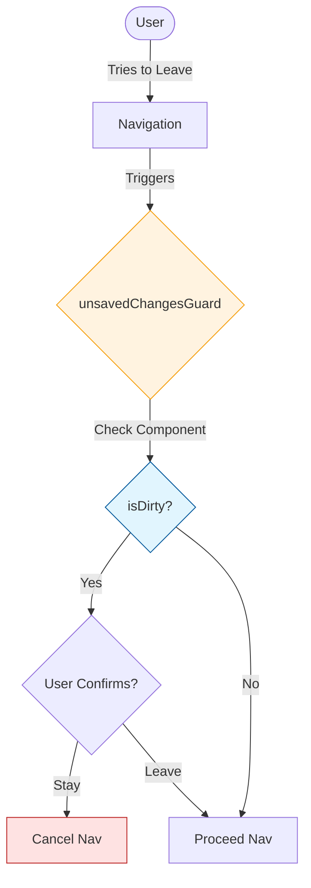
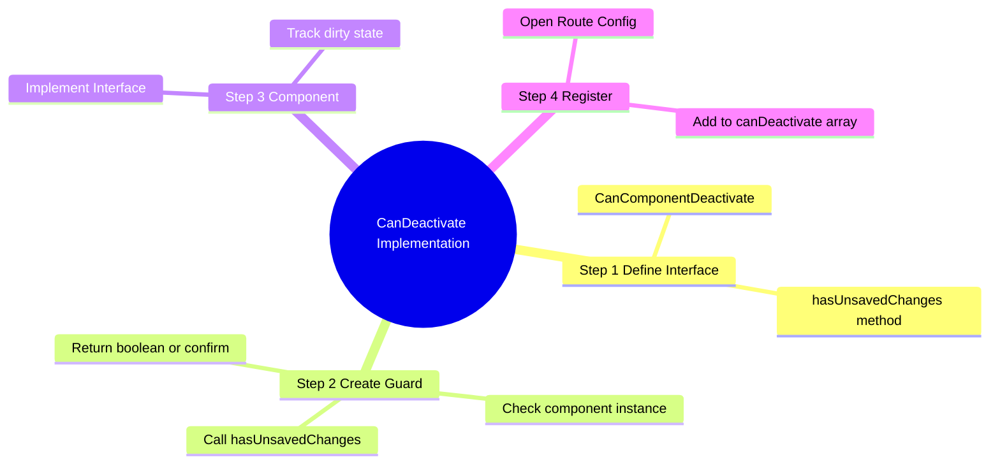
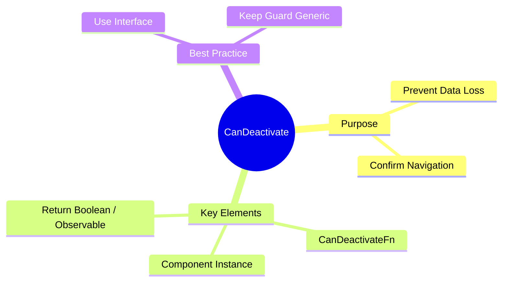

# 💾 Use Case 2: CanDeactivate (Functional)

> **Goal**: Prevent users from accidentally losing unsaved work by intercepting navigation attempts.

---

## 1. 🔍 How It Works

### The Mechanism
1.  **Component Interface**: Define a contract (e.g., `hasUnsavedChanges()`) that your component implements.
2.  **Guard Logic**: The guard checks if the *current component instance* satisfies the condition.
3.  **User Choice**: If changes exist, block navigation (`return false`) or prompt the user (`window.confirm`).

### 📊 Guard Flow



---

## 2. 🚀 Step-by-Step Implementation

### Step 1: Interface & Guard
Define what capability you are checking for.

```typescript
// unsaved-changes.guard.ts
export interface CanComponentDeactivate {
  hasUnsavedChanges: () => boolean;
}

export const unsavedChangesGuard: CanDeactivateFn<CanComponentDeactivate> = (component) => {
  if (component.hasUnsavedChanges()) {
    return confirm('Discard changes?');
  }
  return true;
};
```

### Step 2: The Component
Implement the interface logic.

```typescript
// form.component.ts
export class FormComponent implements CanComponentDeactivate {
  isDirty = false;

  hasUnsavedChanges() {
    return this.isDirty;
  }
}
```

### Step 3: Registering in Routes
Add it to `canDeactivate`.

```typescript
// guards.routes.ts
{
  path: 'edit',
  component: FormComponent,
  canDeactivate: [unsavedChangesGuard] // <--- Here
}
```

---

## 🔧 Implementation Flow Mindmap

This mindmap shows **how the use case is implemented** step-by-step:



---

## 🚪 Exit Interview Analogy (Easy to Remember!)

Think of CanDeactivate like an **exit interview when leaving a job**:

| Concept | Exit Interview Analogy | Memory Trick |
|---------|------------------------|--------------| 
| **CanDeactivate guard** | 🚪 **HR at the door**: "Before you leave..." | **"Exit checkpoint"** |
| **hasUnsavedChanges()** | 📝 **Pending work check**: "Do you have unfinished projects?" | **"Dirty check"** |
| **return true** | 👋 **"All clear, goodbye!"**: Clean exit | **"Can leave"** |
| **return false** | 🛑 **"Wait, finish this first!"**: Block departure | **"Cannot leave"** |
| **confirm()** | 🤔 **"Are you sure?"**: Last chance to change mind | **"User decides"** |

### 📖 Story to Remember:

> 🚪 **Leaving the Office**
>
> You're trying to leave work (navigate away):
>
> **Without Guard (no exit interview):**
> ```
> You: *walks out door* 🚶
> Computer: *unsaved spreadsheet disappears* 💨
> You: "NOOOO! My work!" 😱
> ```
>
> **With CanDeactivate Guard:**
> ```
> You: *tries to leave* 🚶
> HR (Guard): "Wait! Let me check..."
> 
> → "Any unsaved work?" (hasUnsavedChanges)
> → If YES: "Are you sure you want to discard?" (confirm)
>   → User: "No, let me save first" → Stay
>   → User: "Yes, I don't need it" → Leave
> → If NO: "All clear, have a nice day!" → Leave
> ```
>
> **The guard prevents accidental data loss!**

### 🎯 Quick Reference:
```
🚪 CanDeactivate       = Exit checkpoint (before leaving)
📝 hasUnsavedChanges() = "Any pending work?" check
✅ return true         = "You may leave"
🛑 return false        = "Stay here"
🤔 confirm()           = "Are you sure?" dialog
```

---

## 3. 🧠 Mind Map: Quick Visual Reference


