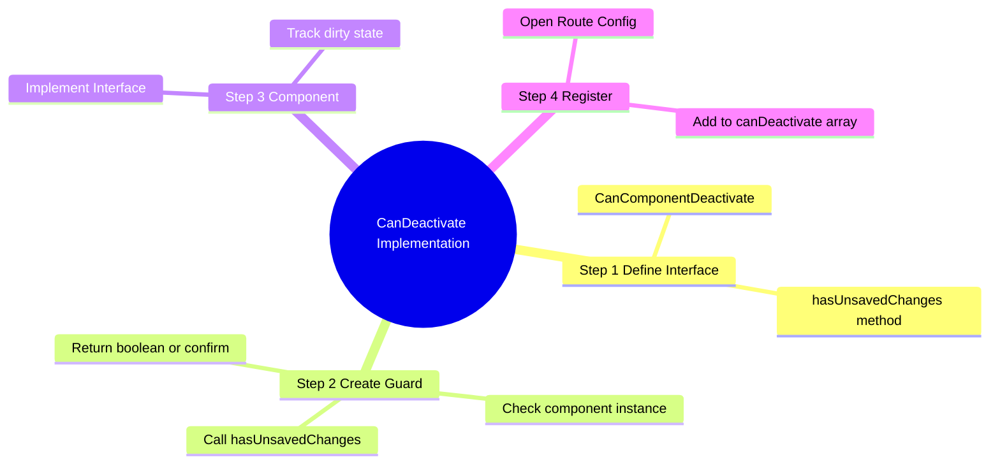
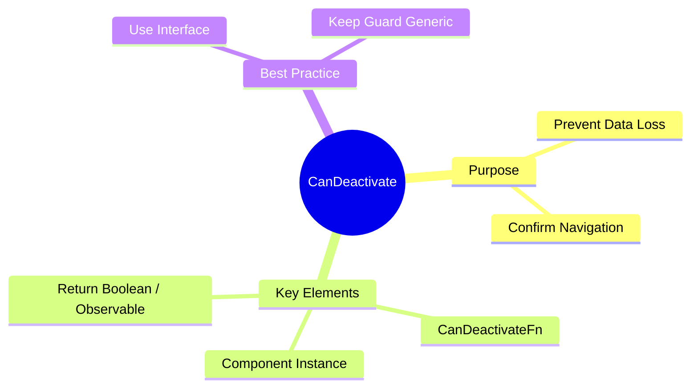

# 💾 Use Case 2: CanDeactivate (Functional)

> **Goal**: Prevent users from accidentally losing unsaved work by intercepting navigation attempts.

---

## 1. 🔍 How It Works

### The Mechanism
1.  **Component Interface**: Define a contract (e.g., `hasUnsavedChanges()`) that your component implements.
2.  **Guard Logic**: The guard checks if the *current component instance* satisfies the condition.
3.  **User Choice**: If changes exist, block navigation (`return false`) or prompt the user (`window.confirm`).

### 📊 Guard Flow


---

## 2. 🚀 Step-by-Step Implementation

### Step 1: Interface & Guard
Define what capability you are checking for.

```typescript
// unsaved-changes.guard.ts
export interface CanComponentDeactivate {
  hasUnsavedChanges: () => boolean;
}

export const unsavedChangesGuard: CanDeactivateFn<CanComponentDeactivate> = (component) => {
  if (component.hasUnsavedChanges()) {
    return confirm('Discard changes?');
  }
  return true;
};
```

### Step 2: The Component
Implement the interface logic.

```typescript
// form.component.ts
export class FormComponent implements CanComponentDeactivate {
  isDirty = false;

  hasUnsavedChanges() {
    return this.isDirty;
  }
}
```

### Step 3: Registering in Routes
Add it to `canDeactivate`.

```typescript
// guards.routes.ts
{
  path: 'edit',
  component: FormComponent,
  canDeactivate: [unsavedChangesGuard] // <--- Here
}
```

---

## 🔧 Implementation Flow Mindmap

This mindmap shows **how the use case is implemented** step-by-step:



---

## 3. 🧠 Mind Map: Quick Visual Reference


