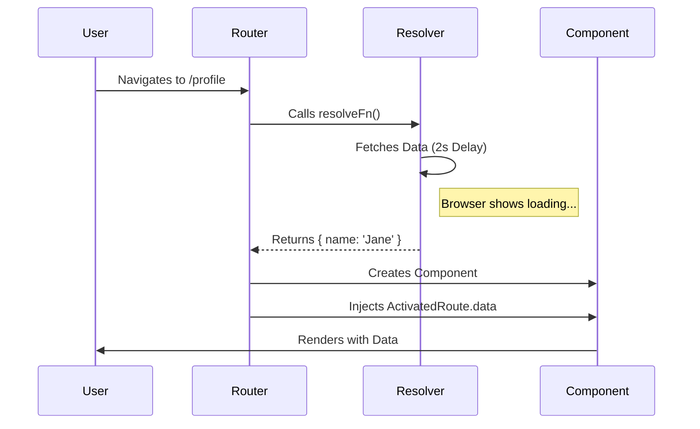
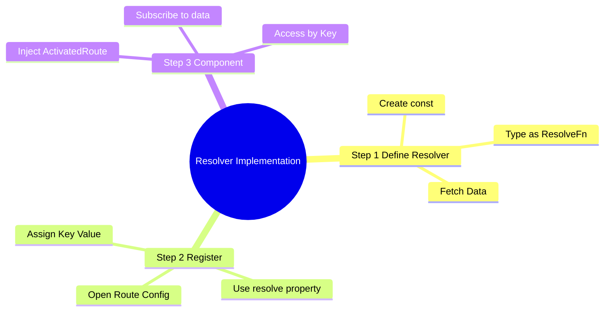
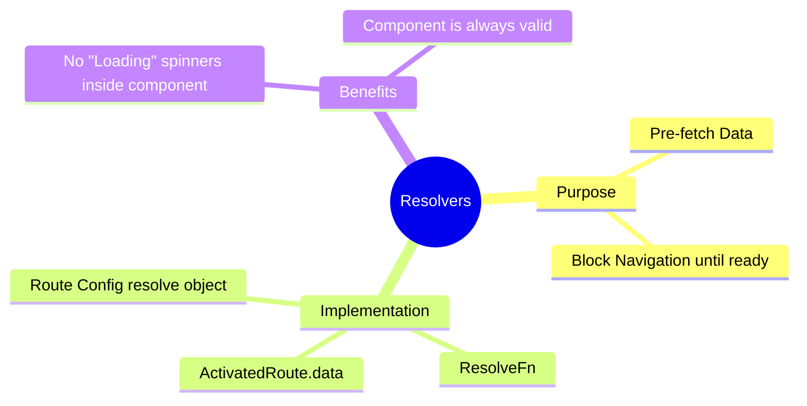

# ⏳ Use Case 3: Resolve (Functional)

> **Goal**: Ensure necessary data is loaded **before** the component is displayed, preventing UI flickering or empty states.

---

## 1. 🔍 How It Works

### The Mechanism
Resolvers are specialized guards that return data. The Router waits for the data (Observable to complete or Promise to resolve) before:
1.  Activating the new route.
2.  Creating the component.

### 📊 Resolver Flow



---

## 2. 🚀 Step-by-Step Implementation

### Step 1: The Functional Resolver
Just a function that returns the data!

```typescript
// user.resolver.ts
export const userResolver: ResolveFn<UserProfile> = (route, state) => {
  return httpClient.get<UserProfile>(`/api/users/${route.params['id']}`);
};
```

### Step 2: Registering in Routes
Use the `resolve` property. The key you choose (`userData`) is how you access it later.

```typescript
// guards.routes.ts
{
  path: 'profile',
  component: ProfileComponent,
  resolve: {
    userData: userResolver // <--- Key: Value
  }
}
```

### Step 3: Accessing Data
Inject `ActivatedRoute` and listen to `data`.

```typescript
// profile.component.ts
ngOnInit() {
  this.route.data.subscribe(({ userData }) => {
    this.user = userData;
  });
}
```

---

## 🔧 Implementation Flow Mindmap

This mindmap shows **how the use case is implemented** step-by-step:



---

## 3. 🧠 Mind Map: Quick Visual Reference


