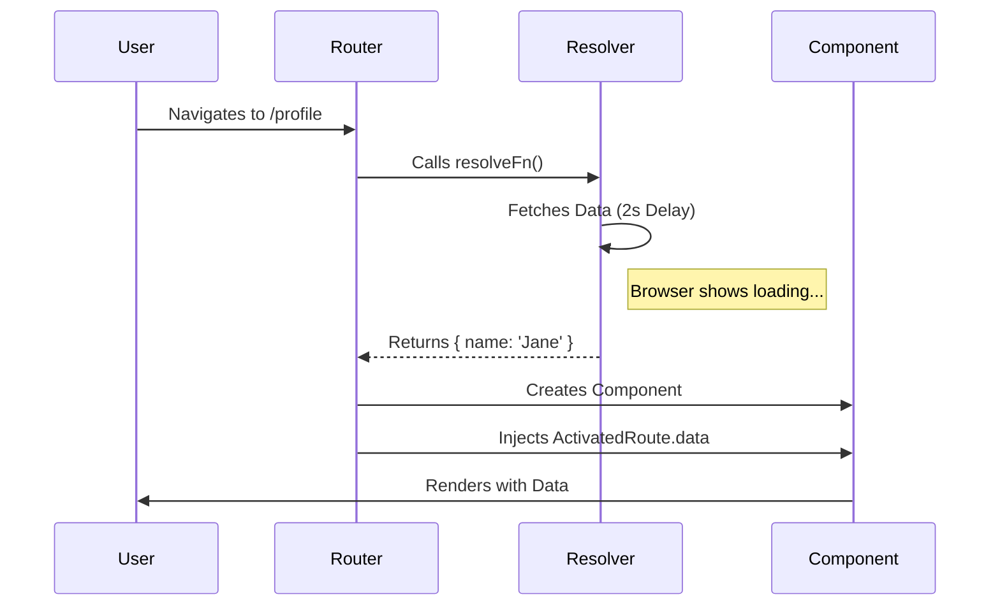
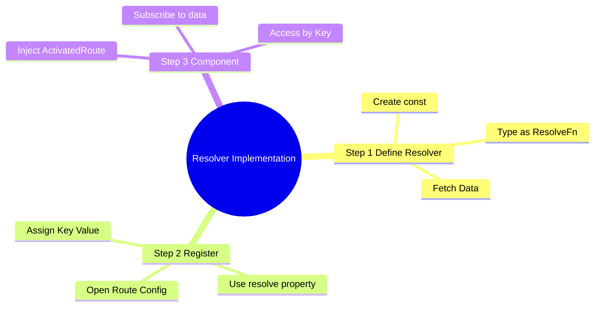
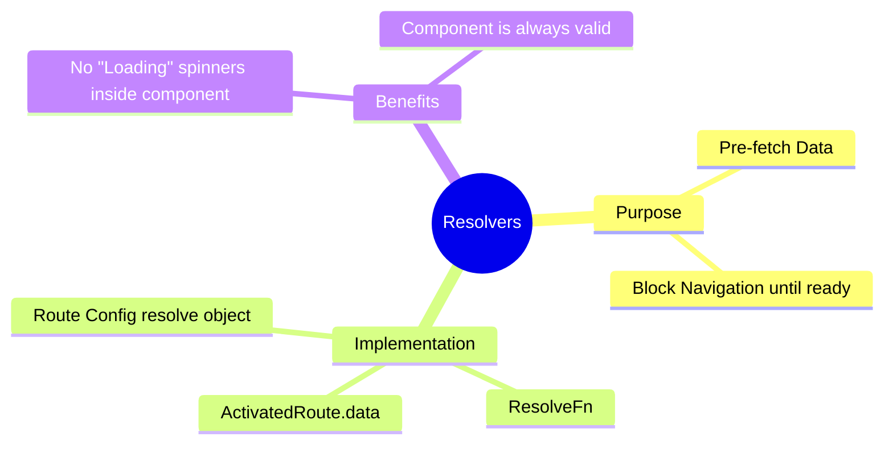

# ⏳ Resolve (Functional)

> **Goal**: Ensure necessary data is loaded **before** the component is displayed, preventing UI flickering or empty states.


## 📋 Table of Contents
- [1. 🔍 How It Works](#1--how-it-works)
  - [The Mechanism](#the-mechanism)
  - [📊 Resolver Flow](#resolver-flow)
  - [📦 Data Flow Summary (Visual Box Diagram)](#data-flow-summary-visual-box-diagram)
- [2. 🚀 Step-by-Step Implementation](#2--step-by-step-implementation)
  - [Step 1: The Functional Resolver](#step-1-the-functional-resolver)
  - [Step 2: Registering in Routes](#step-2-registering-in-routes)
  - [Step 3: Accessing Data](#step-3-accessing-data)
- [🔧 Implementation Flow Mindmap](#implementation-flow-mindmap)
- [🛎️ Room Service Analogy (Easy to Remember!)](#room-service-analogy-easy-to-remember)
  - [📖 Story to Remember:](#story-to-remember)
  - [🎯 Quick Reference:](#quick-reference)
- [3. 🧠 Mind Map: Quick Visual Reference](#3--mind-map-quick-visual-reference)

---
---

## 1. 🔍 How It Works

### The Mechanism
Resolvers are specialized guards that return data. The Router waits for the data (Observable to complete or Promise to resolve) before:
1.  Activating the new route.
2.  Creating the component.

### 📊 Resolver Flow



### 📦 Data Flow Summary (Visual Box Diagram)

```
┌─────────────────────────────────────────────────────────────┐
│  NAVIGATION REQUEST                                         │
│                                                             │
│   router.navigate(['/profile/123'])                         │
│          │                                                  │
│          ▼                                                  │
│   ┌───────────────────────────────────────────────────────┐ │
│   │  ⏳ RESOLVE GUARD (Room Service)                       │ │
│   │                                                       │ │
│   │  export const userResolver: ResolveFn<User> = (route) │ │
│   │    => {                                               │ │
│   │      const http = inject(HttpClient);                 │ │
│   │      return http.get(`/api/users/${route.params.id}`);│ │
│   │    };                                                 │ │
│   │                                                       │ │
│   │  🚪 NAVIGATION BLOCKED until data returns!            │ │
│   └───────────────────────────────────────────────────────┘ │
│          │                                                  │
│          │  (Browser shows loading indicator...)            │
│          │                                                  │
│          ▼                                                  │
│   ┌───────────────────────────────────────────────────────┐ │
│   │  📦 DATA READY                                        │ │
│   │                                                       │ │
│   │  { id: 123, name: 'John', email: 'john@example.com' } │ │
│   └───────────────────────────────────────────────────────┘ │
│          │                                                  │
│          │  Now component can be created!                   │
│          │                                                  │
│          ▼                                                  │
│   ┌───────────────────────────────────────────────────────┐ │
│   │  🎯 COMPONENT                                         │ │
│   │                                                       │ │
│   │  ngOnInit() {                                         │ │
│   │    this.route.data.subscribe(({ userData }) => {      │ │
│   │      this.user = userData;  // ✅ Data already here!  │ │
│   │    });                                                │ │
│   │  }                                                    │ │
│   │                                                       │ │
│   │  • No loading spinner needed inside component         │ │
│   │  • No null checks - data is guaranteed                │ │
│   └───────────────────────────────────────────────────────┘ │
└─────────────────────────────────────────────────────────────┘
```

> **Key Takeaway**: Resolver = "Pre-fetch data" guard. Component only loads AFTER data is ready. No more loading spinners or null checks!

---

## 2. 🚀 Step-by-Step Implementation

### Step 1: The Functional Resolver
Just a function that returns the data!

```typescript
// user.resolver.ts
export const userResolver: ResolveFn<UserProfile> = (route, state) => {
  return httpClient.get<UserProfile>(`/api/users/${route.params['id']}`);
};
```

### Step 2: Registering in Routes
Use the `resolve` property. The key you choose (`userData`) is how you access it later.

```typescript
// guards.routes.ts
{
  path: 'profile',
  component: ProfileComponent,
  resolve: {
    userData: userResolver // <--- Key: Value
  }
}
```

### Step 3: Accessing Data
Inject `ActivatedRoute` and listen to `data`.

```typescript
// profile.component.ts
ngOnInit() {
  this.route.data.subscribe(({ userData }) => {
    this.user = userData;
  });
}
```

---

## 🔧 Implementation Flow Mindmap

This mindmap shows **how the use case is implemented** step-by-step:



---

## 🛎️ Room Service Analogy (Easy to Remember!)

Think of Resolvers like **room service at a hotel**:

| Concept | Room Service Analogy | Memory Trick |
|---------|---------------------|--------------| 
| **Resolver** | 🛎️ **Room service**: Prepares food before you enter room | **"Pre-fetch data"** |
| **Route** | 🚪 **Your hotel room**: The destination | **"Where you're going"** |
| **Data** | 🍽️ **Breakfast tray**: Ready and waiting when you arrive | **"Pre-loaded data"** |
| **Waiting** | ⏳ **Door locked until ready**: Can't enter until food arrives | **"Blocks navigation"** |
| **ActivatedRoute.data** | 🎁 **Tray on table**: Pick it up when you enter | **"Access resolved data"** |

### 📖 Story to Remember:

> 🛎️ **Hotel Room Service**
>
> You're checking into a fancy hotel:
>
> **Without Resolver (Regular Check-in):**
> ```
> 1. Enter room 🚶
> 2. Room is empty 😐
> 3. Call room service "I'm hungry!"
> 4. Wait... wait... waiting... ⏳
> 5. Finally eat 🍽️
> ```
>
> **With Resolver (VIP Check-in):**
> ```
> 1. Request room 🚶
> 2. "Please wait, preparing your breakfast..."
> 3. Door opens 🚪
> 4. Tray already on table! 🍽️ ✨
> 5. Eat immediately! 😋
> ```
>
> **Food is READY before you even walk in!**

### 🎯 Quick Reference:
```
🛎️ Resolver          = Room service (pre-fetch)
🚪 Route             = Hotel room (destination)
🍽️ Data              = Breakfast (already prepared)
⏳ Navigation blocked = Door locked until ready
🎁 route.data        = Pick up tray (access data)
```

---

## 3. 🧠 Mind Map: Quick Visual Reference


