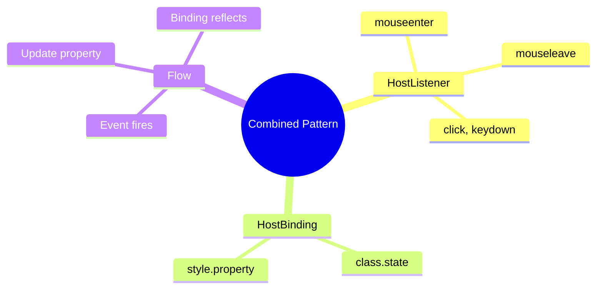

# 🔗 Combined HostListener + HostBinding

> **Goal**: Create interactive components by combining event listeners with dynamic bindings.


## 📋 Table of Contents
- [🔍 How It Works](#how-it-works)
- [🚀 Implementation](#implementation)
- [🌍 Real World Uses](#real-world-uses)
  - [📦 Data Flow Summary (Visual Box Diagram)](#data-flow-summary-visual-box-diagram)
- [🧠 Mind Map](#mind-map)

---
---

## 🔍 How It Works

The pattern: **Listen** to events → **React** by changing bound properties.

```typescript
// Listen to event
@HostListener('mouseenter')
onEnter() { this.isHovered = true; }

// React with binding
@HostBinding('class.hovered')
isHovered = false;
```

---

## 🚀 Implementation

```typescript
@Component({...})
export class InteractiveCard {
    // BINDINGS
    @HostBinding('class.active') isActive = false;
    @HostBinding('style.borderColor')
    get borderColor() {
        return this.isActive ? '#4ade80' : '#667eea';
    }

    // LISTENERS
    @HostListener('click')
    onClick() {
        this.isActive = !this.isActive;
    }

    @HostListener('mouseenter')
    onEnter() { /* change styles */ }
}
```

---

## 🌍 Real World Uses

1. **Expandable cards** - Click to expand, hover to preview
2. **Custom buttons** - Hover/active states without CSS only
3. **Drag-and-drop** - Track dragging state

---

### 📦 Data Flow Summary (Visual Box Diagram)

```
┌─────────────────────────────────────────────────────────────┐
│  COMBINED: HostListener + HostBinding                       │
│                                                             │
│   THE PATTERN:                                              │
│   ┌───────────────────────────────────────────────────────┐ │
│   │ HostListener (LISTEN)   →   HostBinding (REACT)       │ │
│   │                                                       │ │
│   │ User interacts with element                           │ │
│   │        │                                              │ │
│   │        ▼                                              │ │
│   │ @HostListener('mouseenter')                           │ │
│   │ onEnter() { this.isHovered = true; }                  │ │
│   │        │                                              │ │
│   │        ▼                                              │ │
│   │ @HostBinding('class.hovered')                         │ │
│   │ isHovered = false;  // Bound to class                 │ │
│   │        │                                              │ │
│   │        ▼                                              │ │
│   │ <host class="hovered">  // Class applied!             │ │
│   └───────────────────────────────────────────────────────┘ │
│                                                             │
│   COMPLETE EXAMPLE:                                         │
│   ┌───────────────────────────────────────────────────────┐ │
│   │ @HostListener('click') onClick() {                    │ │
│   │   this.isActive = !this.isActive;                     │ │
│   │ }                                                     │ │
│   │                                                       │ │
│   │ @HostBinding('class.active') isActive = false;        │ │
│   │ @HostBinding('style.borderColor')                     │ │
│   │ get borderColor() {                                   │ │
│   │   return this.isActive ? 'green' : 'gray';            │ │
│   │ }                                                     │ │
│   └───────────────────────────────────────────────────────┘ │
└─────────────────────────────────────────────────────────────┘
```

> **Key Takeaway**: Listen to events with @HostListener → Update property → @HostBinding reflects change in DOM!

---

## 🧠 Mind Map


