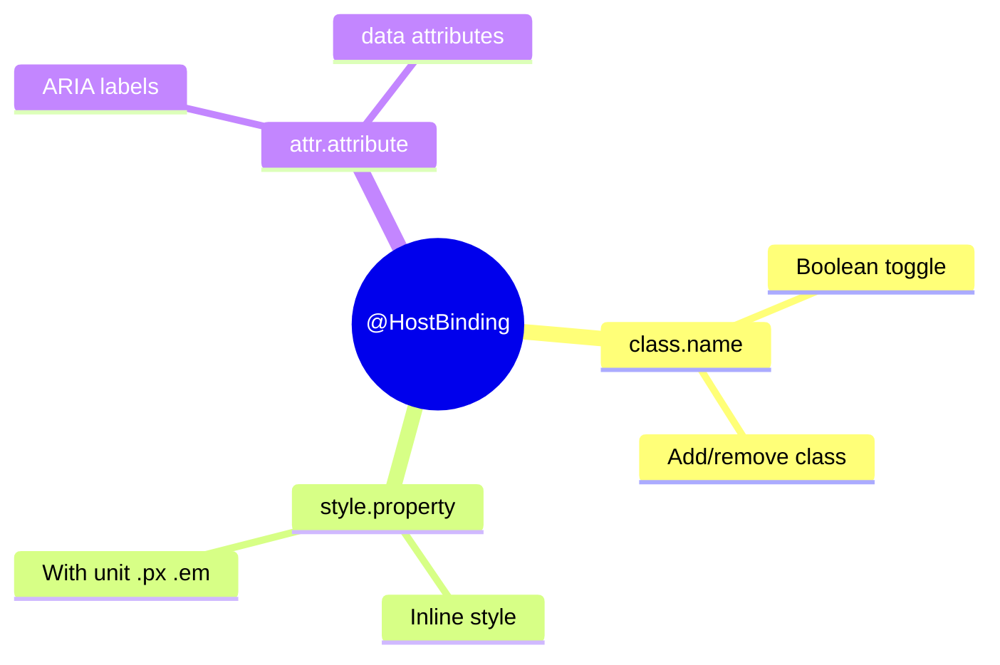

# 🎨 @HostBinding Basics

> **Goal**: Dynamically bind host element classes, styles, and attributes.


## 📋 Table of Contents
- [🔍 How It Works](#how-it-works)
  - [Binding Types](#binding-types)
- [🚀 Implementation](#implementation)
  - [📦 Data Flow Summary (Visual Box Diagram)](#data-flow-summary-visual-box-diagram)
- [🧠 Mind Map](#mind-map)

---
---

## 🔍 How It Works

`@HostBinding` binds a class property to a host element property.

### Binding Types

| Syntax | Example | Result |
|--------|---------|--------|
| `class.name` | `@HostBinding('class.active')` | Adds/removes class |
| `style.prop` | `@HostBinding('style.color')` | Sets inline style |
| `style.prop.unit` | `@HostBinding('style.width.px')` | Style with unit |
| `attr.name` | `@HostBinding('attr.role')` | Sets attribute |

---

## 🚀 Implementation

```typescript
// Class binding - adds class when true
@HostBinding('class.dark-mode')
isDarkMode = false;

// Style binding
@HostBinding('style.borderColor')
borderColor = '#667eea';

// Style with unit suffix
@HostBinding('style.fontSize.px')
fontSize = 16; // becomes "16px"

// Attribute binding with getter
@HostBinding('attr.aria-disabled')
get ariaDisabled() {
    return this.isDisabled ? 'true' : null;
}
```

---

### 📦 Data Flow Summary (Visual Box Diagram)

```
┌─────────────────────────────────────────────────────────────┐
│  @HostBinding: BIND COMPONENT PROPERTIES TO HOST ELEMENT    │
│                                                             │
│   CLASS BINDING:                                            │
│   ┌───────────────────────────────────────────────────────┐ │
│   │ @HostBinding('class.active')                          │ │
│   │ isActive = false;                                     │ │
│   │                                                       │ │
│   │ isActive = true  → <host class="active">              │ │
│   │ isActive = false → <host class="">                    │ │
│   └───────────────────────────────────────────────────────┘ │
│                                                             │
│   STYLE BINDING:                                            │
│   ┌───────────────────────────────────────────────────────┐ │
│   │ @HostBinding('style.backgroundColor')                 │ │
│   │ bgColor = 'blue';                                     │ │
│   │                                                       │ │
│   │ → <host style="background-color: blue">               │ │
│   │                                                       │ │
│   │ @HostBinding('style.width.px')                        │ │
│   │ width = 100;  // Adds unit automatically!             │ │
│   │ → <host style="width: 100px">                         │ │
│   └───────────────────────────────────────────────────────┘ │
│                                                             │
│   ATTRIBUTE BINDING:                                        │
│   ┌───────────────────────────────────────────────────────┐ │
│   │ @HostBinding('attr.aria-label')                       │ │
│   │ label = 'Close button';                               │ │
│   │ → <host aria-label="Close button">                    │ │
│   └───────────────────────────────────────────────────────┘ │
└─────────────────────────────────────────────────────────────┘
```

> **Key Takeaway**: @HostBinding binds component properties to the host element. Use `class.`, `style.`, or `attr.` prefix!

---

## 🧠 Mind Map


