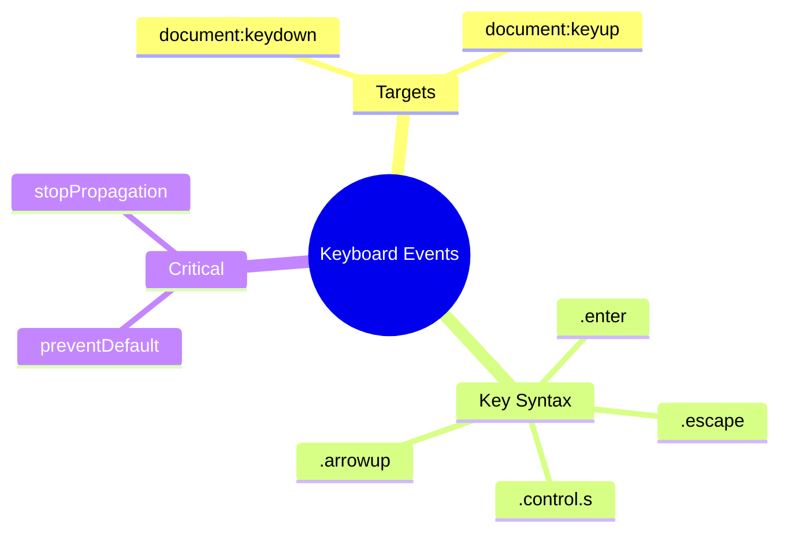

# ⌨️ Keyboard Events

> **Goal**: Handle global keyboard shortcuts using @HostListener.


## 📋 Table of Contents
- [🔍 How It Works](#how-it-works)
  - [Key Binding Syntax](#key-binding-syntax)
- [🚀 Implementation](#implementation)
- [🐛 Common Pitfalls](#common-pitfalls)
  - [❌ Forgetting preventDefault()](#forgetting-preventdefault)
  - [📦 Data Flow Summary (Visual Box Diagram)](#data-flow-summary-visual-box-diagram)
- [🧠 Mind Map](#mind-map)

---
---

## 🔍 How It Works

Listen to document-level keyboard events with `document:keydown.keyName` syntax.

### Key Binding Syntax

| Syntax | Description |
|--------|-------------|
| `document:keydown.escape` | Single key |
| `document:keydown.control.s` | Combo key |
| `document:keydown.shift.control.z` | Multi-modifier |

---

## 🚀 Implementation

```typescript
// Single key
@HostListener('document:keydown.escape')
onEscape() {
    this.closeModal();
}

// Combo - prevent browser default!
@HostListener('document:keydown.control.s', ['$event'])
onSave(event: KeyboardEvent) {
    event.preventDefault(); // 🛡️ CRITICAL!
    this.save();
}
```

---

## 🐛 Common Pitfalls

### ❌ Forgetting preventDefault()

```typescript
// ❌ Browser's save dialog opens!
@HostListener('document:keydown.control.s')
onSave() { this.save(); }
```

**Fix:** Add `event.preventDefault()`.

---

### 📦 Data Flow Summary (Visual Box Diagram)

```
┌─────────────────────────────────────────────────────────────┐
│  @HostListener KEYBOARD EVENTS                              │
│                                                             │
│   KEY BINDING SYNTAX:                                       │
│   ┌───────────────────────────────────────────────────────┐ │
│   │ 'document:keydown.escape'      → Escape key           │ │
│   │ 'document:keydown.control.s'   → Ctrl+S               │ │
│   │ 'document:keydown.shift.ctrl.z'→ Shift+Ctrl+Z         │ │
│   │ 'document:keydown.arrowdown'   → Arrow Down           │ │
│   └───────────────────────────────────────────────────────┘ │
│                                                             │
│   FLOW:                                                     │
│   ┌───────────────────────────────────────────────────────┐ │
│   │ User presses Ctrl+S                                   │ │
│   │        │                                              │ │
│   │        ▼                                              │ │
│   │ @HostListener('document:keydown.control.s', ['$event'])│ │
│   │ onSave(event: KeyboardEvent) {                        │ │
│   │   event.preventDefault();  // CRITICAL!               │ │
│   │   this.save();                                        │ │
│   │ }                                                     │ │
│   └───────────────────────────────────────────────────────┘ │
│                                                             │
│   ⚠️ REMEMBER: Always preventDefault() for browser shortcuts│
└─────────────────────────────────────────────────────────────┘
```

> **Key Takeaway**: Use `document:keydown.keyname` syntax for global shortcuts. Always `preventDefault()` for browser combos!

---

## 🧠 Mind Map


