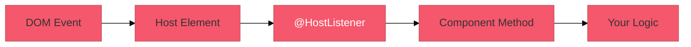
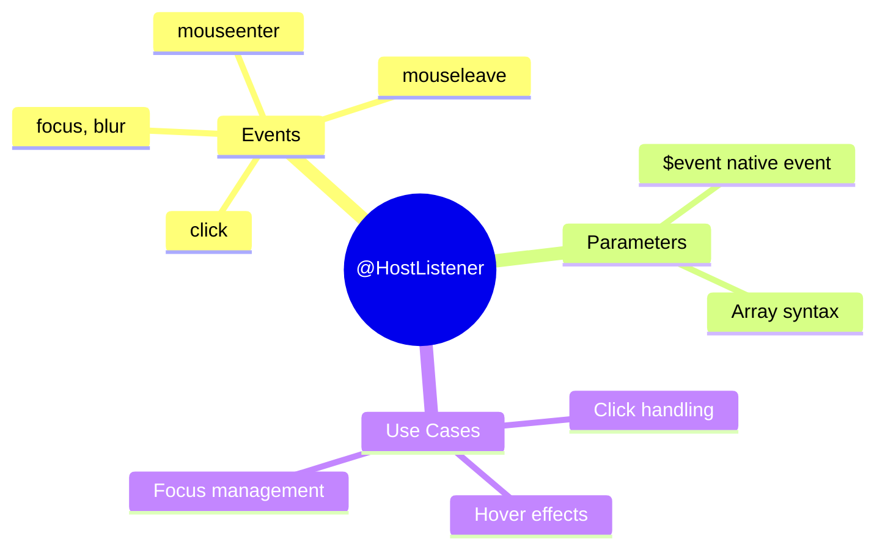

# 👆 Use Case 1: Basic @HostListener

> **Goal**: Listen to DOM events on the host element.

---

## 🔍 How It Works

`@HostListener` decorator turns a method into an event handler for the host element.

```typescript
@HostListener('eventName', ['$event'])
methodName(event: Event) { }
```

### 📊 Event Flow



---

## 🚀 Implementation

### Step 1: Import HostListener

```typescript
import { HostListener } from '@angular/core';
```

### Step 2: Decorate Method

```typescript
@HostListener('click', ['$event'])
onClick(event: MouseEvent) {
    console.log('Clicked!', event);
}

@HostListener('mouseenter')
onMouseEnter() {
    this.isHovered = true;
}

@HostListener('mouseleave')
onMouseLeave() {
    this.isHovered = false;
}
```

---

## 🐛 Common Pitfalls

### ❌ Forgetting to Import

```typescript
// ❌ Error: HostListener is not defined
@HostListener('click')
```

**Fix:** `import { HostListener } from '@angular/core';`

---

## 🌍 Real World Uses

1. **Dropdown close on outside click**
2. **Hover states for custom components**
3. **Track user interaction analytics**

---

## 👂 Security Guard Ears Analogy (Easy to Remember!)

Think of @HostListener like a **security guard listening for sounds**:

| Concept | Guard Analogy | Memory Trick |
|---------|---------------|--------------| 
| **@HostListener** | 👂 **Guard's ears**: Always listening for specific sounds | **"Listen for events"** |
| **Host element** | 🏢 **Building entrance**: The area being monitored | **"The target"** |
| **Event type** | 🔔 **Specific sound**: "Only alert me for doorbell" | **"What to listen for"** |
| **$event** | 📋 **Incident report**: Details of what happened | **"Event details"** |
| **Handler method** | 🚨 **Response action**: What guard does when sound heard | **"Your logic"** |

### 📖 Story to Remember:

> 👂 **The Building Security System**
>
> Your directive/component is a security guard:
>
> **Setting Up the Guard:**
> ```typescript
> @HostListener('click', ['$event'])      // "Alert me on click"
> onClick(event: MouseEvent) {
>   // Guard responds to click
> }
>
> @HostListener('mouseenter')              // "Alert me on hover"
> onMouseEnter() {
>   // Guard responds to mouse entering
> }
>
> @HostListener('document:keydown', ['$event'])  // "Listen to whole building"
> onKeydown(event: KeyboardEvent) {
>   // Guard responds to any key press
> }
> ```
>
> **Guard's Job:**
> ```
> User clicks element → 👂 Guard hears click → 🚨 Guard responds
> Mouse enters area  → 👂 Guard hears enter → 🚨 Guard responds
> ```
>
> **The guard doesn't CREATE events. The guard LISTENS and RESPONDS!**

### 🎯 Quick Reference:
```
👂 @HostListener   = Guard's ears (listen for events)
🏢 Host element    = Building entrance (target element)
🔔 'click'         = Specific sound (event name)
📋 $event          = Incident report (event object)
🚨 Handler method  = Guard's response (your logic)
```

---

## 🧠 Mind Map


