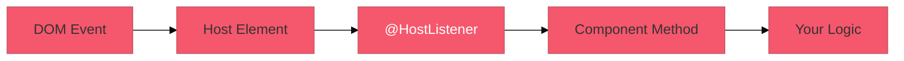
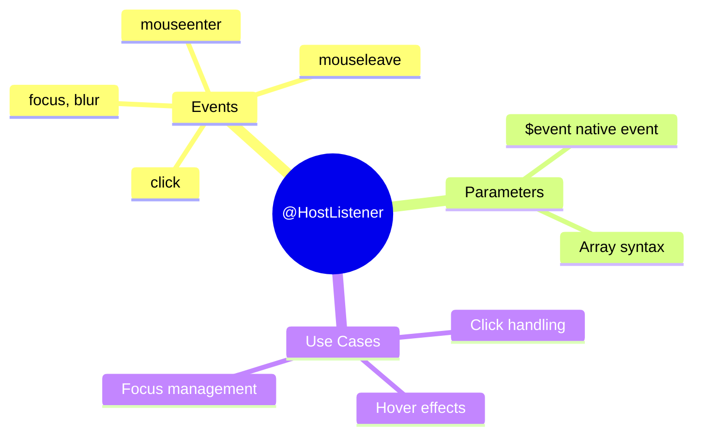

# 👆 Use Case 1: Basic @HostListener

> **Goal**: Listen to DOM events on the host element.

---

## 🔍 How It Works

`@HostListener` decorator turns a method into an event handler for the host element.

```typescript
@HostListener('eventName', ['$event'])
methodName(event: Event) { }
```

### 📊 Event Flow



---

## 🚀 Implementation

### Step 1: Import HostListener

```typescript
import { HostListener } from '@angular/core';
```

### Step 2: Decorate Method

```typescript
@HostListener('click', ['$event'])
onClick(event: MouseEvent) {
    console.log('Clicked!', event);
}

@HostListener('mouseenter')
onMouseEnter() {
    this.isHovered = true;
}

@HostListener('mouseleave')
onMouseLeave() {
    this.isHovered = false;
}
```

---

## 🐛 Common Pitfalls

### ❌ Forgetting to Import

```typescript
// ❌ Error: HostListener is not defined
@HostListener('click')
```

**Fix:** `import { HostListener } from '@angular/core';`

---

## 🌍 Real World Uses

1. **Dropdown close on outside click**
2. **Hover states for custom components**
3. **Track user interaction analytics**

---

## 🧠 Mind Map


