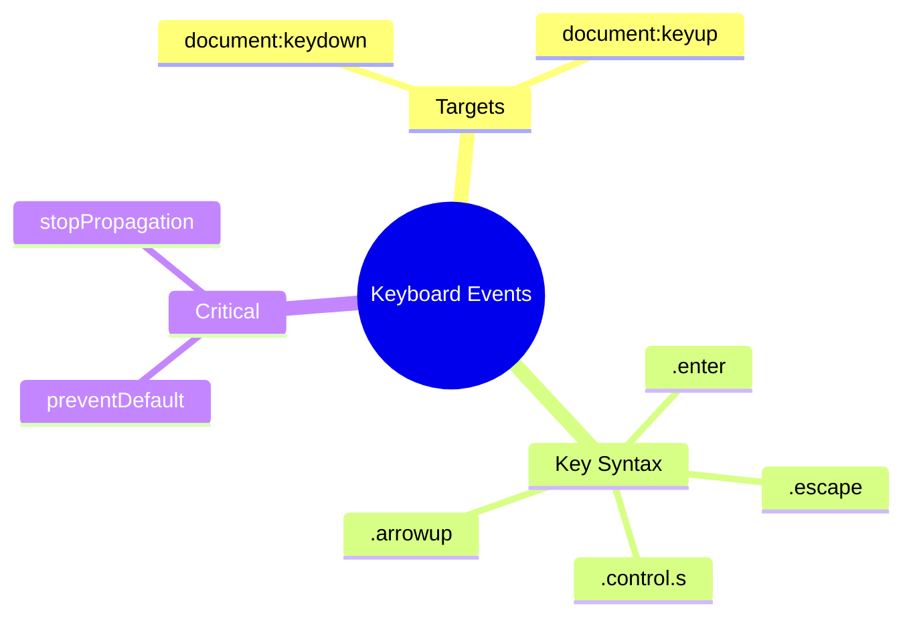

# ⌨️ Use Case 2: Keyboard Events

> **Goal**: Handle global keyboard shortcuts using @HostListener.

---

## 🔍 How It Works

Listen to document-level keyboard events with `document:keydown.keyName` syntax.

### Key Binding Syntax

| Syntax | Description |
|--------|-------------|
| `document:keydown.escape` | Single key |
| `document:keydown.control.s` | Combo key |
| `document:keydown.shift.control.z` | Multi-modifier |

---

## 🚀 Implementation

```typescript
// Single key
@HostListener('document:keydown.escape')
onEscape() {
    this.closeModal();
}

// Combo - prevent browser default!
@HostListener('document:keydown.control.s', ['$event'])
onSave(event: KeyboardEvent) {
    event.preventDefault(); // 🛡️ CRITICAL!
    this.save();
}
```

---

## 🐛 Common Pitfalls

### ❌ Forgetting preventDefault()

```typescript
// ❌ Browser's save dialog opens!
@HostListener('document:keydown.control.s')
onSave() { this.save(); }
```

**Fix:** Add `event.preventDefault()`.

---

## 🧠 Mind Map


