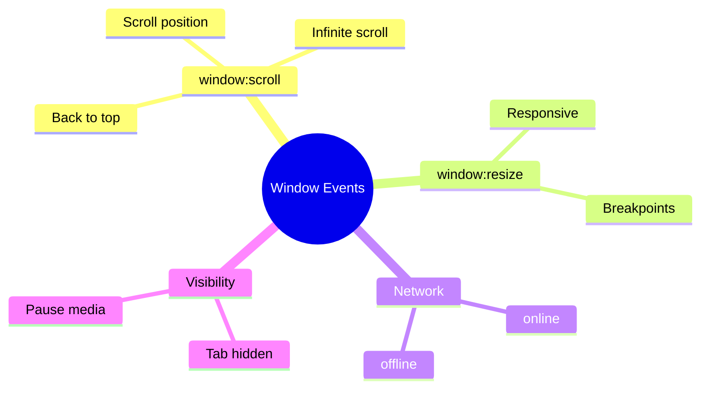

# 🖥️ Use Case 3: Window/Document Events

> **Goal**: Handle global window-level events like scroll, resize, network status.

---

## 🔍 How It Works

Target window or document with prefix syntax:

| Event | Syntax |
|-------|--------|
| Scroll | `window:scroll` |
| Resize | `window:resize` |
| Online | `window:online` |
| Offline | `window:offline` |
| Tab visibility | `document:visibilitychange` |

---

## 🚀 Implementation

```typescript
@HostListener('window:scroll')
onScroll() {
    this.scrollY = window.scrollY;
}

@HostListener('window:resize')
onResize() {
    this.width = window.innerWidth;
}

@HostListener('document:visibilitychange')
onVisibility() {
    this.isVisible = !document.hidden;
}
```

---

## 🌍 Real World Uses

1. **Infinite scroll** - Load more on scroll
2. **Responsive layouts** - React to resize
3. **Auto-pause video** - On tab hidden
4. **Show "You're offline" banner**

---

## 🧠 Mind Map


