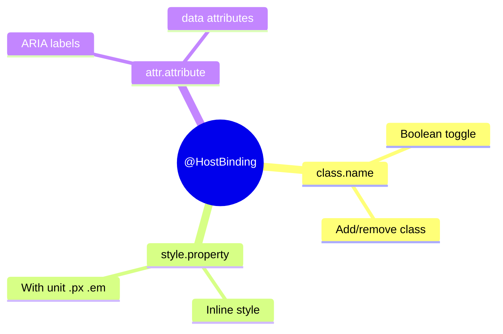

# 🎨 Use Case 4: @HostBinding Basics

> **Goal**: Dynamically bind host element classes, styles, and attributes.

---

## 🔍 How It Works

`@HostBinding` binds a class property to a host element property.

### Binding Types

| Syntax | Example | Result |
|--------|---------|--------|
| `class.name` | `@HostBinding('class.active')` | Adds/removes class |
| `style.prop` | `@HostBinding('style.color')` | Sets inline style |
| `style.prop.unit` | `@HostBinding('style.width.px')` | Style with unit |
| `attr.name` | `@HostBinding('attr.role')` | Sets attribute |

---

## 🚀 Implementation

```typescript
// Class binding - adds class when true
@HostBinding('class.dark-mode')
isDarkMode = false;

// Style binding
@HostBinding('style.borderColor')
borderColor = '#667eea';

// Style with unit suffix
@HostBinding('style.fontSize.px')
fontSize = 16; // becomes "16px"

// Attribute binding with getter
@HostBinding('attr.aria-disabled')
get ariaDisabled() {
    return this.isDisabled ? 'true' : null;
}
```

---

## 🧠 Mind Map


